BSV 中文教程
===========================
欢迎 :hand: 这里(可能)是首个中文 Bluespec SystemVerilog (BSV) 教程。


同步更新至：

- GitHub : https://github.com/WangXuan95/BSV_Tutorial_cn
- Gitee : https://gitee.com/wangxuan95/BSV_Tutorial_cn

# 1 前言

## <span id="head2">1.1 为什么要 BSV？Verilog 不好用？</span>
BSV 是一门高级硬件描述语言（**H**igh-**L**evel **H**ardware **D**escription **L**anguage, **HL-HDL**），与 Verilog 一样，被用于 FPGA 或 ASIC 的前端设计和验证。BSV 于 2003 年被 Bluespec :tm: 开发，期间一直作为商业收费 :moneybag: 工具而存在，到 2020 年它的编译器才开源，这才给了我们接触它的机会。

Verilog 的语法简单、特性少，却能全面且精准的描述绝大多数数字电路：从组合逻辑到时序逻辑，从同步时钟到跨时钟域，从流水灯到CPU。可以说 Verilog 在数字逻辑设计中的地位就像 C 语言在程序设计中的地位一样，是“小而美”的语言。学习 Verilog 时，只需要掌握3种常见写法：`assign`， `always @ (*)` 和 `always @ (posedge clk)` ，剩下的就依赖于你对电路设计的理解了。当然，这才是最难的，包括各种繁杂的硬件设计思维——同步电路、异步电路、状态机、并行展开、流水线化、握手信号、总线协议等。各位读到这里有没有意识到问题——用如此简单的抽象级别来描述如此复杂的数字电路系统，会不会很吃力？相信每个接触过复杂的 Verilog 系统的读者，都体会过被 always 块下的几十个状态所支配的恐惧，也清晰地记得模块实例化时那几十行吓人的端口连接。因此，我们需要一种抽象层次更高的 HDL 来提高开发效率，BSV 就能胜任这一工作。

> :pushpin: 在笔者看来 BSV 并不能替代 Verilog ——至少现在不能。同样，HLS、SpinalHDL、Chisel 也无法撼动 Verilog 的地位。这就像各种高级语言也没有替代 C 语言一样。一些说法把 Verilog/VHDL 在数字逻辑设计中的地位，比作汇编语言在程序设计中的地位，笔者认为该说法具有误导性。Verilog/VHDL 所在的抽象层次恰到好处，且是通用（跨平台）的——支持各厂家的FPGA和ASIC，因此成为了数字逻辑设计的主流语言，这与 C 语言的理念类似，应当比作 C 语言。
>

## 1.2 关于本教程

在开始前，读者要有如下基础：

- 熟悉 Verilog/VHDL ，熟悉数字电路设计，比如状态机、流水线、握手信号、串并转换、单口RAM、双口RAM等知识。
- 起码要知道软件编程语言中的基本概念：数据类型、分支、循环、数组、函数。

另外，如果有以下知识，学起来会更轻松：

* 了解一点面向对象的概念，例如 C++、JAVA、Python 中的类、实例、成员变量、方法函数等概念。
* 会打开命令行无脑输命令，因为 BSV 编译器要在 Linux 命令行（或 Windows WSL）中使用。

本教程参考了 《BSV by example》 [1] 这篇很棒的官方教程。但也有很大不同：

* 本教程基于开源的 BSV 编译器 bsc，会带读者在命令行中使用编译器。
* 本教程不是直译自 [1]，而是根据其大纲而重构的，符合中文语法习惯，直译原文则会很生硬。
* 本教程根据自己的理解，对 [1] 的内容进行删减和重排序。
* 本教程会讲述一些 [1] 中没有讲，但也很实用的内容，它们来自于内容更全的 BSV 参考指南 [2] 。
* 本教程在讲解中配套了很多有实际意义的代码，还展示了3个大型项目：SPIFlash读写器、RISC-V流水线CPU、JPEG图像压缩器。
* 作为实用教程，笔者将讲述 BSV 生成的 Verilog 模块的特性，指导读者把它嵌入 Verilog 项目中。

笔者也是 BSV 初学者，完全凭借对数字逻辑设计的热爱~~用爱发电~~编写了本教程。出现不准确的表述也在所难免，可以提 issue 让笔者改进。

## 1.3 参考资料

[1] R. Nikhil and K. Czeck. BSV by Example: The next-generation language for electronic system design.  Bluespec, Inc. 2010. http://csg.csail.mit.edu/6.S078/6_S078_2012_www/resources/bsv_by_example.pdf.

[2] Bluespec SystemVerilog Reference Guide. Bluespec, Inc. 2017. https://web.ece.ucsb.edu/its/bluespec/doc/BSV/reference-guide.pdf.

- [2] 是内容最全 BSV 的官方资料，可作为查阅文档。


## 目录 :page_with_curl:

- [2 BSV概览](#head6)
	- [2.1 BSV vs. Verilog](#head7)
	- [2.2 BSV vs. Chisel/SpinalHDL](#head8)
	- [2.3 BSV vs. HLS](#head9)
	- [2.4 总结](#head10)
- [3 准备工作](#head11)
	- [3.1 安装 bsc 编译器](#head12)
	- [3.2 安装 iverilog 和 Tcl](#head13)
	- [3.3 安装 gtkwave](#head14)
	- [3.4 部署脚本 bsvbuild.sh](#head17)
	- [3.5 找一款顺手的代码编辑器](#head18)
- [4 项目组织与构建](#head19)
	- [4.1 单模块项目](#head20)
	- [4.2 单包多模块项目](#head21)
	- [4.3 多包项目](#head22)
	- [4.4 生成与查看波形](#head23)
- [5 类型与变量](#head24)
	- [5.1 类型类](#head25)
	- [5.2 基本数据类型](#head26)
	- [5.3 Integer 与 String 类型](#head31)
	- [5.4 使用 $display 打印](#head34)
	- [5.5 变量定义与赋值](#head35)
	- [5.6 组合逻辑电路](#head39)
	- [5.7 元组 Tuple](#head45)
	- [5.8 Maybe 类型](#head46)
- [6 时序逻辑电路](#head47)
	- [6.1 寄存器 Reg](#head48)
	- [6.2 读写顺序与调度注解](#head52)
	- [6.3 线网 Wire](#head53)
	- [6.4 规则 rule](#head59)
	- [6.5 调度属性](#head64)
	- [6.6 并发寄存器 mkCReg](#head75)
- [7 模块与接口](#head76)
	- [7.1 模块层次结构](#head77)
	- [7.2 值方法与动作方法](#head80)
		- [e.g. 比特编码器 v1](#head83)
	- [7.3 方法的隐式条件](#head84)
		- [e.g. 比特编码器 v2](#head86)
		- [e.g. 比特编码器 v3](#head88)
	- [7.4 动作值方法](#head89)
		- [e.g. 比特编码器 v4](#head90)
	- [7.5 方法实现的简写](#head91)
		- [e.g. 自增寄存器 v1](#head92)
	- [7.6 使用现成的接口](#head93)
		- [e.g. 自增寄存器 v2](#head94)
	- [7.7 接口嵌套](#head95)
		- [e.g. 可配置自增寄存器 v1](#head96)
	- [7.8 用元组返回多个接口](#head97)
		- [e.g. 可配置自增寄存器 v2](#head98)
	- [7.9 动作函数](#head99)
- [8 存储与队列](#head100)
	- [8.1 BRAMCore](#head101)
	- [8.2 BRAM](#head106)
	- [8.3 队列 FIFO 概览](#head114)
	- [8.4 常规 FIFO](#head115)
		- [e.g. 开平方计算流水线 v2](#head118)
	- [8.5 不保护 FIFO](#head119)
	- [8.6 LFIFO](#head120)
		- [e.g. 累加式写入的存储器](#head121)
	- [8.7 DFIFOF](#head122)
		- [e.g. 比特编码器 v5](#head123)
	- [8.8 BypassFIFO](#head124)
	- [8.9 大容量的 BRAMFIFO](#head125)
- [9 高级数据类型](#head126)
	- [9.1 数组 array](#head127)
	- [9.2 向量 Vector](#head129)
	- [9.3 typedef 关键字](#head134)
	- [9.4 枚举 enum](#head135)
	- [9.5 结构体 struct](#head136)
	- [9.6 标签联合体 union tagged](#head137)
	- [9.7 case 语句与表达式](#head138)
- [10 多态](#head142)
	- [10.1 多态中的基本概念](#head143)
	- [10.2 多态函数举例](#head148)
	- [10.3 多态模块举例](#head149)
		- [e.g. 自定义更多的寄存器](#head150)
		- [e.g. 自定义双缓冲模块](#head151)
- [11 状态机 StmtFSM](#head152)
	- [11.1 基本的构建和使用方法](#head153)
	- [11.2 执行结构](#head156)
	- [11.3 分支和循环](#head164)
	- [11.4 区别局部变量和寄存器](#head168)
	- [11.5 举例](#head169)
		- [e.g. SPI 发送器](#head170)
- [12 BSV for Verilog](#head171)
	- [12.1 输入输出信号](#head172)
	- [12.2 删除不必要的信号](#head177)
	- [12.3 引入缺少的 Verilog 库文件](#head180)
- [13 样例研究](#head183)
	- [13.1 SPIFlash 读写器](#head184)
	- [13.2 RISC-V 流水线 CPU](#head187)
	- [13.3 JPEG 图像压缩器](#head190)


# <span id="head6">2 BSV概览</span>

## <span id="head7">2.1 BSV vs. Verilog</span>

为了提升读者的学习热情:raising_hand:，我先展示一个实用样例：编写一个 **SPI 总线的发送控制器** 。虽然使用 Verilog 写起来有一点难度，但用 BSV 写起来**非常简单**！

SPI 发送控制器的时序波形如**图1**，驱动时钟是 `clk`。当 `en=1` 时，说明外界发起了一个发送请求，于是从 `data` 信号上读入 8bit 数据，随后的若干周期，在 `mosi` 信号上按从高到低的顺序逐个输出它的比特位（并转串），同时还要产生 `sck` 和 `ss` 的波形。在发送的过程中，`rdy=0`指示模块正忙。忙完后 `rdy` 恢复 1，此时才能响应下一个 `en=1` 的请求。

| 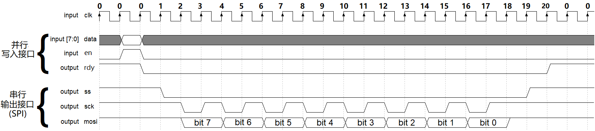 |
| :---: |
| **图1**：SPI 发送控制器的波形 |

>  :pushpin: `en` 和 `rdy` 构成了一对握手信号，在 `en` 与 `rdy` 同时 `=1` 的周期完成一次握手，这是一种常用的硬件设计方法，很多总线协议都会用到，只是名称可能不一样。比如，AXI 总线的握手信号叫 valid 和 ready 。

下面用 Verilog 实现它。整个发送的过程共经历了 21 个 `clk` 周期，我们用一个 `0~20` 的计数变量来表示当前状态。`cnt=0` 表示空闲状态，遇到 `en=1` 时就令 `cnt<=1`，并在之后的每个时钟周期都令 `cnt+1`，并根据 `cnt` 的值输出 `ss`, `sck` 和 `mosi`，直到 `cnt=20` 时归零。另外注意到 `2≤cnt≤17` 时，输出的信号是 8 个有规律的循环，它们的输出描述可以合并，没必要繁琐地逐一描述。这样，该模块的核心部分实现大概如下 :point_down: （不用仔细看）


```verilog
// Verilog SPI 发送（可综合）
reg [4:0] cnt = 0;
reg [7:0] rdata = 0;
assign rdy = (cnt==0) ? 1 : 0;

always @ (posedge clk or negedge rstn)
	if(!rstn) begin
		{ss, sck, mosi} <= 3’b111;
	end else begin
		if(cnt==0) begin
			if(en) begin
				rdata <= data;
				cnt <= 1;
			end
		end else if(cnt==1) begin
			ss <= 1’b0;               // ss 拉低
			cnt <= cnt + 1;
		end else if(cnt<=17) begin
			sck <= cnt[0];            // cnt 为偶数时，令 sck=0，cnt 为奇数时，令 sck=1。
			mosi <= rdata[8-(cnt/2)]; // 在 mosi 上产生串行输出
			cnt <= cnt + 1;
		end else if(cnt==18) begin
			mosi <= 1’b1;
			cnt <= cnt + 1;
		end else if(cnt==19) begin
			ss <= 1’b1;               // ss 拉高
			cnt <= cnt + 1;
		end else begin
			cnt <= 0;
		end
	end
```

以上 Verilog 代码已经是一个很简短的实现了，但可读性很差，难于修改，如果我们想在 `ss` 拉低之前再插入一个时钟周期干其它的事情，则后面的所有状态转移以及 `2≤cnt≤17` 时的奇偶判断都得改，容易改出 bug。

各位读者在用 Verilog 编写 testbench 时可能想过：“如果电路设计中也能使用 testbench 中的顺序执行语法，那该多方便啊”，比如以上 SPI 发送过程可以写作如下 :point_down: ，用 `@(posedge clk) ...` 来表示“等到下一个时钟上升沿干某某某事情”，这种顺序执行模式很符合人类的思维，修改起来也方便，但不可综合（无法生成电路）。

```verilog
// Verilog SPI 发送（testbench 写法，不可综合！！）
reg signed [31:0] cnt = 7;       // cnt 初始值为 7
initial begin
	{ss, sck, mosi} <= 3’b111;
	@(posedge clk)               // 等到下一个时钟上升沿
		ss <= 1’b0;              // ss 拉低
	while(cnt>=0) begin          // while 循环，cnt 从 7 递减到 0，共8次
		@(posedge clk) begin     // 等到下一个时钟上升沿
			sck <= 1’b0;         // sck 拉低
			mosi <= wdata[cnt];  // mosi 依次产生串行 bit
		end
		@(posedge clk) begin     // 等到下一个时钟上升沿
			sck <= 1’b1;         // sck 拉高
			cnt = cnt - 1;       // cnt 每次循环都递减
		end
	end
	@(posedge clk) mosi <= 1’b1; // mosi 拉高
	@(posedge clk) ss <= 1’b1;   // ss 拉高，发送结束
end
```

下面展示 SPI 控制器的 BSV 实现。8~24 行描述的是一个类似于 Verilog testbench 的流程，详见代码注释。

```bsv
module mkSPIWriter (SPIWriter);        // BSV SPI 发送（可综合！！）， 模块名称为 mkSPIWriter
   Reg#(bit) ss <- mkReg(1'b1);
   Reg#(bit) sck <- mkReg(1'b1);
   Reg#(bit) mosi <- mkReg(1'b1);
   Reg#(Bit#(8)) wdata <- mkReg(8'h0);
   Reg#(int) cnt <- mkReg(7);          // cnt 的复位值为 7

   FSM spiFsm <- mkFSM (               // mkFSM 是一个状态机自动生成器，能根据顺序模型生成状态机 spiFsm
      seq                              // seq...endseq 描述一个顺序模型，其中的每个语句占用1个时钟周期
         ss <= 1’b0;                   // ss 拉低
         while (cnt>=0) seq            // while 循环，cnt 从 7 递减到 0，共8次
            action                     // action...endaction 内的语句在同一周期内执行，即原子操作。
               sck <= 1’b0;            // sck 拉低
               mosi <= wdata[cnt];     // mosi 依次产生串行 bit
            endaction
            action                     // action...endaction 内的语句在同一周期内执行，即原子操作。
               sck <= 1’b1;            // sck 拉高
               cnt <= cnt - 1;         // cnt 每次循环都递减
            endaction
         endseq
         mosi <= 1’b1;                 // mosi 拉高
         ss <= 1’b1;                   // ss 拉高，发送结束
         cnt <= 7;                     // cnt 置为 7，保证下次 while 循环仍然正常循环 8 次
      endseq );                        // 顺序模型结束

   method Action write(Bit#(8) data);  // 当外部需要发送 SPI 时，调用此 method。参数 data 是待发送的字节
      wdata <= data;
      spiFsm.start();                  // 试图启动状态机 spiFsm
   endmethod

   method Bit#(3) spi = {ss,sck,mosi}; // 该 method 用于将 SPI 信号引出到模块外部
endmodule
```

首先，以上 BSV 代码看似与 Verilog testbench 写法一样，都是顺序执行。但 Verilog testbench 不可综合，BSV 却可综合。这是 BSV 的 `StmtFSM` 包提供的自动化生成状态机的功能（详见注释）。相比于 Verilog 手动编写的状态机，省略了状态转移行为的手动管理，使我们可以专注地描述每个状态下的行为。

其次，你会发现 BSV 代码中完全没出现时钟 (`clk`) 和复位 (`rstn`) 信号。实际上 BSV 在默认情况下使用同步时序逻辑，所有的动作都同步于一个默认时钟的上升沿，所有的寄存器都受控于一个默认的复位信号。BSV 转换成 Verilog 后，时钟和复位信号会显现出来。

> 在数字逻辑设计中，应该养成能用同步时序，就不用异步时序的好习惯，除非涉及到跨时钟域的需要。Verilog 自由度很高，导致 Verilog 初学者爱在 `always @ (…)` 敏感列表中加入奇奇怪怪的门控时钟或不同边沿的触发，导致各种冒险，也使时序约束变得困难。初学 BSV 时就不容易犯这种问题。当然，BSV 也提供了异步（多时钟）设计方法和异步组件（例如异步FIFO），详见 [2]。本教程**只涉及同步时序设计**，因为这已经能涵盖大部分数字逻辑设计的需要。

最后，你还会注意到这个 BSV 代码中看不出模块输入输出信号的定义。因为 BSV 将它们封装成了**方法** (method)。以上述代码中的方法`method Action write` 为例，当外部需要启动 SPI 发送时就调用此方法。参数 `Bit#(8) data` 是待发送的字节，会映射为 Verilog 中的一个 8 位的输入信号，而握手信号 en 和 rdy 会自动生成（如下 :point_down: ）。当 `spiFsm` 状态机正忙（即正在发送SPI时）时，对 `method Action write` 的调用将无法生效；用 Verilog 的思维来讲：此时 `rdy=0`，即使 `en=1` 也无法发送数据。

```bsv
// 用 BSV 编译器把 BSV 模块转化为 Verilog 后的接口定义
module mkSPIWriter(          // 这些注释是笔者加上的
	input  CLK,              // 自动生成的时钟
	input  RST_N,            // 自动生成的复位
    // 由 method Action write(Bit#(8) data) 生成的信号
    input  [7:0] write_data, // 对应波形图1中的 data 信号
	input  EN_write,         // 对应波形图1中的 en 信号（是自动生成的握手信号）
	output RDY_write,        // 对应波形图1中的 rdy 信号（是自动生成的握手信号）
    // 由 method Bit#(3) spi 生成的信号
	output [2:0] spi,        // 3bit 分别对应 ss,sck,mosi 信号
);
```

总结起来，在本例中，BSV 相比 Verilog 具有更高层次的抽象：

* **隐式时钟/复位**：只需给出寄存器的复位状态，和每个时钟周期的行为，时钟和复位信号会自动生成。
* **方法抽象**：把接口动作抽象为方法调用。
* **自动生成握手信号**：BSV 会根据方法能否能生效，来自动生成握手信号。
* **自动生成状态机**：提供了根据顺序模型自动生成状态机的库，使我们能专注于行为描述，不需要手动维护状态判断和跳转。

有些读者可能担心 BSV 抽象层次过高，会不会失去对电路细节的控制能力？实际上，BSV 并不屏蔽我们对每一个时钟周期下的行为的描述能力，相反是在提升这个描述能力，让我们能专注于描述行为，而不必重复一些繁琐的低层次工作。而且之后你会发现，只要你愿意，也可以把 BSV 写成 Verilog 那样的寄存器传输（RTL）级的抽象层次，但那样还不如直接写 Verilog 了。


## <span id="head8">2.2 BSV vs. Chisel/SpinalHDL</span>

Chisel 和 SpinalHDL 也可以归类为高级硬件描述语言（HL-HDL）。因为笔者并没有学过它们 ，本节留待日后补充。这里摆出 BSV 官方对 Chisel 和 BSV 的比较：

> :point_right:  BSV 的抽象层次高于 Chisel，因为 Chisel 仍与 Verilog一样处于经典时钟逻辑层次的抽象（尽管Chisel提供了面向对象等高级特性），而 BSV 具有原子事务（Atomic Transactions Level）的抽象级别。
>
> :point_right:  BSV 的语法是专门针对硬件设计而设计的，不依附于任何现有语言。不像 Chisel 和 SpinalHDL 是基于现有语言 Scala 的，可能存在一些只适合软件设计思路的干扰性语法。


## <span id="head9">2.3 BSV vs. HLS</span>

**BSV** 与高层次综合 (**H**igh **L**evel **S**ynthesis, **HLS**) 的理念有本质上的不同。BSV 的目标是提高电路的时钟周期级行为的描述能力，而 HLS 则试图屏蔽时序的概念，以无时序描述能力的高级语言（C/C++）为起点，靠**自动调度**来确定执行时序。虽然这让软件设计人员能够快速上手，但也让 HLS 的应用场合受限。例如，HLS 可以设计高性能的神经网络加速器，但设计 CPU 就捉襟见肘。

以下文字摘自 [1]，讲述了 BSV 相比于 HLS 的优势：

> :point_right:  基于 C/SystemC 的 HLS 被许多业内人视为发展方向。不幸的是，这存在一定的问题。众所周知，高性能软件的关键是好的算法，好的算法是由算法工程师设计的，而不是由自动工具设计的（编译器只会优化我们编写的算法，而不会提升算法本身）。同样，面积小、时序好的硬件也是由硬件工程师设计的。因此，至关重要的是要赋予硬件工程师最大的表达架构的能力。HLS 却恰恰相反——它掩盖了架构，而是尝试用启发式方法选择架构。设计人员对此活动只有间接的控制能力，例如约束硬件资源限制和指定优化方法（unrolling, peeling, fusion 等），很难（常常涉及猜测）将产生一个好的架构。


## <span id="head10">2.4 总结</span>

**图2**比较了 Verilog, VHDL, Chisel, HLS, BSV 的抽象层次(Level of abstraction)和架构透明度(Architectural Transparent) 。架构透明度越高，语言对电路细节(微架构)的控制能力越强，生成的电路的行为也越容易被开发者掌控(可预测性高)。

| 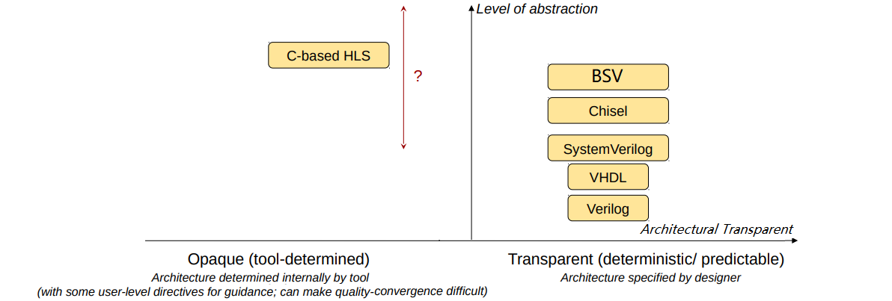 |
| :---: |
| **图2**：比较 Verilog, VHDL, Chisel, HLS 与 BSV |


# <span id="head11">3 准备工作</span>

本章教大家搭建 BSV 开发环境。BSV 编译器运行在 Linux 系统上，可以使用以下平台之一：

* Linux 实体机 :computer:
* Linux 虚拟机
* Windows10 bash (**W**indows **S**ubsystem of **L**inux, **WSL**)，强烈推荐 :raised_hands: ！！WSL 的开启方法可以参考：
  * Install WSL：https://docs.microsoft.com/en-us/windows/wsl/install
  * win10开启wsl，让我们愉快的使用Linux：https://zhuanlan.zhihu.com/p/384026893


> :point_right: 提示：开启 WSL 后，在 Windows 的某个目录（文件夹）下打开 WSL 命令行的方式是：在”文件资源管理器“空白处摁住shift+右键 → ”在此处打开 PowerShell 窗口“ → 在 PowerShell 中输入 wsl + 回车 → 即可进入 Linux 环境。


## <span id="head12">3.1 安装 bsc 编译器</span>

BSV 的编译器 bsc 是以源码的形式发布在[Bluespec官方bsc仓库](https://github.com/B-Lang-org/bsc)的，并未提供编译好的可执行文件。不过，笔者帮你们编译好了，它在本仓库的 **bsc-build.tar.gz** 压缩包中。（笔者是在 **Ubuntu 16.04 (x86_64)** 中编译它的，复制到 WSL 上发现也能工作）

首先进入 **bsc-build.tar.gz** 所在的目录的命令行，运行以下命令把 **bsc-build.tar.gz** 复制到你想安装的位置并解压，例如你想把它安装在 `/opt` 目录下：

```bash
$ tar -xzvf bsc-build.tar.gz -C /opt
# 注意 tar 前面的 $ 仅仅是提示你输入命令的起始符，不要把 $ 也输进去了
# 如果显示 Permission Denied，请在命令前面加上 sudo（下同）。
```

以上命令在 `/opt` 目录中解压出一个叫 `bsc` 的目录，其中 `bsc/bin` 目录下有可执行文件 bsc。运行一下它试试：

```bash
$ /opt/bsc/bin/bsc       # 如果打印如下，说明 bsc 正常工作
Usage:
  bsc -help                               to get help
  bsc [flags] file.bsv                    to partially compile a Bluespec file
  bsc [flags] -verilog -g mod file.bsv    to compile a module to Verilog
  bsc [flags] -verilog -g mod -u file.bsv to recursively compile modules to Verilog
  bsc [flags] -verilog -e topmodule       to link Verilog into a simulation model
  bsc [flags] -sim -g mod file.bsv        to compile to a Bluesim object
  bsc [flags] -sim -g mod -u file.bsv     to recursively compile to Bluesim objects
  bsc [flags] -sim -e topmodule           to link objects into a Bluesim binary
  bsc [flags] -systemc -e topmodule       to link objects into a SystemC model
```

然后用 vi 或 nano（或任何你习惯的文本编辑器）编辑当前用户的 `.bashrc` 文件：

```bash
$ vi ~/.bashrc
```

将以下两行追加到 `.bashrc` 文件的末尾（目的是把 bsc 和相关 lib 添加到永久环境变量）：

```bash
export PATH=/opt/bsc/bin:$PATH
export LIBRARY_PATH=/opt/bsc/lib:$LIBRARY_PATH
```

然后启动一个新的命令行，运行一下 bsc 试试，能正常工作即可：

```bash
$ bsc
```

如果笔者提供的 bsc 在你的 Linux 上不能工作，请前往[Bluespec官方bsc仓库](https://github.com/B-Lang-org/bsc)，自行按照 README 的指示编译 bsc 编译器。注：WSL 下编译 bsc 可能面临各种依赖问题，因此建议用 Linux 实体机或虚拟机编译 bsc 。


## <span id="head13">3.2 安装 iverilog 和 Tcl</span>

Icarus Verilog (iverilog) 用于进行 BSV 和 Verilog 的联合仿真；tcl-dev 是为了使用 Bluespec Tcl Shell (bluetcl)。运行以下命令安装：

```bash
$ apt-get install iverilog tcl-dev
```

安装好后，运行一下 iverilog 试试：

```bash
$ iverilog    # 如果打印如下，说明 iverilog 正常工作
iverilog: no source files.
Usage: iverilog [-ESvV] [-B base] [-c cmdfile|-f cmdfile]
                [-g1995|-g2001|-g2005|-g2005-sv|-g2009|-g2012] [-g<feature>]
                [-D macro[=defn]] [-I includedir]
                [-M [mode=]depfile] [-m module]
                [-N file] [-o filename] [-p flag=value]
                [-s topmodule] [-t target] [-T min|typ|max]
                [-W class] [-y dir] [-Y suf] source_file(s)
```


## <span id="head14">3.3 安装 gtkwave</span>

为了查看仿真产生的波形，需要安装 gtkwave。

### <span id="head15">在 Linux 上安装 gtkwave</span>

如果使用的是 Linux 实体机或虚拟机，可以直接安装：

```bash
$ apt-get install gtkwave
```

今后在使用时，用以下命令查看仿真产生的 .vcd 波形文件 ：

```bash
$ gtkwave wave.vcd     #今后用该命令查看波形文件 wave.vcd
```

### <span id="head16">在 Windows 上安装 gtkwave</span>

你不能在 WSL 中安装 gtkwave，因为 gtkwave 是一个图形界面 (GUI)，而 WSL 是没有 GUI 的。替代办法就是直接在 Windows 上安装 gtkwave。请前往 [**gtkwave官网** ](http://gtkwave.sourceforge.net/)下载 ZIP 压缩包，把它解压到你想安装的文件夹下，找到其中的 `gtkwave/bin` 目录里面的 **gtkwave.exe** ，运行它，如果打开了一个窗口，则安装成功。


## <span id="head17">3.4 部署脚本 bsvbuild.sh</span>

为了方便调用 bsc 和 iverilog 等工具进行编译、仿真、生成波形、生成 Verilog 的流程，我编写了自动脚本 **bsvbuild.sh** 。请运行以下命令把它复制到 `/opt/bsc/bin` 目录下（也就是3.1节中bsc的安装目录），并提供运行权限：

```bash
# 请在 bsvbuild.sh 所在的目录运行以下命令：
$ cp bsvbuild.sh /opt/bsc/bin
$ chmod +x /opt/bsc/bin/bsvbuild.sh
```

然后运行  **bsvbuild.sh** ，会打印该脚本的使用方法：

```bash
$ bsvbuild.sh    # 如果打印如下，说明 bsvbuild.sh 正常工作

 usage: run following command under the directory which contains .bsv source file(s):
         /opt/bsc/bin/bsvbuild.sh -<param> [<top_module>] [<top_file_name>]

 arguments:
         -<param>:
                 -bs    : run BSV simulation.
                 -bw    : generate BSV simulation wave.
                 -bsw   : run BSV simulation and generate wave.
                 -v     : generate Verilog source only.
                 -vs    : generate Verilog source and run Verilog simulation.
                 -vw    : generate Verilog source and generate Verilog simulation wave.
                 -vsw   : generate Verilog source, run Verilog simulation and generate wave.
                 -clean : remove temporary files in current directory using:
                                 rm *.bo *.ba *.cxx *.h *.o sim.out sim.out.so
         <top_module>:
                 The top level module name. optional, default is mkTb
         <file_name>:
                 The top level file name. optional, default is Tb.bsv

 example:
         /opt/bsc/bin/bsvbuild.sh -vsw mkCounter Counter.bsv

 dependency:
         1. bsc : BSV compiler
         2. iverilog : Verilog simulator, only for Verilog simulation

 The meaning of printing colors:
         1. error message
         2. compilation commands and important notes
         3. simulation print, e.g., from $display() in BSV
```


## <span id="head18">3.5 找一款顺手的代码编辑器</span>

BSV 的代码文件名后缀为 .bsv ，尽管用记事本都能编写，但没有高亮和补全写起来确实很难受。这里我推荐用 vscode ，并给他安装 BSV 的高亮插件。

首先安装 vscode （过程略）。然后打开 vscode ，如**图3**操作，点击”扩展“ → 输入”bluespec“ → 找到”Bluespec System Verilog“ → 点击右侧”安装“ → 安装完成后，点击”启用“。

| 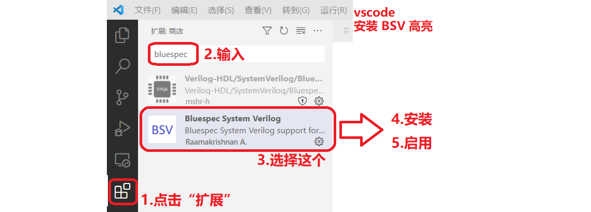 |
| :-----------------------------------: |
|  **图3**：在vscode中安装BSV高亮扩展   |

启用该插件后，重启 vscode ，再打开的 .bsv 文件就有 BSV 的高亮。


# <span id="head19">4 项目组织与构建</span>

本章讲述 BSV 的项目组织结构；以及用命令行编译、仿真、生成波形、生成 Verilog 的方式。

## <span id="head20">4.1 单模块项目</span>

BSV 项目是由**包** (package) 和**模块** (module) 来组织的。我们首先看看单包、单模块项目。打开 `src/1.Hello/Hello.bsv` 可以看到如下代码，它打印 `Hello World!` 后直接退出：

```bsv
// 代码路径：src/1.Hello/Hello.bsv
package Hello;        // 包名: Hello。每个.bsv文件内只能有1个与文件名相同的包

module mkTb ();       // 模块名: mkTb，该模块没有接口
   rule hello;                   // 规则名: hello
      $display("Hello World!");  // 就像 Verilog 的 $display 那样，
                                 // 该语句不参与综合, 只是在仿真时打印
      $finish;                   // 仿真程序退出
   endrule
endmodule

endpackage
```

在代码所在的目录中打开命令行，运行以下命令：

```bash
# 在 src/1.Hello/ 目录下运行以下命令
$ bsvbuild.sh -bs mkTb Hello.bsv
```

命令含义是：以 `mkTb` 为顶层模块，以 `Hello.bsv` 为顶层文件进行仿真，`-bs` 参数代表进行 BSV 仿真，只打印，不生成仿真波形文件。

该命令会产生如下输出。可以看到 **bsvbuild.sh** 调用了一些编译链接命令，然后进行仿真并打印出了 `Hello World!` ，最后因为遇到 `$finish;`而结束。

```bash
top module: mkTb
top file  : Hello.bsv

bsc -sim -g mkTb -u Hello.bsv
checking package dependencies
compiling Hello.bsv
code generation for mkTb starts
Elaborated module file created: mkTb.ba
All packages are up to date.
bsc -sim -e mkTb -o sim.out
Bluesim object created: mkTb.{h,o}
Bluesim object created: model_mkTb.{h,o}
Simulation shared library created: sim.out.so
Simulation executable created: sim.out

./sim.out
Hello World!
```

>  :point_right: 任何 BSV 仿真顶层代码中都要有 `$finish;` ，否则会陷入死循环（按 Ctrl+C 可强制退出）。

因为顶层模块名为默认名称 `mkTb` ，上述命令可以简化为：

```bash
# 在 src/1.Hello/ 目录下运行以下命令
$ bsvbuild.sh -bs Hello.bsv
```

以上命令的 `-bs` 是一个很重要的编译参数，有种七种选项，如**表1**。你可以都试试，看看效果如何。

​			**表1**：**bsvbuild.sh** 的编译参数。

| 编译参数 |   生成Verilog？    | 仿真方式 |     仿真打印？     | 生成仿真波形(.vcd)？ |
| :------: | :----------------: | :------: | :----------------: | :------------------: |
|   -bs    |                    |   BSV    | :heavy_check_mark: |                      |
|   -bw    |                    |   BSV    |                    |  :heavy_check_mark:  |
|   -bsw   |                    |   BSV    | :heavy_check_mark: |  :heavy_check_mark:  |
|    -v    | :heavy_check_mark: |    -     |                    |                      |
|   -vs    | :heavy_check_mark: | Verilog  | :heavy_check_mark: |                      |
|   -vw    | :heavy_check_mark: | Verilog  |                    |  :heavy_check_mark:  |
|   -vsw   | :heavy_check_mark: | Verilog  | :heavy_check_mark: |  :heavy_check_mark:  |

可以看到， BSV 代码可以进行两种仿真方式：

* 直接用 BSV 仿真
* 生成 Verilog 后再仿真

这两种仿真方式的结果在正常情况下应该相同，这说明了 BSV 生成的 Verilog 正确性。据 BSV 官方说：BSV正确性是100%保证的，不会像 HLS 那样偶尔会出现 C 仿真与 C-Verilog co-simulation 结果不一致的情况。

另外，据我测试，Verilog 仿真的编译速度略微快于 BSV ，但 BSV 仿真的运行速度往往远远快于 Verilog。


## <span id="head21">4.2 单包多模块项目</span>

我们再看看如何组织单包、多模块项目。打开 `src/2.DecCounter/DecCounter.bsv` 。它的结构如下：

```bsv
// 代码路径：src/2.DecCounter/DecCounter.bsv (部分)
interface DecCounter;                  // 接口名 DecCounter，用于连接调用者和被调用者
   method UInt#(4) count;              //    方法1：可被被调用者调用
   method Bool overflow;               //    方法2：可被被调用者调用
endinterface

(* synthesize *)
module mkDecCounter (DecCounter);      // 模块名 mkDecCounter，被调用者，接口是DecCounter
   //...
   method UInt#(4) count ...           // 实现方法1
   method Bool overflow ...            // 实现方法2
endmodule

module mkTb ();                        // 模块名 mkTb ，调用者
   DecCounter counter <- mkDecCounter; // 例化一个 mkDecCounter，并拿到它的接口，叫做 counter
   
   // counter.count ...                // 通过接口名 counter 来调用子模块，比如调用 count 方法
endmodule
```

上述代码首先定义了一个**接口** (interface)，接口类型名为 `DecCounter`，其中包含两个**方法** (method)。然后规定模块 `mkDecCounter` 的接口为 `DecCounter` ，这样，它就必须实现接口 `DecCounter` 下的所有方法。然后 `mkTb` 模块中例化了一个 `mkDecCounter` 作为子模块，并拿到了它的接口，显然，该接口的类型为 `DecCounter` ，并被命名为 `counter` 。最后，`mkTb` 中可以调用 `counter` 的方法。

运行以下命令进行仿真：

```bash
# 在 src/2.DecCounter/ 目录下运行以下命令
$ bsvbuild.sh -bs mkTb DecCounter.bsv
```

该命令中只需指定顶层模块 `mkTb` ，无需指定子模块 `mkDecCounter` ，BSV 编译器会自动找到 `mkDecCounter` 。

然后，我们来看看多模块生成的 Verilog 是什么样。注意到 `mkDecCounter` 的定义上有一个 `(* synthesis *)` 属性，它告诉编译器，该 BSV 模块需要可综合，且单独生成一个 Verilog 模块。除了顶层模块 `mkTb` 必然要生成一个 Verilog 模块外，每个添加了 `(* synthesis *)` 的 BSV 模块都会生成 1 个 Verilog 模块，而不添加 `(* synthesis *)`的 BSV 模块会嵌入它的上级（调用者）的 Verilog 代码体内。

运行 Verilog 仿真命令：

``` bash
# 在 src/2.DecCounter/ 目录下运行以下命令
$ bsvbuild.sh -vs mkTb DecCounter.bsv
```

产生了两个 Verilog 文件。

- `mkDecCounter.v` ： 包含 Verilog 模块 `mkDecCounter` 。
- `mkTb.v` ： 包含 Verilog 模块 `mkTb` 。是仿真的顶层，上述仿真结果就是运行该模块所产生的。

如果删除 `mkDecCounter` 上方的 `(* synthesis *)` 属性，则上述命令只会产生1个 Verilog 模块 `mkTb` ，而 `mkDecCounter` 则被嵌入 `mkTb` 中。这能帮助我们缩减 Verilog 模块的数量——当一个 BSV 模块过于复杂时，为了提升可读性，把它拆分成多个 BSV 模块来实现；当生成 Verilog 后，这些 BSV 模块只产生一个 Verilog 模块，作为黑箱使用或发布。


## <span id="head22">4.3 多包项目</span>

我们再看看如何组织多包、多模块项目。打开目录 `src/3.SPIWriter/` ，目录下有两个 `.bsv` 文件，每个文件内都有一个包 (package)，其中 `SPIWriter.bsv` 就包含 2.1 节中所述的 SPI 发送控制器，而 `TbSPIWriter.bsv` 中的 `mkTb` 调用了 `mkSPIWriter` 进行仿真。与单包多模块项目不同的是，调用者 `mkTb` 与被调用者 `mkSPIWriter` 不在同一个包中，因此 `TbSPIWriter.bsv` 中用如下语句引入了被调用包：

```bsv
import SPIWriter::*;  // 引入用户编写的包 SPIWriter （对应文件SPIWriter.bsv）
```

编译命令如下。只需给出顶层文件和顶层模块名，无需指定它调用的其它文件名或包名，编译器会自动寻找。

```bash
# 在 src/3.SPIWriter/ 目录下运行以下命令
$ bsvbuild.sh -bs mkTb TbSPIWriter.bsv
```

> 注：规范的 Verilog 项目中，每个 .v 文件只能包含一个模块。而规范的 BSV 项目中，每个 .bsv 文件只能包含一个包，但每个包可以包含多个模块，这些模块往往共同实现某个功能。


## <span id="head23">4.4 生成与查看波形</span>

在目录 `src/4.3.SPIWriter/` 下，运行以下命令生成 Verilog 仿真波形。

```bash
# 在 src/3.SPIWriter/ 目录下运行以下命令
$ bsvbuild.sh -vw mkTb TbSPIWriter.bsv
```

运行后，发现生成了两个 Verilog 模块：`mkTb.v` 和 `mkSPIWriter.v` ，以及一个仿真波形文件 `mkTb_vw.vcd `，该波形文件就是以 `mkTb.v` 为顶层文件仿真而生成的（仿真引擎是 iverilog）。

因此，通过观察波形，我们可以理解 `mkTb.v` 如何通过各个输入输出信号与 `mkSPIWriter.v` 交互，进而理解 `mkSPIWriter.v` 的输入输出行为。将来我们要在 Verilog 项目中用到 SPI 发送器时，可以调用 `mkSPIWriter.v` 。

为了查看波形，用 gtkwave 打开生成的波形文件 `mkTb_vw.vcd` 。如果你用是 Linux 实体机/虚拟机，运行命令：

```bash
# 在 src/3.SPIWriter/ 目录下运行以下命令
$ gtkwave mkTb_vw.vcd     # 只有有 GUI 的 Linux 实体机/虚拟机 能运行该命令
```

如果你用的是 WSL ，请在 Windows 中把 3.3 节安装的 **gtkwave.exe** 设置为 `.vcd` 文件的打开方式，操作如**图4**。这样，今后只要双击 `.vcd` 文件就能查看波形。

|        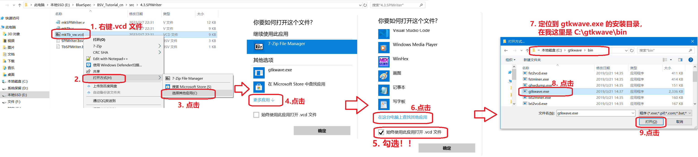         |
| :----------------------------------------------------------: |
| **图4**：在 Windows 中，把 **gtkwave.exe** 设为 `.vcd` 文件的打开方式 |

打开 **gtkwave** 后，按**图5**操作：

1. 在左上方展开模块层次。这里的 `top` 是 `mkTb` 模块的实例化；`spi_writer` 是子模块 `mkSPIWriter` 的实例化。我们选中 `top` 。
2. 在左下方寻找我们关注的信号，比如这里我们找到被调用者 `spi_writer` 的 4 个输入输出接口，选中它们。
3. 点击左下角的 Append ，把选中的信号加入右侧查看窗口。
4. `spi_writer$spi[2:0]` 信号包含了 `ss`, `sck` 和 `mosi`，为方便查看，双击它展开每个位 。
5. 用左上角的放大镜 :mag: 按钮调整波形缩放。

| 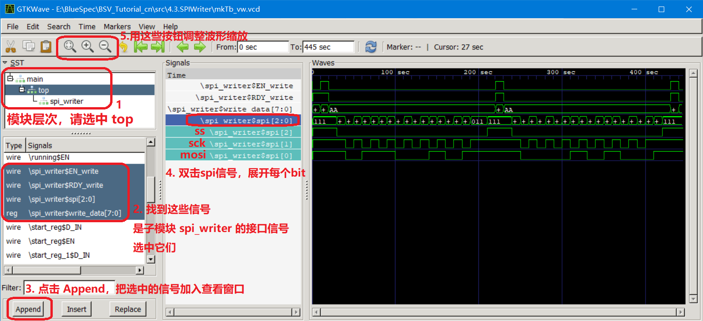 |
| :--------------------------------------: |
|      **图5**：**gtkwave** 基本用法       |

可以看出，**图5**与我们预想 SPI 的波形（**图1**）相同，说明 `mkSPIWriter` 的设计是成功的。

提示：每次编译后，新的 `.vcd` 文件都会覆盖旧的。此时没必要每次都重新打开 **gtkwave** ，那样就要重新添加信号，太麻烦了。我们只需在 **gtkwave** 左上角点击 File → Reload Waveform 即可。

> :point_right: 调试 BSV 代码时，建议结合仿真打印（来自$display()等）和查看波形这两种方式。很多硬件工程师习惯只看波形，虽然波形涵盖海量的细节信息，但令人眼花缭乱。而 $display() 能帮你快速打印你想要的信息。该经验也适用于 Verilog 调试。


# <span id="head24">5 类型与变量</span>

类型 (type) 是编程语言对数据或资源的一个抽象，是为了提高代码可读性，并让编译器在编译期排查一些低级错误（例如计算一个IP地址的平方，虽然也可以算，但很可能是程序员粗心写出来的，因此报错）。要记住：对于 Verilog 和 BSV 这些 HDL，对任何类型的运算操作，最终都会编译成对若干比特位的数字逻辑运算。

与 Verilog 不同，BSV 是强类型语言，会进行严格的类型检查。每个变量都有一个类型，变量只能取与之兼容的值。

BSV 对大小写有严格的要求，类型名和常量的首字母总是大写，比如 `UInt`, `Bit`, `Bool`, `True`, `False` 。而变量名的首字母总是小写。例如对于以下的布尔变量（布尔变量 `Bool`，要么取`True`，要么取`False`），类型名 `Bool` 首字母大写，变量名 `oflow` 首字母小写：

```bsv
Bool oflow = cnt >= 9;
```

甚至对于接口变量也这样，比如以下代码实例化了模块 `mkSPIWriter` 并获得其接口，接口类型名 `SPIWriter` 首字母大写，接口变量名 `spi_writer` 首字母小写：

```bsv
SPIWriter spi_writer <- mkSPIWriter;
```

后续我们会理解为什么接口也是类型。在 BSV 中**万物皆变量或类型** 。


## <span id="head25">5.1 类型类</span>

BSV 中的类型必须派生 (deriving) 自零个、一个或多个**类型类** (type class)。用户可以自定义类型类，但多数情况下使用预定义的类型类就够，如**表2**。

​			**表2**：BSV 中的类型类一览。

| 类型类         | 说明                                                         |
| -------------- | ------------------------------------------------------------ |
| `Bits`         | 派生出的类型的变量可以用 `pack()` 函数转换为位向量（`Bit#(n)`类型）；反之，位向量也可以用 `unpack()` 函数转换为该类型的变量。 |
| `Eq`           | 派生出的类型的变量之间可以判断是否相等。                     |
| `Ord`          | 派生出的类型的变量之间可以比较大小。                         |
| `Arith`        | 派生出的类型的变量之间可以进行算术运算（加减乘除）。         |
| `Literal`      | 派生出的类型的变量可以创建自从整数文字（例如123, 4567 这样）。 |
| `RealLiteral`  | 派生出的类型的变量可以创建自从实数文字（例如12.3, 45.67 这样）。 |
| `Bounded`      | 派生出的类型的变量具有有限范围。                             |
| `Bitwise`      | 派生出的类型的变量之间可以进行按位运算（与、或、非等）。     |
| `BitReduction` | 派生出的类型的变量可以进行逐位合并运算来产生1位的结果（类比Verilog中的 \|a 写法）。 |
| `BitExtend`    | 派生出的类型的变量可以进行位扩展操作。                       |

> :pushpin: BSV 的类型类就像 C++ 中的虚类 (virtual class)。类可以派生自多个虚类，这在C++中叫做“多继承/多派生”。

例如，以下代码自定义了一个**结构体** (stuct) 类型，用来表示以太帧报头，类型名为 `EthHeader`，它派生自 `Bits` 和 `Eq` 类型类。

```bsv
typedef struct {
   UInt#(48) dst_mac;     // 成员变量1：目的地址
   UInt#(48) src_mac;     // 成员变量2：源地址
   UInt#(16) pkt_type;    // 成员变量3：帧类型
} EthHeader deriving(Bits, Eq);  // 派生自的类型类是 Bits 和 Eq
```

对于 `EthHeader` 类型的两个变量：

```bsv
EthHeader hdr1 = EthHeader{dst_mac: 'h0123456789AB, src_mac: 'h456789ABCDEF, pkt_type: 'h0800};
EthHeader hdr2 = EthHeader{dst_mac: 'h0123456789AB, src_mac: 'h456789ABCDEF, pkt_type: 'h0860};
```

因为派生自 `Eq` 类型类，可以用 `==` 判断它们是否相等：

```bsv
hdr1 == hdr2   // 若相等，该语句返回 True，否则返回 False
               // 只有当3个成员变量都相等时，才返回 True
```

又因为派生自 `Bits` 类型类，可以用 `pack()` 函数来把它转换为 `Bit#(112)` 类型的变量，也即把三个成员变量拼接成一个 112 位的向量：

```bsv
Bit#(112) bits = pack(hdr1);  //结构体的成员变量共占 48+48+16=112 位
```

> :pushpin: `Bits` 是最重要的类型类，只有派生自 Bits 的类型的变量作为寄存器、FIFO、或存储器内的值时，才是**可综合**的。因为硬件中本质上都是位向量的逻辑运算。

BSV 中常用的类型转换函数如**表3**。注意 ：如果代码中包含过多类型转换，表明类型设计或选择不佳，我们应该精心设计数据类型（例如数据向量类型、CAN总线帧类型等），让代码变得可读、可维护。

​			**表3**：BSV 中的类型转换函数一览。

| 函数名       | 类型类      | 说明                                                         |
| ------------ | ----------- | ------------------------------------------------------------ |
| `pack`       | `Bits`      | 把派生自 `Bits` 类型类的类型的变量转化为位向量，也即`Bit#(n)`类型。 |
| `unpack`     | `Bits`      | 把位向量转化为派生自 `Bits` 类型类的类型，具体是什么类型，取决于 `=` 左值的类型。 |
| `truncate`   | `BitExtend` | 高位截断，比如把 Int#(32) 截断为 Int#(16) 。具体截断为多少位，取决于 `=` 左值的类型。 |
| `zeroExtend` | `BitExtend` | 高位补零扩展，比如把 UInt#(16) 扩展为 UInt#(32) 。具体扩展为多少位，取决于 `=` 左值的类型。 |
| `signExtend` | `BitExtend` | 高位符号扩展，比如把 Int#(16) 扩展为 Int#(32) 。具体扩展为多少位，取决于 `=` 左值的类型。 |
| `extend`     | `BitExtend` | 高位扩展，根据类型自动选择采用 `zeroExtend` 还是 `signExtend` |


## <span id="head26">5.2 基本数据类型</span>

本节介绍 BSV 预定义的几种类型。它们都派生自 `Bits` 类型类，因此可以作为寄存器、FIFO、或存储器内的值，我们称之为**可综合数据类型**。

### <span id="head27">Bit#(n) 类型</span>

`Bit#(n)` 是 n 位向量，下面语句定义了一个 8 位向量，并给他赋值为 `'h12` （即16进制的`0x12`）：

```bsv
Bit#(8) a = 'h12;    //和 Verilog 中的 wire [7:0] a = 8'h12 效果类似
```

因为 1 位向量很常用，所以 BSV 还规定 `bit` 是 `Bit#(1)` 的别名：

```bsv
bit a = 'b1;    // 等效于 Bit#(1) a = 'b1
```

`Bit#(8)` 类似 Verilog 中的 `wire [7:0]` ，不同之处在于：Verilog 的位宽检查很宽松，允许隐式的高位截断和扩展（虽然会报编译时 Warning），而 Verilog 的显式的截断和扩展写起来很不优雅：

```bsv
// 这是 Verilog !! 不是 BSV !!
wire [ 6:0] t1 = 7'h12;
wire [11:0] t2 = t1;         // 隐式零扩展，会报编译时 Warning
wire [11:0] t3 = {5'h0, t1}; // 显式零扩展，需要手动给出位宽，有点难看
wire [ 3:0] t4 = t1;         // 隐式截断，会报编译时 Warning
wire [ 3:0] t5 = t1[3:0];    // 显式截断，需要手动给出位宽，有点难看
```

BSV 严格进行位宽检查，只支持显式的高位截断和扩展，但写起来很优雅：

```bsv
Bit#(7)  t1 = 'h12;
//Bit#(12) t2 = t1;          // 隐式零扩展，错误!!!
Bit#(12) t3 = extend(t1);    // 显式零扩展，自动根据左值（12位）判断出来要补 12-7=5位
//Bit#(4)  t4 = t1;          // 隐式截断，错误!!!
Bit#(4)  t5 = truncate(t1);  // 显式截断，自动根据左值（4位）判断出来要保留 4位
```

> :pushpin: 后续我们会学到 Bit#(n) 是一个多态类型（泛型），而 Bit#(7) 和 Bit#(4) 完全不是一种数据类型，这也解释了为什么 BSV 必须进行显式截断和扩展。

用常数对 `Bit#(n)`  类型的变量进行赋值时，和 Verilog 类似，可以用二进制、十进制或十六进制表示常数，举例如下 :point_down: 

```bsv
Bit#(7)  t1 = 7'b0010111;   // 二进制，位宽匹配
Bit#(7)  t2 = 'b0010111;    // 二进制，位宽自动匹配
Bit#(7)  t3 = 'b10111;      // 二进制，位宽自动匹配（高位补零）
//Bit#(7)  t4 = 5'b10111;   // 二进制，位宽不匹配，错误！！
//Bit#(7)  t5 = 'b10010111; // 二进制，位宽自动匹配失败！超出 7 位表示范围，错误！！
Bit#(7)  t6 = 7'd123;       // 十进制，位宽匹配
Bit#(7)  t7 = 'd123;        // 十进制，位宽自动匹配
Bit#(7)  t8 = 123;          // 十进制（省略'd），位宽自动匹配
//Bit#(7)  t9 = 132;        // 十进制（省略'd），位宽自动匹配失败！超出表示范围 0~127 ，错误！！
Bit#(7)  t10= 7'h34;        // 十六进制，位宽匹配
Bit#(7)  t11= 'h56;         // 十六进制，位宽自动匹配
Bit#(80) t12= 12;           // 十进制，位宽自动匹配
```

注意 BSV 和 Verilog 定义常数时的不同点在于：

- Verilog 把省略位宽的常数（比如 `'b0010111` 、 `'d123` 、 `123` 和 `'h56` ）都当作 32 位的，导致 `wire [6:0] t8 = 123` 会报编译时 Warning，因为进行了隐式截断。但 BSV 不对省略位宽的常数做假设，而是根据左值的位宽进行自动位宽匹配，因此 `Bit#(7) t8 = 123` 不报编译时 Warning 。
- 对于不省略位宽的常数，则必须保证左值和右值位宽相等，否则会报错。例如 `Bit#(7) t4 = 5'b10111` 会报错。

BSV 中还有一种 Verilog 没有的常数定义方式： `'0` 和 `'1`  。`'0` 代表所有位都为 0 ；`'1` 代表所有位都为 1 ，它们也会自动匹配左值的位宽。比如：

```bsv
Bit#(45) t1 = '1;      // t1 的所有位置 1
Bit#(89) t2 = '0;      // t2 的所有位置 0
```

与 Verilog 类似，`Bit#(n)` 类型支持位下标选择、位拼接、逐位合并运算、按位逻辑运算、算术运算（等效于无符号数算术运算）、大小比较（等效于无符号数比较）。记住：在进行这些运算时， BSV 依然会进行严格的位宽检查。

```bsv
Bit#(8)  t1 = 'hFF;
Bit#(16) t2 = 'h10;
Bit#(16) t3 = 'h3456;

// 位下标选择、位拼接
Bit#(5)  t4 = t3[12:8];                 // 得到 5'h14
bit      t5 = t3[7];                    // 得到 1'b0
Bit#(13) t6 = { t3[2:0], t3[1:0], t1 }; // 得到 13'h1AFF

// 算术运算、按位逻辑运算
Bit#(16) t8 = t3 - t2;          // 减法，得到 16'h3446
Bit#(16) t9 = t3 * t2;          // 乘法，得到 16'h4560
//Bit#(16) t10 = t2 * t1;       // t2 与 t1 位宽不同，报错!!
Bit#(16) t11= t2 * extend(t1);  // t1 先拓展为 16'h00FF ，乘法得到 16'h0FF0
Bit#(16) t12= t2 | t3;          // 按位或，得到 16'h3456
Bit#(16) t13= t2 | extend(t1);  // 按位或，得到 16'h00FF

// 逐位合并运算
bit      t14= &t2;              // t2 的所有位求与，得到 1'b0
Bool     t15= unpack(&t2);      // t2 的所有位求与，要把 bit 类型转化为 Bool 类型，必须用 unpack

// 大小比较
Bool     t16= t3 > t2;          // t3 > t2 ? ，得到 True
bit      t17= pack(t3 > t2);    // t3 > t2 ? ，要把 Bool 类型转化为 bit 类型，必须用 pack
Bool     t18= t2 > extend(t1);  // t1 先拓展为 16'h00FF，再比较大小，得到 False
```

### <span id="head28">UInt#(n) 类型</span>

`UInt#(n)` 是 n 位的无符号数，取值范围为 `0~2^n-1` 。例如，考虑到 `2^11=2048`，所以 `UInt#(11)` 的取值范围为 `0~2047` 。`UInt#(n)` 用途很广，比如计数器变量。

与 `Bit#(n)` 不同点在于： `UInt#(n)` 不能进行位下标选择和位拼接：

```bsv
UInt#(4) t1 = 13;
//UInt#(2) t2 = t1[2:1];   // 错误！！
//UInt#(8) t3 = {t1, t1};  // 错误！！
```

除此之外，`UInt#(n)` 的特性与 `Bit#(n)` 相同，包括能进行常数赋值、 `extend()`（零扩展，等效于 `zeroExtend()` ）、`truncate()` 、逐位合并运算、按位逻辑运算、算术运算、大小比较。但是注意：`UInt#(n)` 与 `Bit#(n)` 在运算中不能混用，如果要混用，就要用 `pack()` 和 `unpack()` 函数转换，比如：

```bsv
UInt#(16) t1 = 12;
Bit#(16)  t2 = 34;
//UInt#(16) t3 = t1 + t2;       // 错误！！因为 t1, t2 类型不同，不能混用
UInt#(16) t4 = t1 + unpack(t2); // 正确
Bit#(16)  t5 = pack(t1) + t2;   // 正确
```

再比如：

```bsv
UInt#(16) t1 = 12;
//bit     t2 = &t1;  // 错误的逐位合并，应该用 UInt#(1) 承接结果
UInt#(1)  t3 = &t1;  // 正确的逐位合并
```

### <span id="head29">Int#(n) 类型</span>

`Int#(n)` 是 n 位有符号数，取值范围为 `-2^(n-1) ~ 2^(n-1)` 。例如，考虑到 `2^10=2048`，所以 `Int#(11)` 的取值范围为 `-1024~1023` 。

`int` 是 `Int#(32)` 的别名， 取值范围为 `-2147483648 ~ 2147483648` ，是 C 语言的 `int` 的同义词。

> :pushpin: 之前讲过，所有的类型名的首字母都是大写，但 int 和 bit 是唯二的特例。

`Int#(n)` 不支持位下标选择和位拼接。除此之外，`Int#(n)` 支持其它操作：包括常数赋值、 `extend()`（这里是符号扩展，等效于 `signExtend()` ）、`truncate()` 、逐位合并运算、按位逻辑运算、算术运算、大小比较。

特别注意： `Int#(n)` 之间比较大小用的是有符号比较，在 `extend()` 时也进行符号扩展，即把原来的最高位扩展到高位。看下面的例子：

```bsv
module mkTb();
   rule extend_example;
      UInt#(8)  u1 = 'hFA;              // 相当于十进制的 250
      Int#(8)   i1 = unpack(pack(u1));  //把u1转换成有符号数i1，会得到十进制的 -5
      $display("%d", u1 > 2);           //无符号比较，打印 1，显然 250 > 2 成立
      $display("%d", i1 > 2);           //有符号比较，打印 0，显然 -5 > 2 不成立
    
      UInt#(16) u2 = extend(u1);        //u1零扩展
      Int#(16)  i2 = extend(i1);        //i1符号扩展
      $display("u2=%x", u2);            //打印 u2=00fa, 因为 fa   零扩展得到 00fa
      $display("i2=%x", i2);            //打印 i2=fffa, 因为 fa 符号扩展得到 fffa
      $finish;
   endrule
endmodule
```

以上代码中，有符号数和无符号数之间的互相转化方法是 `i1 = unpack(pack(u1))` ，这是一种常见的写法。

### <span id="head30">Bool 类型</span>

`Bool` 类型只有两种取值：`True` 和 `False` 。

虽然 `Bool` 底层是用 1 比特实现的，但 `Bool` 类型与 `bit` 类型不能混淆，它们之间可以用 `pack` 和 `unpack` 互相转化。 

```bsv
Bool b1 = True;
bit  b2 = pack(b1);    // 得到 b2 = 1'b1;
Bool b3 = unpack(b2);  // 得到 b3 = True
```

`Bool` 可以进行非（`!`）、且（`&&`）、或（`||`）运算。注意要区别于 `Bit#(n)` 的按位非（`~`)、按位与（`&`）、按位或（`|`）：

```bsv
Bool b1 = True;     // Bool :
Bool b2 = !b1;      //   非
Bool b3 = b1 && b2; //   且
bit  b4 = 1;        // Bit#(n) :
bit  b5 = ~b4;      //   按位非
bit  b6 = b4 & b5;  //   按位与
```

所有类型的大小比较都会得到 `Bool` 类型，`if(cond)` 、 `while(cond)` 、`for(... ;cond ;...)` 中的条件表达式 `cond` 必须是 `Bool` 类型。


## <span id="head31">5.3 Integer 与 String 类型</span>

本节介绍两种不派生自 `Bits` 类型类的类型，它们不能作为寄存器、FIFO 或存储器中的取值。

### <span id="head32">Integer 类型</span>

`Integer` 类型派生自 `Arith` 类型类，是数学上的整数，是无界的，对他进行算术运算永远不会溢出，不像 `UInt#(n)` 和 `Int#(n)` 是有界的。`Integer` 可以用于仿真，也可在可综合电路中作为循环下标，比如：

```bsv
int arr[16];   // 数组
for (int i=0; i<16; i=i+1)     // 正确
   arr[i] = i;
for (Integer i=0; i<16; i=i+1) // 也正确
   arr[i] = fromInteger(i);
```

但 `Integer` 不能作为寄存器、FIFO或存储器中的取值：

```bsv
Reg#(int) <- mkReg(0);        // 寄存器里存放 int 类型，正确
//Reg#(Integer) <- mkReg(0);  // 寄存器里存放 Integer 类型，错误！！
```

### <span id="head33">String 类型</span>

`String` 类型表示一个字符串，一般用作仿真打印、指定仿真文件名等作用。 `String` 具有不定的长度，可以使用 `+` 拼接，比如：

```bsv
rule test;
   String s = "Hello";
   String t = "BSV Strings";
   String r = s + t;
   $display(r);       // 会打印 HelloBSV Strings
endrule
```

要在 String 中指定一些特殊字符，需要用转义字符 `\` ，如**表4**。

​			**表4**：String 中的特殊字符。

| 写法   | 含义                       |
| ------ | -------------------------- |
| `\r`   | 回车符，ASCII 码是 0x0D    |
| `\n`   | 换行符，ASCII 码是 0x0A    |
| `\t`   | 制表符，ASCII 码是 0x09    |
| `\\`   | 反斜杠，ASCII 码是 0x5C    |
| `\"`   | 双引号，ASCII 码是 0x22    |
| `\xHH` | ASCII 码是 0xHH 的任意字符 |


## <span id="head34">5.4 使用 $display 打印</span>

`$display` 和 `$write` 是用来进行仿真打印的系统任务（system task），它们的使用方法类似 Verilog 的 `$display` 和 `$write` 。其中 `$display` 会在结尾自动打印换行 `'\n'` ，而 `$write` 不会。

调用格式是：

```bsv
$display(格式字符串, 变量1, 变量2, 变量3, ...);
```

比如：

```bsv
$display("a=%d   b=%3d   c=%08x   d=%x   e=%b", a, b, c, d, e );
```

`%d` , `%3d` , `%08x` 这些代表的是以什么格式打印一个变量，具体如**表5** 。

​			**表5**：$display 和 $write 中的格式打印。

| 格式串 | 含义                                                     | 举例    |
| ------ | -------------------------------------------------------- | ------- |
| `%d`   | 以十进制打印，根据变量位宽决定打印占用多少个字符         | `%d`    |
| `%nd`  | 以十进制打印，占用 n 个字符，不够则用空格补齐            | `%3d`   |
| `%0nd` | 以十进制打印，占用 n 个字符，不够则用 '0' 补齐           | `%05d`  |
| `%x`   | 以十六进制打印，变量若为 n 位，则打印占用 (n+3)/4 个字符 | `%x`    |
| `%nx`  | 以十六进制打印，占用 n 个字符，不够则用空格补齐          | `%4x`   |
| `%0nx` | 以十六进制打印，占用 n 个字符，不够则用 '0' 补齐         | `%016x` |
| `%b`   | 以二进制打印，变量若为 n 位，则打印占用 n 个字符         | `%b`    |
| `%nb`  | 以二进制打印，占用 n 个字符，不够则用空格补齐            | `%8b`   |
| `%0nb` | 以二进制打印，占用 n 个字符，不够则用 '0' 补齐           | `%032b` |


## <span id="head35">5.5 变量定义与赋值</span>

### <span id="head36"> 变量定义</span>

变量定义的格式是： 

```
类型名 变量名;
```

比如：

```bsv
UInt#(6) value;
```

可以在变量定义时为它赋值，称作“初始化”，比如：

```bsv
UInt#(6) value = 42;
```

之后也可以继续赋值，比如：

```bsv
UInt#(6) value = 42;
value = 53;
```

### <span id="head37">值赋值 = 与副作用赋值 <-</span>

BSV 有两种赋值符号：

- 值赋值 (`=`) ：左边的变量（左值）被绑定到右边的值（右值），成为右值的一个副本。

- 副作用赋值 (`<-`) ：右值会引起副作用，包括实例化了一个硬件实体、或引起了硬件状态（寄存器、触发器）的变化。例如：
  - 实例化了一个模块并用 `<-` 获得其接口；

  - 调用一个动作值方法 (ActionValue method) 并用  `<-` 获得其返回值（后续7.4节会细讲）。


在 5.2 节的各种例子里，我们一直用的是值赋值 (`=`) ，因为它仅仅是把表达式的值赋给了左值，没有实例化硬件实体，也没有引起硬件状态变化。

下面是一个区分 `=` 和 `<-` 的例子：

```bsv
module mkTb();
   Reg#(int) ra <- mkReg(0);  // 1. 定义一个 Reg#(int) 类型的接口变量 ra 。
                              //    mkReg(0) 实例化一个初值=0的寄存器，ra 拿到了该寄存器的接口
   
   Reg#(int) rb = ra;         // 2. 定义一个 Reg#(int) 类型的接口变量 rb 。
                              //    并没有实例化寄存器，而是让 rb 成为 ra 的别名
   
   Reg#(int) rc <- mkReg(0);  // 3. 定义一个 Reg#(int) 类型的接口变量 rc 。
                              //    mkReg(0) 实例化一个初值=0的寄存器，rc 拿到了该寄存器的接口

   rule increase;
      ra <= ra + 1;           // 每个时钟周期都让 ra + 1
      rc <= rc + 2;           // 每个时钟周期都让 rc + 2
      $display("ra = %1d,  rb = %1d,  rc = %1d", ra, rb, rc); // 会发现 ra 与 rb 值永远相等
                                                              // rc 则与 ra 不同
   endrule

   rule exit;
      if(ra > 5) $finish;
   endrule
endmodule
```

后续我们会学到，`Reg#(int)` 是“寄存器的接口”类型，且该寄存器存放 `int` 类型。而 `Reg#(int) rb = ra;` 语句并没有实例化寄存器，而是让 `rb` 成为 `ra` 的别名，所以要用值赋值 (`=`)。而 `Reg#(int) rc <- mkReg(0);` 语句实例化了一个寄存器，让 `rc` 拿到了该寄存器的接口，所以要用副作用赋值 (`<-`) 。

仿真打印如下。可以看出，因为 `rb` 是 `ra` 的别名，所以他俩永远都一样。而 `rc` 独立于 `ra` ，与 `ra` 的值无关。

```
ra = 0,  rb = 0,  rc = 0
ra = 1,  rb = 1,  rc = 2
ra = 2,  rb = 2,  rc = 4
ra = 3,  rb = 3,  rc = 6
ra = 4,  rb = 4,  rc = 8
ra = 5,  rb = 5,  rc = 10
```

>  :pushpin: 注意：寄存器更新语句 `ra <= ra + 1` 中用到了写入符号 (`<=`)，该符号不是赋值符号，是寄存器写入方法 `ra._write(ra + 1)` 的简写（后续5.1节会细讲），要与 `=` 和 `<-` 区分开。

### <span id="head38">let 语句</span>

在定义变量并赋初始值时，如果右值的类型可以被编译器推断出来，则左值的类型名可以省略，用 `let` 关键字代替。举例：

```bsv
UInt#(8) a = 1;
UInt#(8) b = 2;
UInt#(8) c = a + b;  //定义变量 c，不省略类型声明
let      d = a + b;  //定义变量 d，
                     //可以推断出 d 的类型也是 UInt#(8) ，因此省略类型声明
```

当类型名比较复杂时，可以用 `let` 来简化代码。

注意： `let` 只用在变量定义并赋初始值时。对已经定义过的变量，直接赋值即可，不要用 `let` ，举例：

```bsv
UInt#(8) a = 1;
UInt#(8) b = 2;
// let b = a + b;   // 错误!! 不要用 let ，因为 b 已经定义过了
b = a + b;          // 正确，直接赋值即可
```

注意：不要在无法推断右值的类型时使用 `let` 。比如以下例子中，可以用 `let sub <- mkSub;` 语句来定义一个 `Sub` 类型的接口，因为用户自定义的接口 `Sub` 不是多态接口类型，而是一个确定的接口类型，且代码明确指出 `mkSub` 的接口是 `Sub`， 编译器能推断出 `mkSub` 一定会获得 `Sub` 类型的接口。但是，不要用 `let ra <- mkReg(0);` 语句来定义一个寄存器接口，因为 `Reg#()` 是一个多态类型接口，仅靠右值 `mkReg(0)` 无法推断出左值应该是 `Reg#(int)` 还是 `Reg#(bit)` 抑或是 `Reg#(UInt#(8))` 之类的类型。

```bsv
interface Sub;         // 自定义的接口，不是多态类型，是确定的数据类型
   method int read;
endinterface

module mkSub (Sub);    // mkSub 模块的接口是 Sub
   // ...
endmodule

module mkTb ();
   let sub <- mkSub;   // 可以用 let
                       // mkSub 一定会获得 Sub 类的接口，无歧义
                       // 等效于 Sub sub <- mkSub;
   
// let ra <- mkReg(0); // 不能用 let !!!
                       // 不知道 mkReg 会获得 Reg#(int) 还是 Reg#(bit) 还是 Reg#(UInt#(8)) 之类的接口
                       // 这里要用完整类型名，比如 Reg#(bit) <- mkReg(0);
endmodule
```


## <span id="head39">5.6 组合逻辑电路</span>

有了上述变量定义、赋值、运算的知识，你已经能写出组合逻辑电路了！众所周知，在 C/C++、Java、Python 等计算机编程语言中，定义的变量会对应一片内存空间（比如C语言的全局变量放在 BSS 段、局部变量放在栈空间）。不同于它们，BSV 中定义的变量永远不会占用存储空间（比如寄存器、存储器），只代表一个编译时的符号；或者代表电线中的一个节点。因此，用变量和表达式可以组成组合逻辑电路。

下面展示组合逻辑的样例——把二进制编码的数字转化为格雷码、再从格雷码转化回二进制编码。

> :pushpin: 扩展阅读：格雷码在+1或-1时，只会导致1个比特位变化，可以把跨时钟域采样导致的冒险的误差降低到最小。典型的应用是作为异步 FIFO 中存储器指针。详见： https://en.wikipedia.org/wiki/Gray_code

二进制码转化为格雷码的方式是 “右移1位后与自身进行异或”。例如 6 位二进制码转化为格雷码，用 Verilog 编写如下：

```verilog
// 这是 Verilog ！
// 二进制编码的 wire [5:0] bin 转化为格雷码 gray
wire [5:0] gray = (bin >> 1) ^ bin;
```

格雷码转化为二进制码则略为麻烦：

- 二进制码最高位 = 格雷码最高位
- 二进制码第2高位 = 格雷码第2高位  异或  二进制码最高位
- 二进制码第3高位 = 格雷码第3高位  异或  二进制码第2高位
- ……

用 Verilog 编写如下，该组合逻辑比较复杂，所以用 `always @ (*)` 而不是 `assign` 来写

```verilog
// 这是 Verilog ！
// 格雷码的 wire [5:0] gray 转化为二进制码 bin
reg [5:0] bin;
always @ (*) begin
    bin[5] = gray[5];
    bin[4] = gray[4] ^ bin[5];
    bin[3] = gray[3] ^ bin[4];
    bin[2] = gray[2] ^ bin[3];
    bin[1] = gray[1] ^ bin[2];
    bin[0] = gray[0] ^ bin[1];
end
```

我们用 BSV 实现二进制码与格雷码的互相转化。

目录 `src/4.GrayCode/` 里有五个 .bsv 文件，分别展示了 BSV 中五种实现组合逻辑电路的方法。

### <span id="head40"> 写法1：写在规则内（没用循环）</span>

首先打开`GrayCode_v1.bsv` ，如下，它把组合逻辑表达式写在**规则**（rule）内，这样，获得的结果（`cnt_gray` 和 `cnt_bin` 变量）的作用域就仅限于该规则，不像上述 Verilog 代码那样，`reg [5:0] bin` 的作用域是整个模块。限制变量作用域有利于提高可读性！

```bsv
// 代码路径：src/4.GrayCode/GrayCode_v1.bsv (部分)
module mkTb ();

   Reg#(Bit#(6)) cnt <- mkReg(0);

   rule up_counter;           // 每周期都执行
      cnt <= cnt + 1;         // cnt 从0自增到63
      if(cnt >= 63) $finish;  // 自增到 63 时，仿真结束
   endrule

   rule convert;              // 每周期都执行
      // 把 cnt （二进制编码）转化为 cnt_gray （格雷码）
      Bit#(6) cnt_gray = (cnt >> 1) ^ cnt;

      // 把 cnt_gray （格雷码） 转化回 cnt_bin （二进制编码）
      Bit#(6) cnt_bin = cnt_gray;
      cnt_bin[4] = cnt_gray[4] ^ cnt_bin[5];
      cnt_bin[3] = cnt_gray[3] ^ cnt_bin[4];
      cnt_bin[2] = cnt_gray[2] ^ cnt_bin[3];
      cnt_bin[1] = cnt_gray[1] ^ cnt_bin[2];
      cnt_bin[0] = cnt_gray[0] ^ cnt_bin[1];

      $display("cnt=%b   cnt_gray=%b   cnt_bin=%b", cnt, cnt_gray, cnt_bin );
   endrule

endmodule
```

以上代码打印如下（只展示前8行）：

```
cnt=000000   cnt_gray=000000   cnt_bin=000000
cnt=000001   cnt_gray=000001   cnt_bin=000001
cnt=000010   cnt_gray=000011   cnt_bin=000010
cnt=000011   cnt_gray=000010   cnt_bin=000011
cnt=000100   cnt_gray=000110   cnt_bin=000100
cnt=000101   cnt_gray=000111   cnt_bin=000101
cnt=000110   cnt_gray=000101   cnt_bin=000110
cnt=000111   cnt_gray=000100   cnt_bin=000111
```

### <span id="head41"> 写法2：写在规则内</span>

打开 `GrayCode_v2.bsv` ，看到它与写法1的不同是：把格雷码转二进制码中的重复性高的五行写成了 `for` 循环。这个 `for` 循环可综合，且不代表任何时序行为，编译器会把它**全展开**（unroll）成纯组合逻辑电路。这样的好处是提高了可读性。（实际上 Verilog 的 `always` 块里也能写 `for` 循环）：

```bsv
// 代码路径：src/4.GrayCode/GrayCode_v2.bsv (部分)
Bit#(6) cnt_bin = cnt_gray;
for(int i=4; i>=0; i=i-1)
   cnt_bin[i] = cnt_gray[i] ^ cnt_bin[i+1];
// for 循环完全展开(unroll)后，等效于：
//cnt_bin[4] = cnt_gray[4] ^ cnt_bin[5];
//cnt_bin[3] = cnt_gray[3] ^ cnt_bin[4];
//cnt_bin[2] = cnt_gray[2] ^ cnt_bin[3];
//cnt_bin[1] = cnt_gray[1] ^ cnt_bin[2];
//cnt_bin[0] = cnt_gray[0] ^ cnt_bin[1];
```

### <span id="head42"> 写法3：写在模块内</span>

打开 `GrayCode_v3.bsv` ，看到它与写法2的不同是：把相关的变量定义和计算都移动到了规则外，但仍然在模块内，形如：

```bsv
// 代码路径：src/4.GrayCode/GrayCode_v3.bsv (部分)
module mkTb ();

   Reg#(Bit#(6)) cnt <- mkReg(0);

   // 把 cnt （二进制编码）转化为 cnt_gray （格雷码）
   Bit#(6) cnt_gray = (cnt >> 1) ^ cnt;   // cnt_gray 会根据 cnt 的变化而变化

   // 把 cnt_gray （格雷码） 转化回 cnt_bin （二进制编码）
   Bit#(6) cnt_bin = cnt_gray;
   // 该循环不表示任何时序行为，编译器会把它完全展开（unroll）为组合逻辑
   for(int i=4; i>=0; i=i-1)
      cnt_bin[i] = cnt_gray[i] ^ cnt_bin[i+1];  // cnt_bin 会根据 cnt_gray 的变化而变化

   //...
```

用写法3，`cnt_gray` 和 `cnt_bin` 变量的作用域就是整个模块，本模块的任何规则都能访问组合逻辑电路的结果。这种作用域与 Verilog 类似——所有 `wire` 都是全局的，模块内的任何 `always` 块都能访问。

### <span id="head43"> 写法4：写成函数，写在模块内</span>

打开 `GrayCode_v4.bsv` ，看到它把二进制码转格雷码、格雷码转二进制码写成了**函数** (function) ：

```bsv
// 代码路径：src/4.GrayCode/GrayCode_v4.bsv (部分)
module mkTb ();

   // 函数：把二进制编码转化为格雷码
   function Bit#(6) binary2gray(Bit#(6) value);   // 输入参数：Bit#(6) ，返回 Bit#(6)
      return (value >> 1) ^ value;
   endfunction
   
   // 函数：把格雷码转化为二进制编码
   function Bit#(6) gray2binary(Bit#(6) value);   // 输入参数：Bit#(6) ，返回 Bit#(6)
      for(int i=4; i>=0; i=i-1)
         value[i] = value[i] ^ value[i+1];
      return value;
   endfunction
   
   //...
```

本模块内可以调用这两个函数，每处调用都会实例化一个组合逻辑电路：

```bsv
// 代码路径：src/4.GrayCode/GrayCode_v4.bsv (部分)
   rule convert;
      Bit#(6) cnt_gray = binary2gray(cnt);          // 调用函数 binary2gray
      Bit#(6) cnt_bin  = gray2binary(cnt_gray);     // 调用函数 gray2binary
      $display("cnt=%b   cnt_gray=%b   cnt_bin=%b", cnt, cnt_gray, cnt_bin );
   endrule
```

函数可以单次定义，多次调用。对于常用、普适的组合逻辑电路，推荐用函数！

### <span id="head44"> 写法5：写成函数，写在模块外</span>

打开 `GrayCode_v5.bsv` ，与写法4唯一的不同是，它把两个函数定义在了模块外。这样，它们就不再属于某个模块，而是属于整个包，能被包内的所有模块调用。另外，其它包（文件）也可以用引入语句：

```bsv
import GrayCode_v5::*;
```

然后就可以调用 `GrayCode_v5` 里的这两个函数。对于工具性更强组合逻辑电路，可以用这种方式，做到单次定义，多包调用。

如果需要函数具有“多个返回值”的效果，可以使用 Tuple 数据类型，将在 8.3 节讲到。


## <span id="head45">5.7 元组 Tuple</span>

元组相关的代码见 `src/5.TupleTest/TupleTest.bsv` 

元组是把多个类型的变量放在一起的复合数据类型， BSV 预定义了二元组、三元组、四元组、……、八元组。

以下语句定义了一个二元组并赋值：

```bsv
Tuple2#(Bool, Int#(9)) t2 = tuple2(True, -25);
```

类型名为 `Tuple2#(Bool, Int#(9))` ，说明该二元组由一个 `Bool`  类型与一个 `Int#(9)` 类型组成。该二元组的变量名为 `t2` 。`tuple2()` 是一个函数，用于构建二元组。

同理，以下语句定义一个八元组并赋值。

```bsv
Tuple8#(int, Bool, Bool, int, UInt#(3), int, bit, Int#(6)) t8
   = tuple8(-3, False, False, 19, 1, 7, 'b1, 45);
```

用函数 `tpl_1()` 、 `tpl_2()` 、 `tpl_3()` 、... 可以获得元组的第 1, 2, 3, … 个元素：

```bsv
// 代码路径：src/5.TupleTest/TupleTest.bsv (部分)
Bool v1 = tpl_1(t2);  // 获取 t2 的第一个元素，得到 True
int  v2 = tpl_2(t2);  // 获取 t2 的第二个元素，得到 -25
//Bool v3=tpl_3(t2);  // 不能获取 t2 的第三个元素，因为 t2 是 Tuple2
Bool v3 = tpl_3(t8);  // 获取 t8 的第三个元素，得到 False
```

元组的方便之处在于，可以用 `match` 语句来承接元组中的元素，比如如下例子：（它会自动定义两个变量 v1 和 v2）。

```bsv
match {.va, .vb} = t2;   // 隐式定义了2个变量来承接 t2 的值
                         // va 是 Bool 类型的 True
                         // vb 是 Int#(9) 类型的 -25
```

下面看看元组的用途，如果函数 (function) 和方法 (method) 想要达到“多个返回值”的效果，就可以用元组。我们用 BSV 的预定义函数 `split()` 举例，它可以把一个 `Bit#()` 类型拆分成两个 `Bit#()` 。它的函数原型如下：

```bsv
function Tuple2#(Bit#(m), Bit#(n)) split (Bit#(mn) xy)  // split函数返回二元组，两个元素是拆分后的 Bit#()
    provisos (Add#(m,n,mn));                            // provisos 关键字是函数声明中的补充要求，
                                                        // 这里要求 m + n == mn
                                                        // 因为拆分后的位宽加起来要等于拆分前的位宽
```

比如我们要把一个 `Bit#(13)` 变量拆成 `Bit#(8)` （高位）和一个 `Bit#(5)` （低位），可以用：

```bsv
Bit#(13) b13 = 'b1011100101100;
Tuple2#(Bit#(8), Bit#(5)) tsplit = split(b13);
match {.b8, .b5} = tsplit;                        // 得到 b8='b10111001   b5=01100
```


## <span id="head46">5.8 Maybe 类型</span>

`Maybe#(td)` 是 BSV 预定义的一种多态类型，他能给任意类型（设类型名为 `td`）的数据附加上“是否有效”的信息。

以下代码中，我们定义两个 Maybe 类型的变量，它们中的数据类型都是 `Int#(9)` ，一个无效，一个有效：

```bsv
Maybe#(Int#(9)) value1 = tagged Invalid;    // 无效
Maybe#(Int#(9)) value2 = tagged Valid 42;   // 有效，取值为 42
```

BSV 针对 `Maybe#(td)` 类型提供了两个函数：

- `isValid(x)` :  接受 `Maybe#(td)` 类型的变量 `x` 作为参数：
  - `x` 无效则返回 False 
  - `x` 有效则返回 True

- `fromMaybe(dv, x)` :  接受 `td` 类型的变量 `dv` 和 `Maybe#(td)` 类型的变量 `x` 作为参数：
  - `x` 无效则返回 `dv` 
  - `x` 有效则返回 `x` 中的取值。


使用例：

```bsv
let v1 = isValid(value1);           // 得到 v1 是 Bool 类型的 False
let d1 = fromMaybe(-99, value1);    // 得到 d1 是 Int#(9) 类型的 -99
let v2 = isValid(value2);           // 得到 v2 是 Bool 类型的 True
let d2 = fromMaybe(-99, value2);    // 得到 d2 是 Int#(9) 类型的 42
```


# <span id="head47">6 时序逻辑电路</span>

本章我们会学习时序逻辑电路的描述方法，包括两类重要的模块：寄存器 `Reg` 、线网 `Wire` ；以及 BSV 的重要概念—— 规则 (rule) 及其调度机制和属性。

## <span id="head48">6.1 寄存器 Reg</span>

寄存器是一类用于保存数据（或者叫保存电路状态）的模块。本节涉及：

- 接口`Reg#()` 以及其配套的模块 `mkReg` 、 `mkRegU` 、 `mkDReg` 

### <span id="head49">mkReg 和 mkRegU</span>

`mkReg` 和 `mkRegU` 都是模块名，用来实例化寄存器，唯一的区别是 `mkRegU` 的初始值未知（dont-care，可能是0或1），转化成 Verilog 后，你会发现 `mkReg` 定义的寄存器会在同步复位信号 `RST_N` 的控制下恢复默认值，而 `mkRegU` 不会。

以下例子定义并实例化了两个可以存储 `int` 值的寄存器 `x` 和 `y` ：

```bsv
Reg#(int) x <- mkReg(23);  //初值=23
Reg#(int) y <= mkRegU;     //初值未知
```

根据左值的类型 `Reg#(int)` ，编译器得知该寄存器中存储的数据的类型是 `int` ，那么被实例化的寄存器位宽显然就是 32 位。

`Reg#(int)` 是一个**接口** (interface) 的类型名，`int` 可以换成其它任何类型，因此 `Reg#()` 是个多态接口，其定义为：

```bsv
interface Reg#(type td);         // 寄存器中存储的数据的类型名为 td ，可能是任何类型
   method Action _write (td x);  // 该方法用于把 td 类型的变量 x 写入寄存器
   method td _read;              // 该方法用于读出寄存器的值，得到 td 类型的返回值
endinterface
```

而 `mkReg` 的模块定义为：

```bsv
module mkReg#(td v) (Reg#(td))  // 第一个括号里是模块参数，是一个类型为 td 的变量 v ，这里是作为寄存器初始值。
                                // 第二个括号里，表示 mkReg 具有 Reg#(td) 类型的接口
   provisos (Bits#(td, sz));    // 要求 td 派生自 Bits 类型类，即寄存器的值必须有特定的位宽（保证寄存器可综合）
```

以上 `interface Reg#(type td)` 的定义中有两个方法： `_write` 和 `_read`，其中 `_write` 方法用于写入寄存器；`_read` 方法用于读寄存器 。比如对于我们熟悉的计数器，完整的写法是：

```bsv
   module mkTb ();
      Reg#(int) x <- mkReg(23);
      
      rule up_counter;              // rule 每时钟周期都会执行一次
         x._write( x._read + 1 );   // 寄存器的x的值先读出来，+1后再写回去
         $display ("x=%d", x._read );
      endrule
      
      rule done (x >= 26);          // 只有满足条件 x >= 26 的时钟周期才会执行退出
         $finish;
      endrule
   endmodule
```

因为寄存器的读写非常常用，所以 BSV 规定可以用寄存器名本身代替 `_read` ，用写入符号 `<=` 代替 `_write` 。

```bsv
x <= x + 1;                // 简化写法，等效于 x._write( x._read + 1 );
$display ("x=%d", x );     // 简化写法，等效于 $display ("x=%d", x._read );
```

以上代码的仿真打印如下：

```
x=         23
x=         24
x=         25
```

第一行打印的是 `x=23` ，考虑到寄存器的初始值是 `23` ，说明打印的是当前时钟周期的旧值，而不是执行 `x<=x+1` 后的新值。这也符合同步时序逻辑的行为——时钟上升沿时，只能采样到寄存器的旧值；对于当前上升沿写入寄存器的值，等到下个时钟上升沿才能采到。

### <span id="head50"> mkDReg</span>

BSV 还提供了一种实用的寄存器模块 `mkDReg` ，它和 `mkReg` / `mkRegU` 具有相同的接口 `Reg#(type td)` 。区别是 `mkDReg` 只在写入后的下一个周期读出写入的值，其余周期都会读出默认值。也就是说： `mkDReg` 只能保留一周期的写入结果。

使用 `mkDReg` 前，需要先引入包：

```bsv
import DReg::*;
```

`mkDReg` 举例如下：

```bsv
// 代码路径：src/6.RegTest/RegTest.bsv (部分)
module mkTb ();
   Reg#(int) cnt <- mkReg(0);

   rule up_counter;            // rule 每时钟周期都会执行一次
      cnt <= cnt + 1;
     if(cnt > 9)  $finish;
   endrule
   
   Reg#(int) reg1 <- mkReg(99);   // reg1 初值  = 99
   Reg#(int) reg2 <- mkDReg(99);  // reg2 默认值 = 99

   rule test (cnt%3 == 0);     // rule条件：只在能整除3的周期执行，相当于每3周期执行一次
      reg1 <= -cnt;
      reg2 <= -cnt;
   endrule

   rule show;
      $display("cnt=%2d    reg1=%2d    reg2=%2d", cnt, reg1, reg2);
   endrule
endmodule
```

本例中，我们在 `cnt=0, 3, 6, 9` 时写入了 `reg1` 和 `reg2 `，考虑到 `reg1` 来自 `mkReg` 模块，它的初始值 `99` 只在最开始有，而之后每次写入都更新为新值，且在下次写入前不会改变。而 `reg2` 来自 `mkDReg` 模块，在每次写入的下一个周期会读出写入值，其余周期都读出默认值 `99` 。仿真打印的结果支持了该结论：

```
cnt= 0    reg1=99    reg2=99
cnt= 1    reg1= 0    reg2= 0
cnt= 2    reg1= 0    reg2=99
cnt= 3    reg1= 0    reg2=99
cnt= 4    reg1=-3    reg2=-3
cnt= 5    reg1=-3    reg2=99
cnt= 6    reg1=-3    reg2=99
cnt= 7    reg1=-6    reg2=-6
cnt= 8    reg1=-6    reg2=99
cnt= 9    reg1=-6    reg2=99
cnt=10    reg1=-9    reg2=-9
```

`mkDReg` 在刚性流水线向后传递时非常有用。你当然可以用 `mkReg` 配合一些规则来实现 `mkDReg` 相同的效果，但在合适的地方用 `mkDReg` 可以降低代码量。后续我们会看到，BSV 提供了大量类似于此的常用模块库。

### <span id="head51">e.g. 开平方计算流水线 v1</span>

本例子用 `mkDReg` 构成一个 16 级**刚性流水线**电路，用来计算 `UInt#(32)` 类型的开平方 (sqrt)。

开平方算法使用逐次逼近迭代法（可以避免乘法运算，降低资源开销），Python 代码如下，它是一个 16 次迭代的过程（不懂 Python 就把它当做伪代码看）：

```python
# Python 实现整数开方
# 效果： y = sqrt(x)
x = 114514                      # 输入数据
y = 0                           # 待计算的开方结果
for n in range(15, -1, -1):     # 迭代 16 次，迭代变量 n=15,14,13,...,2,1,0 
    t = (y<<1<<n) + (1<<n<<n)   # 迭代体
    if x >= t:                  # 迭代体
        x -= t                  # 迭代体
        y += (1<<n)             # 迭代体
print(y)                        # 打印开方结果 √114514
```

我们的需求是高性能——每周期都能输入一项数据、输出一项结果。因此使用 16 级流水线，每级在每周期都负责计算一次迭代：

- 流水线最前级计算 n=15 的迭代体
- 流水线第二级计算 n=14 的迭代体
- 流水线第三级计算 n=13 的迭代体
- ......
- 流水线最末级计算 n=0 的迭代体

每级都把计算的中间结果 (x 和 y) 用 `mkDReg` 传递给流水线下一级，等下个时钟周期时再计算下一次迭代。

首先，我们根据以上伪代码，编写单次迭代的函数 `sqrtIteration` 如下。注意 x 和 y 被打包成二元组 `Tuple2#(UInt#(32), UInt#(32))` ，这是为了后续编写的方便。

```bsv
// 代码路径：src/15.Sqrt/Sqrt_v1.bsv (部分)
function Tuple2#(UInt#(32), UInt#(32)) sqrtIteration( Tuple2#(UInt#(32), UInt#(32)) data, int n );
   match {.x, .y} = data;
   let t = (y<<1<<n) + (1<<n<<n);
   if(x >= t) begin
      x = x - t;
      y = y + (1<<n);
   end
   return tuple2(x, y);
endfunction
```

然后创建 17 个 `mkDReg` 来构成流水线各级之间的寄存器。考虑到每个寄存器都应持有中间结果 x 和 y，因此寄存器的内容数据类型是二元组 `Tuple2#(UInt#(32), UInt#(32))`  ，所以寄存器的接口类型名是：

```bsv
Reg#( Tuple2#(UInt#(32), UInt#(32)) )
```

我们用长度为 17 的数组定义 17 个该类型的接口：

```bsv
Reg#( Tuple2#(UInt#(32), UInt#(32)) ) dregs [17];   // 这是一个寄存器接口数组！
```

并在 for 循环中用 `mkDReg` 分别实例化它们。注意： `mkDReg` 的默认值设为 `tuple2(0, 0)` ，即 x=0, y=0 ，作为没有数据输入（流水级空闲）的情况。

```bsv
   for(int n=16; n>=0; n=n-1)
      dregs[n] <- mkDReg( tuple2(0, 0) );
```

然后我们编写计算行为。每级流水线的行为都是调用迭代函数进行迭代计算，是高度重复的，所以用 for 循环批量生成 16 个规则 (rule) ，每个规则都从上一级段寄存器中取出数据，经过 `sqrtIteration` 函数完成迭代计算，然后写入下一级寄存器：

```bsv
   for(int n=15; n>=0; n=n-1)   // 该 for 循环用来批量部署 rule
      rule pipe_stages;
         dregs[n] <= sqrtIteration( dregs[n+1] , n );
      endrule
```

最后编写测试代码，每周期向最前级寄存器 `dregs[16]` 写入想要开方的数据，从最末级寄存器 `dreg[0]` 拿出开方结果：

```bsv
// 代码路径：src/15.Sqrt/Sqrt_v1.bsv (部分)
   Reg#(UInt#(32)) cnt <- mkReg(1);
   rule sqrter_input;
      UInt#(32) x = cnt * 10000000;                             // x 是待开方的数据
      dregs[16] <= tuple2(x, 0);                                // 把 x=x, y=0 写入最前级流水段寄存器
      $display("input:%d      output:%d", x, tpl_2(dregs[0]));  // 从流水线最末级寄存器拿出数据
      cnt <= cnt + 1;
      if(cnt > 40) $finish;
   endrule
```

打印结果不在这里展示，读者可自行运行 `src/15.Sqrt/Sqrt_v1.bsv` 来验证。因为从输入到输出之间有 17 级流水线，所以每个打印的输出数据对应的是 17 行之前的输入数据。也就是说：该流水线的延迟是17周期。但不影响吞吐率高达1数据/周期

> :triangular_flag_on_post: 目前我们没学模块定义和调用，所以该代码的实现和测试是放在同一个模块中的，没什么实际使用价值。8.2 节中我们将把它实现为模块，并使用 FIFO 给他加入反压 (back-pressure) 功能。


## <span id="head52">6.2 读写顺序与调度注解</span>

熟悉 Verilog 的读者应该知道，寄存器每周期只能写入一个值，但能在任何地方被读取，且读到的值永远是上一周期写入的旧值。为了保证能读到旧值，我们说，在同一个时钟周期内，**在逻辑上**，寄存器的 `_read` 方法必须先于 `_write` 方法执行。

为了约定同一个周期内的方法之间的**顺序约束**，BSV 规定了如**表6** 的六种**调度注解** (Scheduling Annotation)。

​			**表6**：BSV 规定的六种**调度注解**。其中 mA 和 mB 是同一个模块的两个方法。

| 调度注解 | 顺序要求                      | 规则放置要求                            | 备注            |
| -------- | ----------------------------- | --------------------------------------- | --------------- |
| **CF**   | mA 和 mB 可以任意颠倒顺序     | mA 和 mB 可以写在同一个规则或不同的规则 |                 |
| **SB**   | mA 必须在 mB 之前执行         | mA 和 mB 可以写在同一个规则或不同的规则 | 和 **SA** 互逆  |
| **SA**   | mA 必须在 mB 之后执行         | mA 和 mB 可以写在同一个规则或不同的规则 | 和 **SB** 互逆  |
| **SBR**  | mA 必须在 mB 之前执行         | mA 和 mB 只能写在不同的规则             | 和 **SAR** 互逆 |
| **SAR**  | mA 必须在 mB 之后执行         | mA 和 mB 只能写在不同的规则             | 和 **SBR** 互逆 |
| **C**    | mA 和 mB 无法在同一个周期执行 | mA 和 mB 只能写在不同的规则             |                 |

寄存器（包括 `mkReg`, `mkRegU`, `mkDReg`）具有如**表7**的调度注解。

​			**表7**：寄存器的调度注解。

| mkReg、mkRegU、mkDReg | _read  | _write  |
| --------------------- | ------ | ------- |
| **\_read**            | **CF** | **SB**  |
| **\_write**           | **SA** | **SBR** |

对**表7**解读如下：

- _read **CF** _read：两次 `_read` 之间不存在冲突，可以以任意的顺序排列。
- _read **SB** _write：代表 `_read` 必须排到 `_write` 之前，保证读到旧值。且 `_read` 和 `_write` 可以放在同一规则内。
- _write **SA** _read：代表 `_write` 必须排到 `_read` 之后，也就是上一条调度注解反过来。
- _write **SBR** _write： 代表两次 `_write` 不能放在同一个规则内。但可以放在不同规则内（后一次 `_write` 会覆盖前一次 `_write` 的数据 ，成为下一周期的寄存器值）

BSV 的每一个硬件模块的方法之间都有调度注解，用来指示该模块的方法在同一周期内的**逻辑执行顺序**。在 6.3 节中，我们会看到规则之间也有逻辑执行顺序，编译器会根据它们调用的方法的调度注解来排列多个规则在同一个时钟周期内的逻辑执行顺序。

为了理解寄存器的 _write **SBR** _write ，试试编译如下代码：

```bsv
module mkTb ();
   Reg#(int) cnt <- mkReg(0);
   rule up_counter;
      cnt <= cnt + 1;
      if(cnt > 1) $finish;
   endrule

   Reg#(int) x <- mkReg(0);

   rule test1;
      x <= cnt + 1;       // x._write
      x <= cnt + 99;      // x._write 再次
   endrule

   rule show;
      $display("cnt=%3d  x=%3d", cnt, x);
   endrule
endmodule
```

编译时会报错如下。因为 **SBR** 不允许两次 `_write` 放在同一个规则里。

```
Error: "test.bsv", line 15, column 9: (G0004)
  Rule `RL_test1' uses methods that conflict in parallel:
    x.write(...)
  and
    x.write(...)
  For the complete expressions use the flag `-show-range-conflict'.
```

但我们可以写成如下这样，因为两个分支只能执行一个，所以不报任何 Warning 。

```bsv
   rule test1;
      if(cnt%2 == 0)        // 判断cnt能否整除2
         x <= cnt + 1;
      else
         x <= cnt + 99;
   endrule
```

我们还可以把两条 `x._write` 放在不同的规则里：

```bsv
   Reg#(int) x <- mkReg(0);

   rule test1;
      $display("test1");
      x <= cnt + 1;
   endrule

   rule test2;
      $display("test2");
      x <= cnt + 99;
   endrule

   rule show;
      $display("cnt=%3d  x=%3d", cnt, x);
   endrule
```

编译时，会产生如下编译时 Warning  :point_down: ，表明检测到两个规则都想在每周期执行 `x._write` ，因为 **SBR** 要求必须确定两次 `_write` 的顺序，编译器自作主张地让规则 `test1` 先于规则 `test2` 执行。

```
Warning: "test.bsv", line 3, column 8: (G0036)
  Rule "test1" will appear to fire before "test2" when both fire in the same
  clock cycle, affecting:
    calls to x.write vs. x.write
Warning: "test.bsv", line 3, column 8: (G0117)
  Rule `test2' shadows the effects of `test1' when they execute in the same
  clock cycle. Affected method calls:
    x.write
```

仿真打印如下 :point_down: 。可以看出，虽然 `test1` 和 `test2` 都是每周期都会执行，但因为 `test2` 在逻辑上后执行，所以最终是 `test2` 中的 `x<=cnt+99` 覆盖掉了 `test1` 中的 `x<=cnt+1` 的执行结果。

```
cnt=  0  x=  0
test1
test2
cnt=  1  x= 99
test1
test2
cnt=  2  x=100
test1
test2
```


## <span id="head53">6.3 线网 Wire</span>

线网 Wire 是一类用于在规则 (rule) 之间瞬时传递数据的模块，这里的瞬时是指在当前周期内。

Wire 包括以下几种接口和模块：

- 接口 `Wire#(type td)` 以及其配套的模块 `mkDWire` 、 `mkWire`  、 `mkBypassWire`
- 接口 `RWire#(type td)` 以及其配套的模块 `mkRWire`
- 接口 `PulseWire` 以及其配套的模块 `mkPulseWire`

> :pushpin: 在 Verilog 里，wire 用来放置组合逻辑电路的结果。但 BSV 里有更简单的描述组合逻辑电路的方法，即 5.6节讲过的定义变量并赋值，或者用函数。而 Wire 虽然也可以用来构建组合逻辑，但不是必要的。

### <span id="head54"> mkDWire</span>

`Wire#(type td)` 的接口定义如下，具有一个写方法 `_write` 和一个读方法 `_read` 。

```bsv
interface Wire#(type td);        // Wire中的数据的类型名为 td ，可能是任何类型
   method Action _write (td x);  // 该方法用于把 td 类型的变量 x 写入
   method td _read;              // 该方法用于读出，得到 td 类型的返回值
endinterface
```

与寄存器相同， `_write` 方法可以简写为 `<=` ，`_read` 方法可以简写为 Wire 的名称本身。

以下语句实例化一个 `mkDWire` ，其中的数据类型是 `int`，指定它的默认值是 `42` ：

```
Wire#(int) <- mkDWire(42);
```

`mkDWire` 的行为是：当某个周期使用 `_write` 方法写入，在同周期就可以用 `_read` 方法读到该写入值。如果没有写入，则 `_read` 会读到它的默认值。注意 Wire 不保存数据，当前周期写入的数据不会传递到后面的任何周期。

以下展示一个例子，比较了 `mkDWire` 和 `mkReg` ，在 `cnt` 整除 2 的周期写入 `mkDWire` 和 `mkReg` 。

```bsv
// 代码路径：src/7.WireTest/TestDWire.bsv (部分)
module mkTb ();
   Reg#(int) cnt <- mkReg(0);
   rule up_counter;
      cnt <= cnt + 1;
      if(cnt > 3) $finish;
   endrule

   Wire#(int) w1 <- mkDWire(99);  // w1 默认值 = 99
   Reg#(int)  r1 <- mkReg(99);    // r1 初始值 = 99
   
   rule test1 (cnt%2 == 0);     // rule条件：只在能整除2的周期激活
      w1 <= cnt;
   endrule

   rule test2 (cnt%2 == 0);     // rule条件：只在能整除2的周期激活
      r1 <= cnt;
   endrule

   rule show;
      $display("cnt=%2d   w1=%2d   r1=%2d", cnt, w1, r1);
   endrule
endmodule
```

打印结果如下。可以看到，在不写入的周期， `mkDWire` 读到的是默认值 99， 在写入的周期，`mkDWire` 能读到写入的值（即读到新值）；而 `mkReg` 上写入的值只能在下一周期读到（即读到旧值）。

```
cnt= 0   w1= 0   r1=99
cnt= 1   w1=99   r1= 0
cnt= 2   w1= 2   r1= 0
cnt= 3   w1=99   r1= 2
cnt= 4   w1= 4   r1= 2
```

`mkDWire` 以及后面要讲的 `mkWire` 、`mkBypassWire` 具有如**表8**的调度注解。

​			**表8**：`mkDWire` 、 `mkWire` 、 `mkBypassWire` 的调度注解。

| mkDWire、mkWire | _read   | _write  |
| --------------- | ------- | ------- |
| **\_read**      | **CF**  | **SAR** |
| **\_write**     | **SBR** | **C**   |

**表8**解读如下：

- _read **CF** _read：两次 `_read` 之间不存在冲突，可以以任意的顺序排列。
- _read **SAR** _write：代表 `_read` 必须排到 `_write` 之后，保证 `_read` 到新值（与 `Reg` 的顺序正好相反）。且 `_read` 和 `_write` 不能放在同一个规则内。
- _write **SBR** _read：也就是上一条调度注解反过来。
- _write **C** _write： 代表两次 `_write` 不能在同一周期执行，且不能放在规则内 。

### <span id="head55"> mkWire</span>

学习 `mkWire` 时，我们将第一次接触方法的**隐式条件**的概念。

`mkWire` 的 `_read` 方法被添加了**隐式条件**：

- 当本周期进行了 `_write` 时，`_read` 的**隐式条件**满足，才能执行 `_read` 方法读出该值。
- 当本周期没有进行 `_write` 时，`_read` 的**隐式条件**不满足，会阻止 `_read` 所在的规则的激活。

因此 `mkWire` 不需要默认值。

举例如下：

```bsv
// 代码路径：src/7.WireTest/TestWire.bsv (部分)
module mkTb ();
   Reg#(int) cnt <- mkReg(1);
   rule up_counter;
      cnt <= cnt + 1;
      if(cnt > 7) $finish;
   endrule

   Wire#(int) w1 <- mkWire;
   Wire#(int) w2 <- mkWire;
   
   rule test1 (cnt%2 == 0);     // rule条件：只在能整除2的周期激活
      $display("cnt=%1d  test1", cnt);
      w1 <= cnt;
   endrule

   rule test2 (cnt%3 == 0);     // rule条件：只在能整除3的周期激活
      $display("cnt=%1d  test2", cnt);
      w2 <= cnt;
   endrule

   rule show;                   // 只能在 w1._read 和 w2._write 的周期激活
      $display("cnt=%1d   w1=%2d   w2=%2d", cnt, w1, w2);
   endrule
endmodule
```

仿真打印如下：

```
cnt=2  test1
cnt=3  test2
cnt=4  test1
cnt=6  test1
cnt=6  test2
cnt=6   w1= 6   w2= 6
cnt=8  test1
```

可以看出，只有在 `test1` 执行的周期，`w1._read` 的隐式条件才能满足；只有在 `test2` 执行的周期，`w2._read` 的隐式条件才能满足。考虑到 `show` 同时调用了 `w1._read` 和 `w2._read` ，所以 `show` 只会在 `test1` 和 `test2` 同时执行的周期激活。

### <span id="head56"> mkBypassWire</span>

`mkBypassWire` 与 `mkWire` 行为相同，唯一的区别是它要求每周期都被 `_write` ，一旦编译器分析出它不是每周期都 `_write` 的就报错。因此 `mkBypassWire` 的 `_read` 方法是没有隐式条件的。

### <span id="head57"> mkRWire</span>

`mkRWire` 是功能最全的 `Wire` （但是用起来略显复杂），具有以下接口定义：

```bsv
interface RWire#(type td);    // RWire中的数据的类型名为 td
   method Action wset(td x);  // 该方法用于把 td 类型的变量 x 写入
   method Maybe#(td) wget();  // 该方法用于读，得到 Maybe#(td) 类型，含义是把 td 类型的数据加上一个有效位
endinterface: RWire
```

把变量 `int x` 写入一个 `mkRWire`  `w1` 时，使用如下语句：

```bsv
w1.wset(x);
```

读取一个 `mkRWire`  ，则使用如下语句得到一个 Maybe 类型 的变量。

```bsv
Maybe#(int) mbi = w1.wget;    // 用一个 Maybe#(td) 类型接受 w1 的读取结果
```

5.8 节学过，可以用 `isValid` 函数获取 `mbi` 是否有效，用 `fromMaybe` 函数获取其中的数据。

```bsv
Bool valid = isValid(mbi);          // 如果有效，得到 valid = True, 否则 valid = False
int data = fromMaybe(<无效值>, mbi); // 如果有效，得到 data = 写入值，否则得到 data = <无效值>
                                    // 无效值可以任意设置，比如 0
```

如果 `mkRWire` 在本周期被写入，则读到的  `Maybe#(td)` 是有效的，否则是无效的。

`mkRWire` 具有和其它 Wire 类似的调度注解，如**表9** 。

​			**表9**：`mkRWire` 的调度注解。

| mkRWire  | wget    | wset    |
| -------- | ------- | ------- |
| **wget** | **CF**  | **SAR** |
| **wset** | **SBR** | **C**   |

### <span id="head58"> mkPulseWire</span>

`mkPulseWire` 是不带数据的 `RWire`，只用来传递是否有效的信号，其接口定义如下：

```bsv
interface PulseWire;      // 是确定的接口，不是多态接口
   method Action send();  // 该方法用于写入，即让 PulseWire 在本周期变得“有效”
   method Bool _read();   // 该方法用于读取，返回值代表本周期是否有效，True 有效，False 无效
endinterface
```

`send` 方法没有简写，但 `_read` 方法可以简写为 `PulseWire` 的名称本身。

`mkPulseWire` 具有和其它 Wire 类似的调度注解，如**表10** 。

​			**表10**：`mkPulseWire` 的调度注解。

| mkPulseWire | _read   | send    |
| ----------- | ------- | ------- |
| **\_read**  | **CF**  | **SAR** |
| **send**    | **SBR** | **C**   |

`mkRWire`  和 `mkPulseWire` 举例如下：

```bsv
// 代码路径：src/7.WireTest/TestRWire.bsv
module mkTb ();
   Reg#(int) cnt <- mkReg(1);
   rule up_counter;
      cnt <= cnt + 1;
      if(cnt > 5) $finish;
   endrule

   RWire#(int) w1 <- mkRWire;    // w1 是个 RWire
   PulseWire w2 <- mkPulseWire;  // w2 是个 PulseWire
   
   rule test1 (cnt%2 == 0);     // rule条件：只在能整除2的周期激活
      w1.wset(cnt);
   endrule

   rule test2 (cnt%3 == 0);     // rule条件：只在能整除3的周期激活
      w2.send;
   endrule

   rule show;
      Bool w1_v = isValid(w1.wget);       // w1.wget 得到的是 Maybe#(int) 类型，用 isValid 函数获取是否有效
      int  w1_d  = fromMaybe(0, w1.wget); // w1.wget 得到的是 Maybe#(int) 类型，用 fromMaybe 函数获取数据
      Bool w2_v = w2;                     // 调用 w2._read 获取它是否有效
      $display("cnt=%1d   w1_v=%1d   w1_d=%1d   w2_v=%1d", cnt, w1_v, w1_d, w2_v);
   endrule
endmodule
```

仿真结果如下。可以看出， `mkRWire` 只在写入的周期（cnt能整除2时）有效，此时用 `fromMaybe` 能得到写入的值，其余时候 `fromMaybe` 得到的是指定默认值 0 。而 `w2` 只有在写入的周期（cnt能整除3时）读到 `True` ，其余时候读到 `False` 。

```
cnt=1   w1_v=0   w1_d=0   w2_v=0
cnt=2   w1_v=1   w1_d=2   w2_v=0
cnt=3   w1_v=0   w1_d=0   w2_v=1
cnt=4   w1_v=1   w1_d=4   w2_v=0
cnt=5   w1_v=0   w1_d=0   w2_v=0
cnt=6   w1_v=1   w1_d=6   w2_v=1
```


## <span id="head59">6.4 规则 rule</span>

规则的格式是：

```bsv
rule 规则名称 (显式条件的表达式);
   // 语句……
endrule
```

条件表达式指定了规则的**显式条件**，规则只在显式条件=True 的时钟周期执行。对于显式条件永远=True 的规则，可以省略显式条件的表达式：

```bsv
rule 规则名称;
   // 语句……
endrule
```

可以把 BSV 的规则粗浅地理解为 Verilog 的 `always @ (posedge clk)` 块。但是，在以下情况下规则不会激活：

- 只要规则的**显式条件** =False ，规则就不激活。
- 当规则内的语句具有**隐式条件**时（例如 mkWire 的 _read 方法的隐式条件），只要有任何隐式条件不满足，规则都不激活。
- 当与其它规则发生冲突时，紧急程度低的规则不激活。

这里引入了新的概念—— 规则的**激活**，规则只有在显式和隐式条件都满足时才能激活。当激活时，规则内的所有语句都执行。注意：**激活**是针对规则的概念；而**执行**是针对语句的概念。 比如：

```bsv
rule test(cnt < 10);  // 只有在 cnt < 10 时， 规则激活
   x <= x + 1;        // 只要 rule 激活，就执行
   if(x > 4)          // 应该把if语句看作一个整体，只要规则激活，if语句就执行
      y <= y + 1;     // 单看 if 内的语句，那么它还得在 x>4 满足时才执行
endrule
```

注意：无论具有怎样的条件，单个时钟周期内每个规则最多只能激活一次。

### <span id="head60"> 规则的瞬时性和原子性</span>

规则具有 **瞬时性**、**原子性** 。

**瞬时性**一方面是指单个规则是瞬时完成的；另一方面是指在同一个周期执行的多个规则合起来也是瞬时完成的。**瞬时性**是同步数字逻辑模型所带来的抽象，具体而言，尽管数字电路具有如下各种延迟：

- 建立时间（Tsetup）：要让寄存器采样到正确值，该值需要在时钟上升沿前至少 Tsetup 的时间内保持稳定。
- 保持时间（Thold）：要让寄存器采样到正确值，该值需要在时钟上升沿后至少 Thold 的时间内保持稳定。
- 组合逻辑传递延迟：组合逻辑电路从输入端稳定，到输出端稳定，所需的时间。

但同步数字逻辑把所有寄存器的更新，以及其相关联的组合逻辑的更新，都看作是一个时钟周期内的瞬时变化，也就是把连续时间模型看作离散时间模型。至于建立时间和保持时间是否能满足，那是静态时序分析工具（STA）的工作（比如 Vivado 在 Implementation 时给出的时序报告）。同步数字逻辑降低了设计的难度，也降低了静态时序分析的难度。

规则还有**原子性**：如果规则激活，则规则内的所有语句都执行。如果规则不激活，则整个规则的所有语句都不执行。不存在一部分语句执行，另一部分不执行的情况。

### <span id="head61"> 规则内的执行顺序</span>

我们回顾一下 6.1 节中讲过的六种**调度注解**，也就是**表11**，请把该表背下来，因为它对理解模块的行为、分析规则的逻辑执行顺序非常重要。将来你在查阅 BSV 相关的模块库的文档 [2] 时，还会经常看到这些调度注解。

​			**表11**：BSV 规定的六种**调度注解**。其中 mA 和 mB 是同一个模块的两个方法。

| 调度注解 | 顺序要求                      | 规则放置要求                            | 备注            |
| -------- | ----------------------------- | --------------------------------------- | --------------- |
| **CF**   | mA 和 mB 可以任意颠倒顺序     | mA 和 mB 可以写在同一个规则或不同的规则 |                 |
| **SB**   | mA 必须在 mB 之前执行         | mA 和 mB 可以写在同一个规则或不同的规则 | 和 **SA** 互逆  |
| **SA**   | mA 必须在 mB 之后执行         | mA 和 mB 可以写在同一个规则或不同的规则 | 和 **SB** 互逆  |
| **SBR**  | mA 必须在 mB 之前执行         | mA 和 mB 只能写在不同的规则             | 和 **SAR** 互逆 |
| **SAR**  | mA 必须在 mB 之后执行         | mA 和 mB 只能写在不同的规则             | 和 **SBR** 互逆 |
| **C**    | mA 和 mB 无法在同一个周期执行 | mA 和 mB 只能写在不同的规则             |                 |

如果一个规则调用了同一个模块实例的多个方法，那么他们的逻辑执行顺序是根据调度注解决定的：

- 对于关系为 **C** 、 **SBR** 或 **SAR** 的方法，根本无法写在同一个规则内，编译时会报错。
- 对于关系为 mA **SB** mB 的两个方法（反过来写等效于 mB **SA** mA），则 mA 先于 mB 执行。
- 对于关系为 mA **CF** mB 的两个方法，则无所谓执行顺序，结果都一样。

在 6.1 节中学过，寄存器 `mkReg` 的调度注解是：

- _read **CF** _read
- _read **SB** _write
- _write **SBR** _write

设 `x` , `y` 都是寄存器，对于如下规则，规则内的执行顺序是：先读 `y` 和 `x`（读到的是上周期的旧值），然后写 `x` 和 `y` 。这样就实现了 `x` , `y` 交换的效果。

```bsv
// rule 内执行顺序举例
rule swap;
   x <= y + 1;  // 读y 写x
   y <= x + 1;  // 读x 写y
endrule
```

而软件思维惯性下的**错误**的结论是按照代码排列顺序：读 `y` → 写 `x` →读 `x` →写 `y` 。这样起到的效果也就不是交换了。

### <span id="head62"> 规则间的执行顺序</span>

对于同一个时钟周期内激活的多个规则，尽管合起来看也是在当前时钟周期瞬时执行的，但存在一个额外的约束：多个规则之间**在逻辑上是顺序执行**的！简称为**规则间顺序执行约束** 。换言之，一个规则内的所有语句、方法都执行完后，才能执行下一个规则。

在此约束下，编译器会根据规则中的方法的调度注解，排列规则之间的**逻辑执行顺序**。

考察如下代码中的三个规则 `r1` 、 `r2` 和 `r3`  。

```bsv
// 代码路径：src/8.RuleTest/Test1.bsv (部分)
   Reg#(int) x <- mkReg(1);

   Reg#(int) y <- mkReg(2);    // y 是 Reg 时，rule的逻辑执行顺序是： r3 → r2 → r1
   // 换成 Wire#(int) y <- mkDWire(2); 试试，会发现 rule的逻辑执行顺序变成了： r2 → r3 → r1

   rule r1;               // 读 x，写 x
      $display("r1");
      x <= x + 1;
      if(x >= 2) $finish;
   endrule

   rule r2;               // 读 x，写 y
      $display("r2");
      y <= x;
   endrule

   rule r3;               // 读 x，读 y
      $display("r3   x=%1d  y=%1d", x, y);
   endrule
```

首先，当 `x` 和 `y` 都是寄存器时，编译器根据寄存器的调度注解 _read **SB** _write 分析出：

- 由 `r3` 读 `x`， `r1` 写 `x` 可知 `r3 → r1` （表示 `r3` 在逻辑上先于 `r1` 执行）
- 由 `r2` 读 `x`， `r1` 写 `x` 可知 `r2 → r1`
- 由 `r3` 读 `y`， `r2` 写 `y` 可知 `r3 → r2`

综上可知，执行顺序为 `r3 → r2 → r1` 。仿真打印也验证了这种分析（注意到打印顺序是 `r3 → r2 → r1` ）：

```
r3   x=1  y=2
r2
r1
r3   x=2  y=1
r2
r1
```

如果我们把代码中的 `y` 换成 Wire ，`x` 仍然是寄存器。那么根据 6.2 节所述的 Wire 的调度注解 \_write **SBR** \_read 可知，有一条顺序需要发生变化：

- 由 `r3` 读 `y`， `r2` 写 `y` 可知 `r2 → r3`

综上可知，执行顺序为 `r2 → r3 → r1` 。仿真打印也验证了这种分析（注意打印顺序是 `r2 → r3 → r1` ）：

```
r2
r3   x=1  y=1
r1
r2
r3   x=2  y=2
r1
```

注意：尽管在同一个周期内，多个规则在逻辑上是是顺序执行的，但它们合起来也是瞬时执行。这叫做 **逻辑顺序、时间瞬时** 。

> :pushpin: 与 BSV 的规则之间的顺序执行不同，Verilog 的多个 `always @ (posedge clk)` 块之间在逻辑上是并发的（如果都使用非阻塞赋值 `<=` ），相当于把它们合并成一个大 `always` 块。所以并不能把规则当作 `always @ (posedge clk)`  。尽管 BSV 的这种机制可能让初学者不习惯，但熟悉后就会发现，它方便了我们组织和分析一个时钟周期内的逻辑行为。

### <span id="head63"> 规则间的冲突</span>

同一个时钟周期内激活的多个规则之间可能发生冲突，原因则是无法满足方法之间的调度注解，我们把冲突分为两类：

- **资源冲突**：无法满足方法之间的的 **C** (conflict) 调度注解。
- **排序冲突**：在**规则间顺序执行约束**下，无论怎么排列规则之间的执行顺序，都无法满足所有 **SA**, **SB**, **SAR** 或 **SBR** 调度注解的顺序。

**资源冲突**不难理解，比如两个激活的规则都想写同一个 Wire ，就会产生**资源冲突**，因为 Wire 存在调度注解： \_write **C** \_write 。

为了理解**排序冲突**，举例如下：

```bsv
// 代码路径：src/8.RuleTest/Test2.bsv (部分)
   Reg#(int) x <- mkReg(1);
   Reg#(int) y <- mkReg(2);
   // 试图每周期都交换 x 和 y 的值 （但因为冲突而并不能达到效果！）
   rule x2y;               // 读 x，写 y
      y <= x;
   endrule
   rule y2x;               // 读 y，写 x
      x <= y;
   endrule
   rule show;
      $display("x=%1d  y=%1d", x, y);
   endrule
```

编译器会分析以上代码： 

- 如果把 `x2y` 排在 `y2x` 前面，则不能满足 y.\_read **SB** y.\_write
- 如果把 `y2x` 排在 `x2y` 前面，则不能满足 x.\_read **SB** x.\_write

所以编译器就不知道该如何排列 `x2y` 和 `y2x` 的顺序了，认为两个规则发生**排序冲突**。

编译以上代码可以看到两个 Warning ：

```
Warning: "Test1.bsv", line 3, column 8: (G0010)
  Rule "x2y" was treated as more urgent than "y2x". Conflicts:
    "x2y" cannot fire before "y2x": calls to y.write vs. y.read
    "y2x" cannot fire before "x2y": calls to x.write vs. x.read
Warning: "Test1.bsv", line 20, column 9: (G0021)
  According to the generated schedule, rule `y2x' can never fire.
```

第一个编译时 Warning 代表：编译器认为 `x2y` 和 `y2x` 发生了**排序冲突**，不能在同一个周期执行，于是编译器自作主张，选择了一个紧急程度——认为 `x2y` 比 `y2x` 更紧急。

第二个编译时 Warning 代表：编译器发现 `y2x` 永远不会执行：因为 `x2y` 会在所有周期执行，而 `x2y` 和 `y2x` 冲突，所以 `y2x` 的激活永远被抑制。

编译器是这样处理冲突的（无论是**资源冲突**还是**排序冲突**）：冲突的多个规则永远不能同时激活。为了决定该激活哪个规则，编译器会为这些规则选择一个固定的紧急程度（或者由用户指定）。当冲突的规则在同一周期都激活时，紧急的规则激活；不紧急的规则不激活。


## <span id="head64">6.5 调度属性</span>

一些**属性**（Attribute）可以指导编译器如何分析冲突、处理冲突。包括：

- `(* descending_urgency = "rule_name1, rule_name2, ..." *)` ：在冲突发生时，指定多个规则的紧急程度，紧急的规则抑制不紧急的规则的激活。
- `(* mutually_exclusive = "rule_name1, rule_name2, ..." *)` ：在多个规则互斥（不会同时激活）的情况下，如果编译器分析不出来互斥关系，以为冲突会发生，用 `mutually_exclusive` 告诉编译器它们是互斥的。
- `(* conflict_free = "rule_name1, rule_name2, ..." *)` ：在多个规则可能同时激活，但它们中的引起冲突的语句并不会同时执行时，如果编译器分析不出来互斥关系，以为冲突会发生，用 `conflict_free` 告诉编译器冲突并不会发生。
- `(* preempts = "rule_name1, rule_name2" *)` ： 给两个规则强制加上冲突（即使他们之间不冲突），同时指定紧急程度。

这些属性只能写在以下地方：

- 可以写在模块上面（即 `module` 关键字的前面），此时它可以引用该模块的任何规则。
- 可以放在规则定义上面（即 `rule` 关键字的前面），此时它可以直接引用该规则或同一级别的任何其他规则。

### <span id="head65"> descending_urgency</span>

`descending_urgency` 允许用户指定规则间的**紧急程度** (urgency) ，在发生冲突时，紧急的规则抑制不紧急的规则的激活 。

比如，规定规则 `r1` 比规则 `r2` 紧急：

```bsv
(* descending_urgency = "r1, r2" *)
```

再比如，规定规则 `r1` 比 `r2` 紧急、 规则 `r2` 比规则 `r3` 紧急：

```bsv
(* descending_urgency = "r1, r2, r3" *)
```

紧急关系是传递的，即如果 `r1` 比 `r2` 紧急，`r2` 比 `r3` 紧急，那么 `r1` 比 `r3` 紧急。

> :pushpin: 注： `descending_urgency`  规定的是紧急程度排序，而不是逻辑执行顺序。紧急程度仅用来在规则发生冲突时决定该执行哪个规则，不该执行哪个规则。因此，  `descending_urgency`   不会影响逻辑执行顺序。如果不能区分这两个概念，建议重读 6.4 节。

以下是一个例子。显然，规则 `x2y` 和规则 `y2x` 间发生了**排序冲突** 。用户用 `descending_urgency` 规定 `y2x` 比 `x2y` 紧急。

```bsv
// 代码路径：src/9.RuleUrgency/Test1.bsv
module mkTb ();
   Reg#(int) cnt <- mkReg(0);
   rule up_counter;
      cnt <= cnt + 1;
      if(cnt > 5) $finish;
   endrule

   Reg#(int) x <- mkReg(1);
   Reg#(int) y <- mkReg(2);

   (* descending_urgency = "y2x, x2y" *)  // y2x 比 x2y 紧急
   rule x2y;               // 读 x，写 y
      y <= x + 1;
   endrule
   rule y2x;               // 读 y，写 x
      x <= y + 1;
   endrule
   rule show;
      $display("cnt=%1d  x=%1d  y=%1d", cnt, x, y);
   endrule
endmodule
```

以上代码只报一个编译时 Warning 如下，这是因为 `y2x` 在每周期都激活（没有显式或隐式条件），所以 `x2y` 永远不会激活。

```
Warning: "Test2.bsv", line 16, column 9: (G0021)
  According to the generated schedule, rule `x2y' can never fire.
```

以上代码仿真打印如下 :point_down: 。可以看出：`y` 一直不变的原因是 `y<=x+1;` 永远不会执行；`x<=y+1;` 则每周期都执行。

```
cnt=0  x=1  y=2
cnt=1  x=3  y=2
cnt=2  x=3  y=2
cnt=3  x=3  y=2
cnt=4  x=3  y=2
cnt=5  x=3  y=2
cnt=6  x=3  y=2
```

看到这里你可能会疑惑： `descending_urgency`  这玩意好像没啥用啊？既然它能控制 `x2y` 永远都不会执行，我直接删掉 `x2y` 不就行？实际上以上例子确实很傻，因为 `y2x` 没有显式或隐式条件，永远每周期都会执行，而  `descending_urgency` 真正有用的地方是在规则具有条件时。

### <span id="head66"> 用显式条件影响冲突的发生</span>

具有**显式条件**和**隐式条件**的规则会影响冲突的发生。比如我们给规则 `y2x` 加一个显式条件：

```bsv
// 代码路径：src/9.RuleUrgency/Test2.bsv
module mkTb ();
   Reg#(int) cnt <- mkReg(0);
   rule up_counter;
      cnt <= cnt + 1;
      if(cnt > 5) $finish;
   endrule

   Reg#(int) x <- mkReg(1);
   Reg#(int) y <- mkReg(2);

   (* descending_urgency = "y2x, x2y" *)
   rule x2y;     
      y <= x + 1;          // 读 x，写 y
   endrule
   rule y2x (cnt<3);       // 显式条件 cnt<3
      x <= y + 1;          // 读 y，写 x
   endrule
   rule show;
      $display("cnt=%1d  x=%1d  y=%1d", cnt, x, y);
   endrule
endmodule
```

编译时，不再报任何 Warning ，因为 `y2x` 只在 `cnt<3` 时激活，而 `x2y` 会在 `y2x` 不激活时激活。

仿真打印如下 ，显然，在  `cnt<3`  时，执行的是 `x<=y+1;`  ，在   `cnt>=3`  时，执行的是  `y<=x+1;` 

```
cnt=0  x=1  y=2
cnt=1  x=3  y=2
cnt=2  x=3  y=2
cnt=3  x=3  y=2
cnt=4  x=3  y=4
cnt=5  x=3  y=4
cnt=6  x=3  y=4
```

### <span id="head67"> 用隐式条件影响冲突的发生</span>

6.3 节学过， `mkWire` 的 `_read` 方法具有隐式条件——只在本周期调用了 `_write` 的情况下满足。我们给规则 `y2x` 构造一个隐式条件：

```bsv
// 代码路径：src/9.RuleUrgency/Test3.bsv (部分)
module mkTb ();
   Reg#(int) cnt <- mkReg(0);
   Wire#(int) w1 <- mkWire;   // w1 用于构造隐式条件

   rule up_counter;
      cnt <= cnt + 1;
      if(cnt < 2) w1 <= cnt + 1;  // 只有在 cnt<2 时写 w1
      if(cnt > 5) $finish;
   endrule

   Reg#(int) x <- mkReg(1);
   Reg#(int) y <- mkReg(2);

   (* descending_urgency = "y2x, x2y" *)

   rule x2y;     
      y <= x + 1;       // 读 x，写 y
   endrule
   rule y2x;
      x <= y + w1;      // 读 y，写 x ，注意读 w1 是有隐式条件的！
   endrule
   rule show;
      $display("cnt=%1d  x=%1d  y=%1d", cnt, x, y);
   endrule
endmodule
```

以上代码仿真打印如下。

```
cnt=0  x=1  y=2
cnt=1  x=3  y=2
cnt=2  x=4  y=2
cnt=3  x=4  y=5
cnt=4  x=4  y=5
cnt=5  x=4  y=5
cnt=6  x=4  y=5
```

分析如下：

- 规则 `x2y` 和 `y2x` 有排序冲突。
- 在前2个周期，`x<=y+1;` 被执行，这是因为规则 `y2x` 隐式条件 `w1._read` 被满足，且 `y2x` 紧急程度高于 `x2y` ，所以激活 `y2x` 而不是 `x2y` 。
- 在 cnt>=2 的周期，`y<=x+1;` 被执行，这是因为隐式条件 `w1._read` 不再满足，无法激活 `y2x` ，转而激活与之冲突的 `x2y` 。

### <span id="head68">不能用 if 语句影响冲突的判断</span>

注意 BSV 只能用显式/隐式条件来影响冲突的发生，无法根据 if 语句的真假来判断是否发生冲突，这是因为规则内的 if 条件不会参与规则的激活条件的判断。

比如以下规则 `test` 。现假设在本周期 if 的条件 `cnt < 3` 不成立， `w1` 是 `mkWire` ，且 `_read` 的隐式条件不成立，那么对 `test` 是否激活就有两种观点：

- 激活：因为虽然 `w1._read` 无法执行，但它在 if 条件里，if 条件不成立，所以 `test` 仍然可以激活，没影响。这种观点是错误的！编译器并不会如此判断。（错误）
- 不激活：编译器只看隐式条件 `w1._read` 无法执行，就给出了 `test` 不激活的结论，不管 if 是否成立。（正确）

```bsv
   rule test;
      if(cnt < 3)             // 假设 cnt < 3 不成立
         $display("%d", w1)   // 假设 w1 是 mkWire, 且 _read 的隐式条件不成立
   endrule
```

同理：编译器会保守地认为 if 下的语句在任何时候都会引发冲突。比如以下代码：

```bsv
// 代码路径：src/9.RuleUrgency/Test4.bsv (部分)
   (* descending_urgency = "y2x, x2y" *)

   rule x2y;     
      y <= x + 1;          // 读 x，写 y
   endrule
   
   rule y2x;
      if(cnt < 3)          // if 语句 cnt<3
         x <= y + 1;       // 读 y，写 x
   endrule
```

编译以上代码，会报与 `src/8.RuleTest/Test2.bsv` 相同的编译时 Warning ：

```
Warning: "Test5.bsv", line 16, column 9: (G0021)
  According to the generated schedule, rule `x2y' can never fire.
```

之所以 `x2y` 永远不会运行，是因为 `y2x` 不具有任何显式和隐式条件，编译器认为 `x<=y+1;`  和 `y<=x+1;` 每周期都会发生**排序冲突**，所以让 `y2x` 每周期都抑制 `x2y` 的激活，而无法产生像 `Test2.bsv` 那样的调度。

### <span id="head69"> mutually_exclusive</span>

如果说 `descending_urgency` 是用来指导编译器“冲突发生时该怎么做”，那么 `mutually_exclusive` 和 `conflict_free` 就用来指导编译器“冲突会不会发生”。

从上文我们知道，规则的显式/隐式条件会影响冲突的发生，但是有时候人类能根据显式/隐式条件分析出冲突不会发生，编译器却不能， 这时候就可以用 `mutually_exclusive` 属性，告诉编译器某些规则的条件互斥（也即冲突不可能发生）。

我们先看看编译器能分析出冲突不会发生的情况。以下代码中，假设规则 `test1` 和 `test2` 没有显式条件，则二者发生**排序冲突**。但有如下显式条件时，编译器不认为它们有冲突 ，因为它能分析出 `cnt<3` 和 `cnt>5` 是互斥的，因此编译时不报 Warning ，仿真结果也符合我们预料。

```bsv
   rule test1 (cnt < 3);
      x <= x + 1;
   endrule

   rule test2 (cnt > 5);
      x <= x - 1;
   endrule
```

如果我们改一改两个条件，让编译器分析不出来冲突不会发生：

```bsv
// 代码路径：src/10.RuleNoConflict/MutuallyExclusive.bsv (部分)
   Reg#(Bit#(32)) cnt <- mkReg(1);  // cnt 初始值 = 'b0001
   rule shift_counter;
      cnt <= cnt << 1;              // cnt 每周期左移1 ，这样 cnt 的变化规律是 'b0001 -> 'b0010 -> 'b0100 
      if(cnt > 10) $finish;
   endrule

   Reg#(int) x <- mkReg(1);

// (* mutually_exclusive = "test1, test2" *) // 先不加试试看

   rule test1 (cnt[1] == 1);        // 条件：如果 cnt 第1位为 1
      x <= x + 1;
   endrule

   rule test2 (cnt[2] == 1);        // 条件：如果 cnt 第2位为 1
      x <= x - 1;
   endrule
```

以上代码中，由于 `cnt` 的移位写法，任何时候只会有1位=1，因此人类可以分析出 `cnt[1]==1` 和 `cnt[2]==1` 是互斥的条件（不会同时满足）。但编译器不会这样分析，它会考虑 `cnt` 的所有取值，比如 `cnt='b0110` 时，发现两个条件同时满足，所以以上代码在编译时会报编译时 Warning ，认为两个规则发生冲突：

```
Warning: "MutuallyExclusive.bsv", line 3, column 8: (G0010)
  Rule "test1" was treated as more urgent than "test2". Conflicts:
    "test1" cannot fire before "test2": calls to x.write vs. x.read
    "test2" cannot fire before "test1": calls to x.write vs. x.read
```

同时，编译器会生成选择电路，用来在两个规则的条件同时满足时，选择 `test1` 来执行，尽管它们并不会同时满足。因此，该选择电路就是多余的。

我们可以在规则 `test1` 上方上添加以下属性，来避免报 Warning ，并省略额外的选择电路。

```bsv
(* mutually_exclusive = "test1, test2" *)
```

如果用户分析错误，以为 2 个规则互斥，但它们并不互斥，那么导致冲突的语句的执行结果可能无法预料。例如，两个规则同时写一个 `mkWire`（**资源冲突**），就无法预知写入的值是什么。这种情况是用户应该极力避免的（这种情况下应该用的是 `descending_urgency` 来指定规则的紧急程度，让结果变得可预知，而不是用 `mutually_exclusive` ）

所幸，BSV 编译器会用运行时 Error 来帮助我们尽量排查出这种分析错误的情况。使用 `mutually_exclusive` 时，在仿真时如果检测到 这些规则在同时钟周期激活，就打印 Error（这种打印不会产生电路开销）。注意：这种 Error 是仿真运行时打印的。不过，仿真时不打印 Error 不代表就万事大吉了，因为仿真并不一定覆盖所有情况。最终还是要依赖用户的手工分析来确定两个规则是否真的互斥。

### <span id="head70"> conflict_free</span>

`mutually_exclusive` 具有局限性：有时候多个规则可能同时激活，但它们中的引起冲突的语句并不会同时执行。如何理解这种情况呢？看看以下例子：

```bsv
// 代码路径：src/10.RuleNoConflict/ConflictFree.bsv (部分)
   Reg#(int) cnt <- mkReg(0);

   rule up_counter;
      cnt <= cnt + 1;
      if(cnt > 5) $finish;
   endrule

   Reg#(int) x <- mkReg(1);
   Reg#(int) y <- mkReg(0);
   Reg#(int) z <- mkReg(0);

   // A. 先试试不加任何属性
   //(* mutually_exclusive = "test1, test2" *)  // B.再试试 mutually_exclusive ，
                                                //   发现会报 Warning，因为 test1 和 test2 会同时执行
   //(* conflict_free = "test1, test2" *)       // C.最后试试 conflict_free ，发现运行时不会报 Warning

   // test1 和 test2 能同时激活，但它们中会引起冲突的语句 x<=x+1 和 x<=x-1 不会同时执行，因为 if 语句的存在。
   rule test1;
      y <= y + 1;      // 无关语句
      if(cnt < 3)
         x <= x + 1;   // 产生冲突的语句
   endrule

   rule test2;
      z <= z + 2;      // 无关语句
      if(cnt > 3)
         x <= x - 1;   // 产生冲突的语句
   endrule

   rule show;
      $display("x=%1d  y=%1d  z=%1d", x, y, z);
   endrule
```

以上代码中，规则 `test1` 和 `test2` 在每周期都激活，但因为 if 语句的条件互斥，它们中会引起**排序冲突**的语句不会同时执行。假设我们希望的结果是：

-  `cnt<3` 时能执行 `x<=x+1;` ， `cnt>3` 时能执行 `x<=x-1;` 
- 所有周期都能执行 `y<=y+1;`
- 所有周期都能执行 `z<=z+2;`

我们先试试不加任何属性，编译以上代码，得到编译时 Warning：

```
Warning: "ConflictFree.bsv", line 5, column 8: (G0010)
  Rule "test1" was treated as more urgent than "test2". Conflicts:
    "test1" cannot fire before "test2": calls to x.write vs. x.read
    "test2" cannot fire before "test1": calls to x.write vs. x.read
Warning: "ConflictFree.bsv", line 29, column 9: (G0021)
  According to the generated schedule, rule `test2' can never fire.
```

运行结果如下：

```
x=1  y=0  z=0
x=2  y=1  z=2
x=3  y=2  z=4
x=4  y=3  z=6
x=4  y=4  z=8
x=3  y=5  z=10
x=2  y=6  z=12
```

以上编译时 Warning 我们很熟悉，这是因为（之前讲过的）不能用 if 语句影响冲突的判断，编译器认为规则 `test1` 和 `test2`  在每周期都会发生冲突，在自作主张认为 `test1` 比 `test2` 紧急后，考虑到 `test1` **确实每周期都会激活** ，所以直接让 `test2` 永远都不激活，这是我们不想要的结果。

然后试试 `mutually_exclusive` ，取消这一句的注释：

```bsv
// 取消 src/10.RuleNoConflict/ConflictFree.bsv 中这句话的注释：
(* mutually_exclusive = "test1, test2" *)
```

发现确实没有编译时 Warning 了，但仿真时每周期都会打印运行时 Error 如下：

```
x=1  y=0  z=0
Error: "ConflictFree.bsv", line 18, column 29: (R0001)
  Mutually exclusive rules (from the ME sets [RL_test1] and [RL_test2] ) fired
  in the same clock cycle.

x=2  y=1  z=2
Error: "ConflictFree.bsv", line 18, column 29: (R0001)
  Mutually exclusive rules (from the ME sets [RL_test1] and [RL_test2] ) fired
  in the same clock cycle.

 ########## …… 更多的打印省略 …… ##########
```

这是因为 `test1` 和 `test2` 每周期都会激活，并不互斥，这属于之前讲过的用户分析错误的情况。

因此，要达到我们的目的，这里用 `mutually_exclusive` 是不合适的。

最后，我们把 `mutually_exclusive` 替换成 `conflict_free`：

```bsv
// 取消 src/10.RuleNoConflict/ConflictFree.bsv 中这句话的注释：
(* conflict_free = "test1, test2" *)
```

`conflict_free` 告诉编译器： **尽管这些规则可以同时激活，但它们中导致冲突的语句不会同时执行** （因为一些 if 条件的存在而互斥）。编译后，我们发现没有任何编译时 Warning ，仿真打印结果如下，实现了我们希望的结果。

```
x=1  y=0  z=0
x=2  y=1  z=2
x=3  y=2  z=4
x=4  y=3  z=6
x=4  y=4  z=8
x=3  y=5  z=10
x=2  y=6  z=12
```

如果我们非要试试**欺骗编译器**，构造一种会发生冲突的情况，可以修改 if 中的条件，让它们在 `cnt==3` 时不互斥：

```bsv
// 把 src/10.RuleNoConflict/ConflictFree.bsv 修改成这样：
   (* conflict_free = "test1, test2" *)

   rule test1;
      y <= y + 1;      // 无关语句
      if(cnt < 4)      // 修改：与 cnt>2 不互斥
         x <= x + 1;   // 产生冲突的语句
   endrule

   rule test2;
      z <= z + 2;      // 无关语句
      if(cnt > 2)      // 修改：与 cnt<4 不互斥
         x <= x - 1;   // 产生冲突的语句
   endrule
```

编译以上代码，会发现没有任何编译时 Warning ，但仿真时，在 `cnt=3` 时有运行时 Error 。这是因为在使用 `conflict_free` 时，编译器会帮我们插入运行时检查，检查导致冲突的语句是否真的同时执行。这种检查也不会引起电路开销。

```
x=1  y=0  z=0
x=2  y=1  z=2
x=3  y=2  z=4
x=4  y=3  z=6
Error: "ConflictFree.bsv", line 29, column 9: (R0002)
  Conflict-free rules RL_test2 and RL_test1 called conflicting methods read
  and write of module instance x.

x=4  y=4  z=8
x=3  y=5  z=10
x=2  y=6  z=12
```

### <span id="head71"> preempts</span>

`preempts` （抢占）属性给两个规则强制加上冲突（即使他们并不冲突），同时指定紧急程度。

`preempts` 是有顺序的，该顺序隐含了紧急程度。以下例子指定规则 `r1` 抢占 `r2`，即当 `r1` 激活时，`r2` 就不能激活；当  `r1` 不激活时，`r2` 才能激活。我们可以认为 `r1` 比 `r2` 更紧急。

```bsv
(* preempts = "r1, r2" *)
```

还可以写的更复杂，如下，表示 `r1` 或 `r2` 激活（或2者都激活）时， `r3` 不能激活。

```bsv
(* preempts = "(r1, r2), r3" *)
// 等效于 (* preempts = "r1, r3" *) 
//       (* preempts = "r2, r3" *)
```

第三种写法如下，表示 `r1` 激活时，`r2` 和 `r3` 都不能激活。

```bsv
(* preempts = "r1, (r2, r3)" *)
// 等效于 (* preempts = "r1, r2" *)
//       (* preempts = "r1, r3" *)
```

以下展示一个例子：

```bsv
// 代码路径：src/11.RulePreempts/Test1.bsv (部分)
module mkTb ();
   Reg#(Bit#(32)) cnt <- mkReg(0);

   rule up_counter;
      cnt <= cnt + 1;
      if(cnt > 8) $finish;
   endrule

   Reg#(int) x <- mkReg(0);
   Reg#(int) y <- mkReg(0);
   Reg#(int) z <- mkReg(0);

   // divide3, divide2, other 并不冲突，但强制给它们加上冲突：
   // 当 divide3 激活或 divide2 激活（或者都激活）时，other 不能激活
   (* preempts = "(divide3, divide2), other" *)

   rule divide3 (cnt%3 == 0);
      x <= x + 1;
   endrule

   rule divide2 (cnt%2 == 0);
      y <= y + 1;
   endrule

   rule other;
      z <= z + 1;
   endrule

   rule show;
      $display("cnt=%1d  x=%1d  y=%1d  z=%1d", cnt, x, y, z);
   endrule
endmodule
```

以上代码的运行结果如下。可以看到， `cnt` 能整除 3 时 x 增加 1； cnt 能整除 2 时 y 增加 1；cnt 既不能整除 2 也不能整除 3 时，z

增加 1。

```
cnt=0  x=0  y=0  z=0
cnt=1  x=1  y=1  z=0
cnt=2  x=1  y=1  z=1
cnt=3  x=1  y=2  z=1
cnt=4  x=2  y=2  z=1
cnt=5  x=2  y=3  z=1
cnt=6  x=2  y=3  z=2
cnt=7  x=3  y=4  z=2
cnt=8  x=3  y=4  z=3
cnt=9  x=3  y=5  z=3
```

注意，`preempts` 属性不具有传递关系（而 `descending_urgency` 属性具有传递关系），也就是说，如果 `r1` 抢占 `r2` ， `r2` 抢占 `r3` ，不代表 `r1` 抢占 `r3` ，也即 `r1` 和 `r3` 仍然可以同时激活。

另外，不要混淆 `descending_urgency` 和 `preempts` 。前者在**排序冲突**或**资源冲突**发生时，用来指定紧急程度。后者是在冲突并不存在时，强制规定冲突，并指定一个紧急程度。

`preempts` 可以用来在隐式条件不满足时干一些事情，比如第 8 章学 FIFO 后，我们可以用 `preempts`  实现向多个 FIFO 中压入数据，如果要求每周期只有一项数据可以压入，就可以用 `preempts` 来实现固定优先级调度。

### <span id="head72"> fire_when_enabled</span>

`fire_when_enabled` 属性用于断言：当某个规则的显式和隐式条件为真时，该规则必须被触发。也就是说，`fire_when_enabled` 检查一个规则是否因为与其他规则有冲突，且紧急程度较低，而导致在本来该激活（显式和隐式条件都满足）时被抑制了激活。

`fire_when_enabled` 只能写在一个规则的定义的前面，比如规则名称是 `test1`，那么格式是：

```bsv
   (* fire_when_enabled *)
   rule test1;
```

一个简单的例子如下:point_down: 。

```bsv
   (* descending_urgency = "test2, test1" *)
   (* fire_when_enabled *)
   rule test1 (cnt%2 == 0);
      x <= x + 1;
   endrule
   rule test2 (cnt%3 == 0);
      x <= x + 2;
   endrule
```

因为  `test1` 和 `test2`  存在**排序冲突**，且编译器分析出的隐式条件并不互斥，根据 `descending_urgency` 知，`test1` 的激活可能被 `test2` 抑制，那么 `test1` 的 `fire_when_enabled` 断言就是失败的，导致编译器报错如下：

```
Error: "test.bsv", line 16, column 9: (G0005)
  The assertion `fire_when_enabled' failed for rule `RL_test1'
  because it is blocked by rule
    RL_test2
  in the scheduler
    esposito: [RL_up_counter -> [], RL_test2 -> [], RL_test1 -> [RL_test2]]
```

以下两种修改可以让断言成功：

- 如果把 `test2` 的显式条件改成 `(cnt%2 == 1)` ，编译器就分析出 `test1` 和 `test2` 的显式条件互斥，二者的冲突并不会发生。

- 如果把紧急顺序改成 `(* descending_urgency = "test1, test2" *)` ，那么 `test1` 的激活永远不会被 `test2` 抑制。

### <span id="head73"> no_implicit_conditions</span>

`no_implicit_conditions` 属性用于断言：一个规则中所有的方法不含隐式条件。

`no_implicit_conditions` 只能写在一个规则的定义的前面，比如规则名称是 `test1`，那么格式是：

```bsv
   (* no_implicit_conditions *)
   rule test1;
```

因为隐式条件比较隐蔽，编码时不易发现，在我们不希望一个规则含有隐式条件时，可以用这个断言来避免后续添加更多的代码引入了隐式条件，导致“阴沟里翻船”。

### <span id="head74"> 调度：总结</span>

6.4 和 6.5 节的内容比较晦涩，也不太符合熟悉 Verilog 的开发者的习惯，需要适应，现将几个知识点总结如下。不理解的地方可以倒回去再看。

**调度注解**：规定了同一个模块实例的多个方法之间必须满足的关系和逻辑执行顺序。包括 **CF** 、 **SB** 、 **SA** 、 **SBR** 、 **SAR** 、 **C** ，相关的**表11**需要背下来。这些调度注解决定了模块的行为。

**规则激活的条件**：该规则的所有显式条件和隐式条件成立，且不与紧急程度高于它的其它规则冲突而导致激活受到抑制。

- 注意：规则内 if 条件并不参与激活判断。

**规则的原子性**：在一个周期内，如果规则激活，则内部的所有语句都执行（注意要把 if 整体看成一个语句），不存在部分执行、部分不执行的情况。

**规则间顺序执行约束**：在同一个周期内，多个规则间在逻辑上是顺序执行的。

结合**规则的原子性**和**规则间顺序执行约束**得出：一个规则的所有语句都执行完后，下一个规则才能执行。编译器会根据规则中的方法的调度注解来排列规则的执行顺序——哪个规则必须排在哪个之前，哪个两规则的顺序是无所谓的。

**排序冲突**：在某个周期内，对于所有显式条件和隐式条件都满足的规则，无法给出一个顺序，既满足**规则间顺序执行约束**，又满足各方法的调度注解，就发生排序冲突。

**资源冲突**：违反调度注解 **C** ，就发生资源冲突。

`descending_urgency` ：用来在发生冲突时规定规则的紧急程度，紧急的规则抑制不紧急的规则的激活。

`mutually_exclusive` 和 `conflict_free` 在编译器以为冲突会发生时，用来指导编译器不会发生冲突。不同之处在于：

- `mutually_exclusive` 用在模块的显式条件和隐式条件互斥时（不会同时激活）；
- `conflict_free` 用在规则会同时激活，但导致冲突的语句不会同时执行时。

`preempts` ：给两个规则强制加上冲突（即使他们之间不冲突），同时隐含地指定了紧急程度。


## <span id="head75">6.6 并发寄存器 mkCReg</span>

本章的最后介绍一种略显复杂，但又很实用的模块 —— `mkCReg`。

`mkCReg` 是 `mkDWire` 和 `mkReg` 的复合体。它有多个 `Reg#()`  接口，允许每周期读取多次、写入多次。以下语句 :point_down: 实例化一个内容数据类型为 `int`，具有三个接口的 `creg` ：

```bsv
Reg#(int) creg [3] <- mkCReg(3, 0); // Reg#(int) creg [3] 代表接口数组，数组每项元素的类型为 Reg#(int) 。
                                    // mkCReg 的参数中，3 代表 3 个接口， 0代表寄存器的初始值是0
```

`creg[0]`，`creg[1]`，`creg[2]` 代表该寄存器的第一个、第二个、第三个接口。在同一个时钟周期内，`creg` 行为如下：

- `creg[0]._read` 可以获得上个周期存放在 `creg`  中的值；
- 如果执行了 `creg[0]._write(v1)` ，则本周期可以立即从 `creg[1]._read` 上读到新值 `v1` ，否侧 `creg[1]._read` 获得和 `creg[0]._read` 一样的值。
- 如果执行了 `creg[1]._write(v2)` ，则本周期可以立即从 `creg[2]._read` 上读到新值 `v2` ，否侧 `creg[2]._read` 获得和 `creg[1]._read` 一样的值。
- 如果执行了 `creg[2]._write(v3)` ，则本周期结束后 `creg` 存放的值就是该新值 `v3` ；否则存放和 `creg[2]._read` 一样的值。

因此， `mkCReg` 具有如**表12**的调度注解。

​			**表12**：mkCReg 的调度注解。其中 **(i<j)** 。

| mkCReg             | creg[i].\_read | creg[i].\_write | creg[j].\_read | creg[j].\_write |
| ------------------ | -------------- | --------------- | -------------- | --------------- |
| **creg[i].\_read** | **CF**         | **SB**          | **SBR**        | **SBR**         |
| **creg[i]._write** | **SA**         | **SBR**         | **SBR**        | **SBR**         |

可以看出，同一个接口的 `_read` 和 `_write` 间的顺序和 mkReg 是一样的。对于不同接口，下标小的接口的任何方法和下标大的接口的任何方法的关系都是 **SBR** 。所以我们说：

- 对于同一个接口间的 `_read` 和 `_write`，`mkCReg` 呈现出 `mkReg` 的行为。

- 对于下标小的接口的 `_write` 和下标大的接口的 `_read` ，`mkCReg` 呈现出 `mkDWire` 的行为， `_read` 会读到本周期 `_write` 的新值。类似于 `Wire` 的 _write **SBR** _read ，

以下展示一个例子：

```bsv
// 代码路径：src/12.CRegTest/CRegTest.bsv (部分)
module mkTb ();
   Reg#(int) cnt <- mkReg(23);       // 计数器 cnt 从 23 到 32

   rule up_counter;
      cnt <= cnt + 1;
      if(cnt > 32) $finish;
   endrule
   
   Reg#(int) creg [3] <- mkCReg(3, 0);

   rule rule_test5 (cnt%5 == 0);     // 每5周期执行一次
      creg[0] <= creg[0] + 1;        // 最先执行
   endrule

   rule rule_test3 (cnt%3 == 0);     // 每3周期执行一次
      creg[1] <= creg[1] + 1;        // 执行顺序排第二
   endrule

   rule rule_test2 (cnt%2 == 0);     // 每2周期执行一次
      creg[2] <= creg[2] + 1;        // 最后执行
   endrule

   rule show;
      $display("cnt=%2d    creg0=%2d", cnt, creg[0]);
   endrule
endmodule
```

仿真打印如下 :point_down: 

```
cnt=23    creg= 0
cnt=24    creg= 0
cnt=25    creg= 2
cnt=26    creg= 3
cnt=27    creg= 4
cnt=28    creg= 5
cnt=29    creg= 6
cnt=30    creg= 6
cnt=31    creg= 9
cnt=32    creg= 9
cnt=33    creg=10
```

可以看到，在 `cnt=24` 的周期，`creg` 增加了 `2` （下一周期才能读到），这是因为 `rule_test3` 和 `rule_test2` 都执行了，相当于该周期执行了两次 `+1`：

```
creg[1] <= creg[1] + 1;
creg[2] <= creg[2] + 1;
```

同理，在 `cnt=30` 的周期，`creg` 增加了 `3`，因为相当于执行了三次 `+1` ：

```
creg[0] <= creg[0] + 1;
creg[1] <= creg[1] + 1;
creg[2] <= creg[2] + 1;
```

:pushpin: 注意：因为 `$display("cnt=%2d    creg0=%2d", cnt, creg[0]);` 打印的是 `creg[0]` ，所以只能读到上周期得到的最终值。如果想读到 `creg` 本周期更新后的最新值，可以再多加一个接口：

```
Reg#(int) creg [4] <- mkCReg(4, 0);
```

然后读取 `creg[3]` 即可，比如：

```bsv
// 代码路径：src/12.CRegTest/CRegTest.bsv （修改过！！）
module mkTb ();
   Reg#(int) cnt <- mkReg(23);       // 计数器 cnt 从 23 到 32

   rule up_counter;
      cnt <= cnt + 1;
      if(cnt > 32) $finish;
   endrule
   
   Reg#(int) creg [4] <- mkCReg(4, 0);  // 修改!!：新增一个接口

   rule rule_test5 (cnt%5 == 0);     // 每5周期执行一次
      creg[0] <= creg[0] + 1;        // 优先级最高
   endrule

   rule rule_test3 (cnt%3 == 0);     // 每3周期执行一次
      creg[1] <= creg[1] + 1;        // 优先级第二
   endrule

   rule rule_test2 (cnt%2 == 0);     // 每2周期执行一次
      creg[2] <= creg[2] + 1;        // 优先级最低
   endrule

   rule show;
      $display("cnt=%2d    creg=%2d", cnt, creg[3]);  // 修改!!：从新增的接口读取值
   endrule
endmodule
```

以上程序仿真打印如下。可以看到，`cnt=30` 时我们立即读到了 `creg+3` 后的结果 `creg= 9 `。

```
cnt=23    creg= 0
cnt=24    creg= 2
cnt=25    creg= 3
cnt=26    creg= 4
cnt=27    creg= 5
cnt=28    creg= 6
cnt=29    creg= 6
cnt=30    creg= 9
cnt=31    creg= 9
cnt=32    creg=10
cnt=33    creg=11
```

用`mkCReg` 我们可以优雅地实现固定优先级调度器，可以用 `creg[<最大下标>]` 来立即获得本周期的调度结果；或者用 `creg[0]` 延迟一周期获得。


# <span id="head76">7 模块与接口</span>

模块 (module) 允许我们将大型的项目拆分成功能上、逻辑上独立的模块，提高项目的可读性、可维护性、可复用性。而接口 (interface) 和其中的方法 (method) 是一个模块调用另一个模块的方式。

## <span id="head77">7.1 模块层次结构</span>

有必要区分以下概念：

- **接口定义**：规定了一个接口的类型名（首字母要大写）、接口中有哪些方法、哪些接口（接口可以嵌套接口）、每个方法的名称和类型（值方法、动作方法、还是动作值方法）、接受哪些类型的参数、返回哪个类型。但是不包含接口的实现。
- **模块定义**：规定了一个模块的名称（一般以 mk 开头）、具有什么接口、以及模块的实现（包括对要用到的子模块进行实例化、实现一些规则、以及对它的接口中的所有方法进行实现）。
- **模块实例**：也可以叫**接口实例**，如果要在另一个模块中部署一个子模块，就调用模块名来**实例化**它，并拿到一个**接口实例**变量（首字母要小写），它的类型是该模块的接口，该变量就称为模块实例。我们可以调用它的方法，相当于 Verilog 中通过 input 和 output 对子模块进行交互。注意：一个模块可以一次定义、多次实例化，相当于部署了多个相同的硬件。

**图6**展示了一个项目的层次结构。括号里的是模块名，括号左边是模块实例名。用户定义了4个模块： `mkM1`，`mkM2`，`mkM3` 和 `mkTop` 。注意以下几点：

- `mkM1` 被实例化了2次，一次是在 `mkM3` 种，一次是在 `mkM2` 中。
- 尽管 `mkM3` 的接口是 Empty ，但它仍然能被 `mkTop` 实例化。
- 顶层模块名是 `mkTop` ，但是没有任何模块调用它。当进行仿真时，用命令 `bsvbuild.sh -bs mkTop mkTop.bsv` 相当于指定了 `mkTop` 作为顶层模块，那么它在仿真中的实例名就是默认的 `Top` 

| 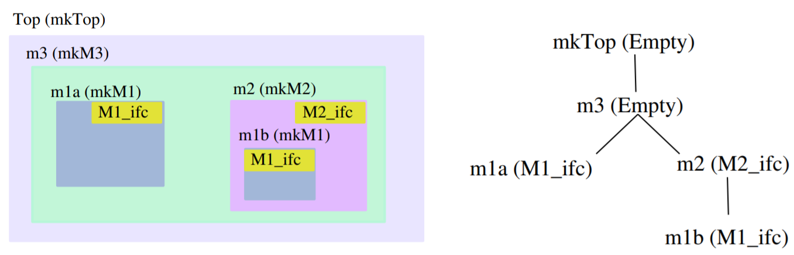 |
| :-----------------------------------------: |
|          **图6**：模块层次结构举例          |

### <span id="head78"> 接口定义语法</span>

接口定义的语法是：

```bsv
interface Ifc_Name;                           // Ifc_Name 是接口名（首字母大写）
   method int method1;                        // 定义一个值方法，返回 int 类型
   method Action method2(int x);              // 定义一个动作方法，接受参数 int x
   method ActionValue#(int) method3 (int x);  // 定义一个动作值方法，接受参数 int x ，返回 int 类型
   // 还可以嵌套其它 interface (详见7.7节)
endmodule
```

其中方法包括3种：

- **值方法 (Value method)** ：返回一个变量，不会改变被调用模块内的状态。一般用于获取模块数据（output）。
- **动作方法 (Action method) **：接受一个或多个变量作为参数，会改变调用模块内的状态。一般用于给模块输入数据（input）。
- **动作值方法 (ActionValue method)** ：接受一个或多个变量作为参数，会改变调用模块内的状态，也会返回一个变量。

### <span id="head79"> 模块定义语法</span>

模块定义的语法是：

```bsv
module mkModuleName (Ifc_Name);     // mkModule 是模块名（习惯上以 mk 开头）, Ifc_Name 是它的接口名
   // rules...                      // 实现一些 rule
   // method1 implementation        // 实现 Ifc_Name 中的方法1
   // method2 implementation        // 实现 Ifc_Name 中的方法2
   // method3 ...                   // 需要实现 Ifc_Name 中的所有方法
endmodule
```

这样，实例化一个模块并获得它的接口的语法是：

```bsv
Ifc_Name instance_name <- mkName;
```

其中接口可以是 Empty ，代表没有接口：

```bsv
module mkModuleName (Empty);
```

或者直接省略 `Empty` 关键字：

```bsv
module mkModuleName ();
```

模块定义还可以有参数 (parameter)，比如定义一个 `int` 类型的参数：

```bsv
module mkModuleName #(parameter int param_value) (Ifc_Name);
```

参数的用途是可以传入一些必须静态确定的硬件配置，比如一个计数器模块，可以用参数指定其内部计数变量的位宽，来决定计数的上限。在生成 Verilog 代码时， 参数也会转化成 Verilog 模块的参数，而不是 input/output 信号。

实例化以上带参数的模块时，使用以下语句，则传入的参数就是 10 。传入的参数必须是能静态确定下来的，比如常数。

```
Ifc_Name instance_name <- mkModuleName(10);
```


## <span id="head80">7.2 值方法与动作方法</span>

本节介绍**值方法**和**动作方法**的定义和调用方式。

### <span id="head81"> 值方法</span>

**值方法** (Value method) 能让调用者从被调用模块中获取数据。例如，寄存器的 `_read` 就是值方法。

值方法的实现内不能调用本模块内的子模块的动作方法和动作值方法，因为这会改变模块内的数据/状态（比如不能写寄存器和 Wire ），换句话说，无论你是否调用值方法，都不会对被调用模块当前和将来的执行轨迹造成影响。

值方法可以有隐式条件，如果隐式条件不满足，则调用它的规则不激活。

### <span id="head82"> 动作方法</span>

**动作方法** (Action method) 能让调用者通过参数把数据给被调用模块（也可以没有参数）。例如，寄存器的 `_write` 就是动作方法。动作方法不会返回数据给调用者。

动作方法可以有隐式条件，如果隐式条件不满足，则调用它的规则不激活。

下面是个最简单的例子，只是用来展示**值方法**和**动作方法**的语法：

```bsv
interface IfcTest;                  // 接口名 IfcTest
   method Action reset;             // 定义动作方法 reset (不带参数)
   method Action set(int value);    // 定义动作方法 set (带参数)
   method int get;                  // 定义值方法 get (不能带参数)
endinterface

module mkTest(IfcTest);             // 模块名 mkTest, 接口是 IfcTest
   Reg#(int) rg [2] <- mkCReg(2, 0);
   method Action reset;
      rg[1] <= 0;
   endmethod
   method Action set(int value);    // 实现动作方法 set
      rg[0] <= value + 2;
   endmethod
    method int get = rg[0] + 1;     // 实现值方法 get
endmodule

module mkTb();
   IfcTest test_module <- mkTest;   // 还可以写成 let test_module <- mkTest;
   rule r1;
      int x = test_module.get;      // 调用值方法 get
      test_module.set(x);           // 调用动作方法 set
   endrule
    rule r2;
      test_module.reset;            // 调用动作方法 reset
   endrule
endmodule
```

以上代码的值方法 `get` 还可以用如下函数风格的写法，用 `return` 返回数据，这种写法用在内部状态需要经历复杂计算才能返回的情况。

```bsv
method int get;
   // 其它语句 （不能调用子模块的动作方法或动作值方法）
   return rg + 1;
endmethod
```


### <span id="head83">e.g. 比特编码器 v1</span>

除了语法讲解外，笔者将用一个实用例子贯穿 7 、8 章 —— 编写一个**比特编码器**。比特编码器是无损编码，产生的输出码能无歧义地恢复为输入码。主要用来压缩一个频繁取较小值的数据流。它的功能要求如下：

- **输入码**：每周期可输入 8bit 数据 din ，或者也可以选择不输入（空闲）。
- 计算**长度码**：寻找 din 左起第一个 =1 的 bit ，用该 bit 所在的下标作为长度码 len。存在一种特例：
  - 当 din=8'h0 时，len=3'd0

- 计算**数据码**：取输入数据的低 len 个 bit 作为数据码 trim 。存在两种特例：
  - 当 din=8'h0 时，trim=1'b0 
  - 当 din=8'h1 时，trim=1'b1

- 拼接**生成码**：令 trim 在高位，len 在低位，进行拼接，得到生成码 code
- 更新**遗留码**，产生**输出数据**：把 code 拼接在上一周期的遗留码 drem 上，拼接后如果长度 >=16 ，就把低 16bit 作为输出码 dout 输出，drem 则删去这低 16bit 。

**表13**是个例子。输出码为空代表当前遗留码没有积攒够 16bit ，暂没有数据输出。

​			**表13**：比特编码器的行为举例。

| 输入码 din    | 长度码 len    | 数据码 trim           | 生成码 code             | 遗留码 drem        | 输出码 dout        |
| ------------- | ------------- | --------------------- | ----------------------- | ------------------ | ------------------ |
| **8bit 固定** | **3bit 固定** | **长度 1\~7bit 可变** | **长度 4\~10 bit 可变** | **长度可变**       | **16bit 固定**     |
| 'b11111111    | 7             | 7'b1111111            | 10'b1111111111          | 10'b1111111111     |                    |
| 'b10110011    | 7             | 7'b0110011            | 10'b0110011111          | 4'b0110            | 'b0111111111111111 |
| 'b01010111    | 6             | 6'b010111             | 9'b010111110            | 13'b0101111100110  |                    |
| 'b00011100    | 4             | 4'b1100               | 7'b1100100              | 4'b1100            | 'b1000101111100110 |
| 'b00001101    | 3             | 3'b101                | 6'b101011               | 10'b1010111100     |                    |
| 'b00000011    | 1             | 1'b1                  | 4'b1001                 | 14'b10011010111100 |                    |
| 'b00000010    | 1             | 1'b0                  | 4'b0001                 | 2'b00              | 'b0110011010111100 |
| 'b00000001    | 0             | 1'b1 **\***           | 4'b1000                 | 6'b100000          |                    |
| 'b00000000    | 0 **\***      | 1'b0 **\***           | 4'b0000                 | 10'b0000100000     |                    |

> :point_right:  **\*** 是特例

我们首先给出比特编码器的接口 `BitCoder` 的定义：

```bsv
// 代码路径：src/13.BitCoding/BitCoding_v1.bsv （部分）
interface BitCoder;
   method Action put(Bit#(8) data);    // 动作方法 put：输入 8 bit数据
   method Bool get_valid;              // 值方法 get_valid：获取输出是否有效
   method Bit#(16) get;                // 值方法 get：获取输出
endinterface
```

然后给出模块 `mkBitCoder` 的实现。首先编写一个函数 `getCode` （组合逻辑电路），用来获取 code 以及其长度。因为 code 最长是 10，所以用 `Bit#(10)` 存放 code ，用 `UInt#(4)` 存放 code 的长度。因为我们想返回这两个值，这里就用了二元组 `Tuple2#(Bit#(10), UInt#(4))` 类型作为返回值。

```bsv
// 代码路径：src/13.BitCoding/BitCoding_v1.bsv （部分）
function Tuple2#(Bit#(10), UInt#(4)) getCode(Bit#(8) din);
   // 计算长度码 len
   UInt#(4) len = 0;
   for(UInt#(4) i=0; i<8; i=i+1)
      if(din[i] == 1)
         len = i;
   
   // 计算数据码 trim 的长度
   UInt#(4) trim_len = len>0 ? len : 1;

   // 获取数据码 trim （保留 din 的低 trim_len 个 bit，其余高位置 0）
   Bit#(7) trim = truncate(din) & ~('1<<trim_len);

   // 获取生成码 code
   Bit#(10) code = {trim, pack(len)[2:0]};

   return tuple2( code, trim_len+3 );
endfunction
```

然后编写模块 `mkBitCoder` 的实现如下 :point_down:

```bsv
// 代码路径：src/13.BitCoding/BitCoding_v1.bsv （部分）
(* synthesize *)
module mkBitCoder (BitCoder);
   // 流水线第一级产生的数据，默认 code 和 code 的长度都是 0
   Reg#(Tuple2#(Bit#(10), UInt#(4))) in_code_and_len <- mkDReg( tuple2(0,0) );   // code 和 code 的长度
   
   // 流水线第二级产生的数据
   Reg#(Bit#(31)) drem       <- mkReg(0);        // 存放遗留码
   Reg#(UInt#(5)) drem_len   <- mkReg(0);        // 遗留码的长度
   Reg#(Bool)     dout_valid <- mkDReg(False);   // dout 是否有效
   Reg#(Bit#(16)) dout       <- mkReg(0);

   // 流水线第二级：更新遗留数据和输出数据
   rule get_drem_and_dout;
      match {.code, .code_len} = in_code_and_len;   // 当流水线上一级没有数据时，mkDReg 默认读到 0 
                                                    // 不会对本 rule 造成副作用

      Bit#(31) data = (extend(code) << drem_len) | drem;   // data = code 拼接 drem
      UInt#(5) len = extend(code_len) + drem_len;

      if(len >= 16) begin                   // 如果总长度 >= 16 ，说明攒够了，可以输出一次
         dout_valid <= True;                //   输出有效
         dout <= truncate(data);            //   输出数据取低 16 bit
         data = data >> 16;                 //   高于 16 位的 bit 作为遗留数据
         len = len - 16;                    //   遗留数据长度-16， 因为有 16 bit 输出了
      end

      drem <= data;                         // 保存遗留数据，供下次使用
      drem_len <= len;                      // 保存遗留数据长度，供下次使用
   endrule

   // 流水线第一级：获取 code 以及其长度
   method Action put(Bit#(8) din);          // 动作方法：输入 din 时调用此方法
      in_code_and_len <= getCode(din);      // 计算 code 和 code 的长度
   endmethod

   method Bool get_valid = dout_valid;      // 值方法
   method Bit#(16) get = dout;              // 值方法
endmodule
```

以上设计使用了两级流水线，几个关键点如下：

- 流水线第一级实现在 `put` 方法中，负责调用 `getCode` 函数计算 code 和 code 的长度。
- 流水线第一级使用名为 `in_code_and_len` 、默认值为 `tuple2(0,0)` 的 `mkDReg` 向第二级传递一项数据，只有当 `put` 方法执行的下一个周期， `in_code_and_len` 才能读到非零的 code 和 code 的长度。
- 流水线第二级使用名为 `dout_valid` 、默认值为 `False` 的 `mkDReg` 传递输出有效信号，只有当有足够的 16bit 需要输出时，才让 `dout_valid=True` 。
- 输出级用 `get_valid` 方法引出 `dout_valid` 的值；用 `get` 方法引出 `dout` 的值。

最后，编写 testbench （测试程序）如下 :point_down: ，它实例化了模块 `mkBitCoder` ，实例名为 `coder` 。它调用 `coder.put` 方法依次输入 `8'h0` \~ `8'hFF` ，一共输入两轮。并在 `coder.get_valid = True` 时打印 `coder.get` 方法的值。

```bsv
// 代码路径：src/13.BitCoding/BitCoding_v1.bsv （部分）
module mkTb();
   Reg#(int) cnt <- mkReg(0);
   rule up_counter;
      cnt <= cnt + 1;
   endrule

   Reg#(Bit#(10)) din <- mkReg(0);
   let coder <- mkBitCoder;

   rule coder_put;
      din <= din + 1;                  // din 每增长一次
      if(din < 'h200)
         coder.put( truncate(din) );   // 就把它输入 coder
      else if(din == '1)
         $finish;
   endrule

   rule coder_get (coder.get_valid);   // 只在 coder.get_valid 有效的周期打印输出
      $display("cnt=%4d   %b", cnt, coder.get);    // 打印时钟周期数和输出
   endrule
endmodule
```

以上 testbench 仿真打印的结果不做赘述，读者可自行检查。我们发现打印完最后一个输出数据是在第 514 个时钟周期，这是因为 512 个周期输入数据 + 2周期的流水线延迟。


## <span id="head84">7.3 方法的隐式条件</span>

### <span id="head85"> 值方法的隐式条件</span>

可以给方法加上隐式条件，让调用它的规则在隐式条件不满足时不能激活。

### <span id="head86">e.g. 比特编码器 v2</span>

在**比特编码器**的例子中，显然我们可以把 `get_valid` 方法作为 `get` 方法的隐式条件，这样还可以省略 `get_valid` 方法。我们在接口定义中删掉 `get_valid` 方法的定义。然后把 `mkBitCoder` 中的 `get` 方法实现改成如下。

```bsv
// 代码路径：src/13.BitCoding/BitCoding_v2.bsv （部分）
   method Bit#(16) get if(dout_valid) = dout;   // 值方法，隐式条件为 dout_valid=True
```

以上带隐式条件的值方法也可以写成：

```bsv
   method Bit#(16) get if(dout_valid);          // 另一种写法
       return dout;
   endmethod
```

然后，在 `mkTb` （testbench）中，可以把调用 coder.get 的规则的显式条件删掉：

```bsv
   rule coder_get;
      $display("cnt=%4d   %b", cnt, coder.get);  // 只在 coder.get_valid 有效周期打印输出
                                                 // 因为 coder.get 具有隐式条件，隐式条件不满足时不会打印
   endrule
```

如此修改后，不影响仿真效果，且代码更简洁。

方法的隐式条件还会随着调用层次而传递——如果一个方法的实现中调用了一个具有隐式条件的方法，则该隐式条件也会成为该方法的隐式条件。

### <span id="head87"> 动作方法的隐式条件</span>

动作方法 (Action Method) 也可以有隐式条件，格式如下：

```bsv
   method Action 方法名(...) if(隐式条件表达式);
      // 语句...
   endmethod
```

### <span id="head88">e.g. 比特编码器 v3</span>

**比特编码器**的动作方法 put 目前还没有添加隐式条件的动机，因为显然 `mkBitCoder`  内部没有拒绝一个新输入的 din 的理由，如果强行构造一个隐式条件来举例那也太傻了。为此，~~甲方爸爸~~稍稍修改功能要求，要求输出码 dout 从 16bit 改成了 8bit 。在这种情况下， 考虑到 code 的宽度可能大于 8bit ，可能导致 drem 越堆积越多，最终溢出可承载的量（我们设计的承载量是 31bit）。为此，我们可以给 put 方法加上隐式条件，隐式条件不满足代表 “drem 要溢出了，不要再输入了” 。这种机制叫做**反压** (back-pressure) ——流水线后级因为一些原因，阻止前级继续向后传递数据。

修改功能要求后，我们先把 dout 相关的变量、接口类型都改成 `Bit#(8)` （步骤省略）。然后修改规则 `get_drem_and_dout` （第二级流水线）的代码，让每周期只取拼接后的低 8bit 作为输出：

```bsv
// 代码路径：src/13.BitCoding/BitCoding_v3.bsv （部分）
   rule get_drem_and_dout;                  // 流水线第二级：更新遗留数据和输出数据
      match {.code, .code_len} = in_code_and_len;

      Bit#(31) data = (extend(code) << drem_len) | drem;   // data = code 拼接 drem
      UInt#(5) len = extend(code_len) + drem_len;

      if(len >= 8) begin                    // 如果总长度 >= 8 ，说明攒够了，可以输出一次
         dout_valid <= True;                //   输出有效
         dout <= truncate(data);            //   输出数据取低 8 bit
         data = data >> 8;                  //   高于 8 位的 bit 作为遗留数据
         len = len - 8;                     //   遗留数据长度-8, 因为有 8 bit 输出了
      end

      drem <= data;                         // 保存遗留数据，供下次使用
      drem_len <= len;                      // 保存遗留数据长度，供下次使用
   endrule
```

然后，给 put 方法加入隐式条件如下：

```bsv
// 代码路径：src/13.BitCoding/BitCoding_v3.bsv （部分）
   method Action put(Bit#(8) din) if(drem_len <= 19); // 隐式条件保证下一周期 drem 拼接后的长度不会溢出（大于31）
      in_code_and_len <= getCode(din);
   endmethod
```

这里我添加的条件是 `drem<=19` ，理由分析可见下图，这是某个时钟周期的视角下两级流水线的状态，是离溢出最近的状态，第二级内含有 `drem_len` 个 bit，并且有 10bit （最长情况下的 code ）正在传来，考虑到它还能输出 8bit ，因此下周期时 `drem_len_next = drem_len+2` 。如果要让下周期拼接后的 data 不溢出容量（31bit），应该有 `drem_len+2+10 <= 31` ，即 `drem<=19` ，作为本周期 `put` 方法的条件。

```
       |-----------------------|              |--------------------------|
       |                       |  (传递10bit)  |   drem容量：31bit         |
put--->| 如果put，最多产生10bit  |------------->| 当前含有 drem_len 个 bit   |---> dout 
       |                       |              |                          |    (可输出8bit)
       |-----------------------|              |--------------------------|
               流水线第一级                               流水线第二级
  图：为了防止溢出，分析 put 的隐式条件如何设置，结论是：流水线第一级应该在条件 drem<=19 满足时才能执行
```

如果把 put 方法的条件改成 `drem_len<=20` 就会发现仿真结果不正确。如果改成 `drem_len<=18` 之类更小的数，就不会获得最高性能。

读者可自行运行 `src/13.BitCoding/BitCoding_v3.bsv` 看结果。我们会发现运行总时间增加到了 593 周期，这是因为 dout 修改为 8bit 位宽后构成了性能瓶颈。


## <span id="head89">7.4 动作值方法</span>

**动作值方法** (ActionValue Method) 既允许向模块传入参数作为数据（也可以不带参数）、修改被调用模块的状态，又允许获取模块内的状态/数据。

动作值方法可以有隐式条件，如果隐式条件不满足，则调用它的规则不激活。

实现一个动作值方法的语法如下：

```bsv
   method ActionValue#(返回值类型) method_name(参数...) if(隐式条件);
      // 语句（可以调用子模块的动作方法或动作值方法
      return 返回值;
   endmethod
```

调用一个动作值方法时，必须用**副作用赋值**符号 `<-` 获得其返回值：

```bsv
返回值类型 变量名 <- module_instance.method_name(提供参数...);
// 如果返回值不是多态接口，可以用 let 变量名 <- module_instance.method_name(提供参数...);
```

**动作值方法**可以认为是一个**动作方法**和一个**值方法**的组合，但是一旦封装成一个动作值方法，就意味着二者变成了原子操作，无法在不执行动作时获取返回值。因此，动作值方法固然能简化代码，但需要考虑好是否需要在一些情况下不执行动作，只想得到返回值，如果有，就不要定义动作值方法，而是用一个动作方法和一个值方法代替。（第 8 章中我们会看到， FIFO 的 deq 方法 和 first 方法不合成一个动作值方法，就是因为有这种考量）。

### <span id="head90">e.g. 比特编码器 v4</span>

下面，为了让动作值方法有意义，~~甲方爸爸~~再次修改比特编码器的功能要求：调用者不再随时能接受 `get` 方法输出的 dout，而是要在不能接受 dout 时，数据能积压在模块内，等下次调用 `get` 时才拿出积压的数据。我们发现，这又构成了另一个**反压** (back-pressure) 因素——**输出反压**：如果不积极地调用 `get` 方法，那么由于数据积压，流水线前级不再能向后传递。

在这种要求下， `get` 方法不再能是一个**值方法**，而必须是一个**动作值方法**，因为 get 的调用会影响模块内状态的变化。

首先，我们把 get 方法的定义改成 ActionValue ：

```bsv
// 代码路径：src/13.BitCoding/BitCoding_v4.bsv （部分）
interface BitCoder;
   method Action  put(Bit#(8) din);    // 动作方法：输入 8 bit数据
   method ActionValue#(Bit#(8)) get;   // 动作值方法：获取 dout
endinterface
```

然后，编写模块实现：

```bsv
// 代码路径：src/13.BitCoding/BitCoding_v4.bsv （部分）
module mkBitCoder (BitCoder);
   // 流水线第一级产生的数据，默认 code 和 code 的长度都是 0
   Reg#(Tuple2#(Bit#(10), UInt#(4))) in_code_and_len <- mkReg( tuple2(0,0) );   // code 和 code 的长度
   Reg#(Bool)    din_valid  <- mkReg(False);    // 指示 in_code_and_len 是否有效
   
   // 流水线第二级产生的数据
   Reg#(Bit#(31)) drem      <- mkReg(0);        // 存放遗留码
   Reg#(UInt#(6)) drem_len  <- mkReg(0);        // 遗留码的长度
   Reg#(Bool)     dout_valid<- mkReg(False);    // 指示 dout 是否有效
   Reg#(Bit#(8))  dout      <- mkReg(0);

   (* conflict_free = "put, get_drem_and_dout" *)

   // 流水线第二级：更新遗留数据和输出数据
   rule get_drem_and_dout (!dout_valid);
      Bit#(31) data = drem;                  // 拿到遗留数据
      UInt#(6) len = drem_len;               // 拿到遗留数据长度

      match {.code, .code_len} = in_code_and_len;

      if(extend(code_len) + drem_len < 32 && din_valid) begin// 只有当不会导致溢出，且 din 有效时
         data = (extend(code) << drem_len) | data;           //    才拿出流水线第一级的 code
         len = extend(code_len) + len;                       //    才拿出流水线第一级的 code_len
         din_valid <= False;                                 //    把 din_valid 置为无效（因为已经决定拿出数据了）
      end

      if(len >= 8) begin                    // 如果总长度 >= 8 ，说明攒够了，可以输出一次
         dout_valid <= True;                //   把输出数据置有效
         dout <= truncate(data);            //   输出数据取低 8 bit
         data = data >> 8;                  //   高于 8 位的 bit 作为遗留数据
         len = len - 8;                     //   遗留数据长度-8, 因为有 8 bit 输出了
      end

      drem <= data;                         // 保存遗留数据，供下次使用
      drem_len <= len;                      // 保存遗留数据长度，供下次使用
   endrule

   // 流水线第一级：获取 code 以及其长度
   method Action put(Bit#(8) din) if(!din_valid);   // 隐式条件保证下一周期 drem 的长度不会溢出
      din_valid <= True; 
      in_code_and_len <= getCode(din);              // 计算 code 和 code 的长度
   endmethod

   method ActionValue#(Bit#(8)) get if(dout_valid);   // 隐式条件：输出数据置有效
      dout_valid <= False;                            // 把输出数据置无效（因为已经决定拿出数据了）
      return dout;
   endmethod
endmodule
```

以上代码中，在流水线第一级和第二级之间添加了一个有效信号寄存器 `din_valid` ，当 `din_valid` 无效时，说明当前 `in_code_and_len` 上没有有效数据，所以允许外界输入一项数据，因此 put 方法的隐式条件设置为 `!din_valid` 。当 `din_valid` 有效时，说明当前 `in_code_and_len` 上有数据，那么就要等待流水线第二级（规则 `get_drem_and_dout`）把数据拿走，同时把 `din_valid` 置无效。

这里使用了一种很具有 BSV 特色的写法——在方法 `put` 和规则 `get_drem_and_dout` 里都写了寄存器  `din_valid` 。虽然二者能同时激活，但由于发生冲突的语句在 if 条件的控制下并不会在同一周期执行，所以用 `conflict_free` 调度属性来避免它们之间的激活抑制：

```
(* conflict_free = "put, get_drem_and_dout" *)
```

同理，流水线第二级到输出级的数据传输也使用有效信号寄存器 `dout_valid`来控制。方法 `get` 和规则 `get_drem_and_dout` 里都写了寄存器 `dout_valid` ，这里不用加入调度属性的原因是编译器会自动判断出来它们是互斥的。

如此编写的代码能在 `get` 方法不被调用的时候堆积数据，这是一个连锁反应，会可能会一直影响到流水线第一级：

- 因为外部不调用 `get` 方法，则 `dout_valid` 不被恢复为 `False` ，规则 `get_drem_and_dout` 就不再会被激活，不再产生新数据。
- 因为规则 `get_drem_and_dout` 不激活，则 `din_valid` 也不能恢复为 `False` ，`put` 方法的隐式条件就不再满足，不再允许输入新数据。

最后，修改 testbench ，给规则 `coder_get` 加上显式条件，让它不是每周期都允许执行 `coder.get` ，此时 `coder` 中的数据会堆积，以此来验证功能的正确性。

```bsv
// 代码路径：src/13.BitCoding/BitCoding_v4.bsv （部分）
   rule coder_get (cnt%2 == 0);   // 因为 coder 中能积攒数据，所以可以添加条件
                                  // 来让一些周期不读取 dout ，也不会导致数据丢失
      let dout <- coder.get;
      $display("cnt=%4d   %b", cnt, dout);
   endrule
```

仿真打印的结果不在这里展示，读者可自行运行 `src/13.BitCoding/BitCoding_v4.bsv` 看结果。

我们发现，即使当规则 `coder_get` 不具有显式条件时，运行的总时间也足足增加到了 1167 周期，性能相比之前的版本大大降低了！这是因为本例的各级流水线是交替执行的，例如方法 `get` 和规则 `get_drem_and_dout` 跟随着寄存器 `dout_valid` 的翻转而交替执行。不像先前的流水线各级是可能并发执行的。

如果要在支持**输出反压**的要求下，同时支持高并发的流水线，目前仅靠我们学过的模块（Reg 和 Wire）写起来不太简洁。等第 8 章学习队列 (FIFO) 时，再给出一个优雅的实现。


## <span id="head91">7.5 方法实现的简写</span>

第 7.5 \~ 7.8 节讲解如何优雅地定义接口和实现方法。

设：

- moduleA 的接口是 IfcA，内有一个方法 methodA
- moduleB 的接口是 IfcB，内有一个方法 methodB
- methodA 和 methodB 的定义完全相同。也即参数列表和返回值类型完全相同。
- moduleA 内有子模块 moduleB

如果你要求调用 methodA 就等效于调用 methodB （包括继承 methodB 的隐式条件），那么 methodA 的实现可以简写为：

```bsv
method methodA = methodB;       // 简写
```

而没必要按照最常见的完整写法来写：

```bsv
method Action methodA(int x);   // 不是简写
   moduleB_instance.methodB(x);
endmethod
```

### <span id="head92">e.g. 自增寄存器 v1</span>

举个例子，我们编写一种自增寄存器 `mkIncreaseReg` ：

* 它保存一个 int 类型的数据
* 它就像寄存器一样能被读和写
* 在不被写的周期，寄存器的值自动 +1

第一版实现如下（仿真结果不是重点，不展示，可自行去跑仿真）

```bsv
// 代码路径：src/14.IncreaseReg/IncreaseReg_v1.bsv （部分）
interface IncreaseReg;                 // 自增计数器的接口
   method Action write(int x);
   method int read;
endinterface

(* synthesize *)
module mkIncreaseReg (IncreaseReg);    // 自增计数器的接口

   Reg#(int) reg_data <- mkReg(0);

   (* preempts = "write, increase" *)  // write方法调用时，不允许寄存器自动+1
   rule increase;
      reg_data <= reg_data + 1;
   endrule

   method write = reg_data._write;     // 动作方法 // 简写
   method read  = reg_data._read;      // 值方法   // 简写
endmodule
```

其中 write 和 read 方法的实现都是简写。实际上这得益于 BSV 中 **万物皆变量或类型**，比如对于 `method write  = reg_data._write;` 它只是把一个 `Action write(int x)` 类型的变量赋值给了另一个。

不简写则如下，也即我们熟悉的类似“函数定义”的风格：

```bsv
   method Action write(int x);
      reg_data <= x;
   endmethod

   method int read;
      return reg_data;
   endmethod
   // 或：
   //method int read = reg_data;   // 这个不算简写，虽然也很方便
```


## <span id="head93">7.6 使用现成的接口</span>

自定义模块时，没必要对每个模块都新定义一个接口，在接口方法类似，且不影响人理解的情况下，可以重用 BSV 预定义的接口，例如我们已经学过的 `Reg#(type a)` 和 `Wire#(type a)` 接口。

### <span id="head94">e.g. 自增寄存器 v2</span>

对于上一节的自增寄存器 `mkIncreaseReg` ，因为读写行为和 BSV 预定义的接口 `Reg#(int)` 类似，所以我们没必要新定义接口类型 `IncreaseReg` ，而是直接借用 `Reg#(int) ` 作为它的接口。

修改代码如下：

```bsv
// 代码路径：src/14.IncreaseReg/IncreaseReg_v2.bsv （部分）
module mkIncreaseReg (Reg#(int));     // 接口为 Reg#(int)

   Reg#(int) reg_data <- mkReg(0);

   (* preempts = "_write, increase" *)   // _write 是 mkIncreaseReg 的一个方法名
                                         // 因为 mkIncreaseReg 的接口是 Reg#(int)
   rule increase;
      reg_data <= reg_data + 1;
   endrule

   return reg_data;       // 接口的简短实现：直接把子模块实例的接口名 reg_data 作为 mkIncreaseReg 的接口返回
endmodule
```

我们知道接口 `Reg#(int)` 有两个方法：

-  `method Action _write(int x)` 

-  `method int _read` 

我们本可以直接用上一节的写法实现它们：

```bsv
   method _write = reg_data._write;
   method _read  = reg_data._read;
```

但这里采用了更简便的写法：

```bsv
   return reg_data;
```

理由是： `reg_data` 本身就是 `mkReg(0)` 的接口实例，类型为 `Reg#(int)` 。那么对于同样具有接口类型为 `Reg#(int)` 的模块 `mkIncreaseReg` ，这里直接返回接口名 `reg_data` 作为 `mkIncreaseReg` 的接口，是没问题的。

在调用时，直接用 `Reg#(int)` 来接受 `mkIncreaseReg` 实例化后的接口：

```bsv
   Reg#(int) inc_reg <- mkIncreaseReg;
```

`inc_reg` 用起来就和普通的寄存器一样，可以使用写入符号 `<=` 作为 `_write` 方法的简写；用接口名本身作为 `_read` 方法的简写。


## <span id="head95">7.7 接口嵌套</span>

接口的定义里可以嵌套其它接口。

### <span id="head96">e.g. 可配置自增寄存器 v1</span>

例如，编写一个可配置自增步数的自增寄存器 `mkIncreaseRegCfg` ，要求它具有两个寄存器接口：

- 接口 `Reg#(int) data` 用来读写数据。在不写入的周期，该数据会自增。
- 接口 `Reg#(int) step` 用来读写自增步数。

定义接口 `IncreaseRegCfg` 如下，它嵌套了两个  `Reg#(int) val`  接口：

```bsv
// 代码路径：src/14.IncreaseReg/IncreaseRegCfg_v1.bsv （部分）
interface IncreaseRegCfg;
   interface Reg#(int) data;    // 嵌套了一个 Reg#(int) 子接口
   interface Reg#(int) step;    // 嵌套了一个 Reg#(int) 子接口
   // 还允许同时定义方法 method ...
endinterface
```

`mkIncreaseRegCfg`  实现如下：

```bsv
// 代码路径：src/14.IncreaseReg/IncreaseRegCfg_v1.bsv （部分）
module mkIncreaseRegCfg (IncreaseRegCfg);
   Reg#(int) reg_data <- mkReg(0);      // 用来保存数据值的寄存器
   Reg#(int) reg_step <- mkReg(1);      // 用来配置步数的寄存器

   (* preempts = "data._write, increase" *)  // data 是子接口名, data._write 是子接口下的方法
   rule increase;
      reg_data <= reg_data + reg_step;
   endrule

   interface data = reg_data;   // 直接把子模块实例的接口名 reg_data 作为 子接口 data
   interface step = reg_step;   // 直接把子模块实例的接口名 reg_step 作为 子接口 step
endmodule
```

如果你有在方法里实现更复杂行为的需求，想要把子接口中的方法展开实现，当然也是可以的，请用接口表达式 `interface  ... endinterface` ，在其中编写它的方法的实现。比如，以上代码的 `interface data = reg_data;` 可以展开写成：

```bsv
   // interface val  = value; 展开写：
   interface data = interface Reg#(int);
      method Action _write(int x);       // 方法 _write 展开写了
         reg_data <= x;
      endmethod
      method _read = reg_data._read;     // 方法 _read 用了 7.5 节的简写
   endinterface;                         // 注意，因为是接口表达式，最后要加 ;
```

在调用时，需要用  `接口名.子接口名.方法` 这样的方式。比如：

```bsv
    // 对于 let inc_reg <- mkIncreaseRegCfg;
    inc_reg.step <= 2;                // 相当于 inc_reg.step._write(2)
    $display("%d", inc_reg.data);     // 相当于 $display("%d", inc_reg.data._read);
```


## <span id="head97">7.8 用元组返回多个接口</span>

上一节中，为了让 `mkIncreaseRegCfg`  具有两个 `Reg#(int)` 接口，我们定义了新的嵌套接口 `IncreaseRegCfg` 。那么有没有办法不定义新的接口，来让一个模块具有多个现成的接口的组合呢？有！你可以用复合数据类型，比如接口数组、接口结构体、接口元组：

- **接口数组**适合用在想要多个相同类型的接口时。6.5 节讲过的并发寄存器 `mkCReg` 就会返回一个 `Reg#()` 接口数组。本文就不讲解了，在阅读 9.1 节后，读者可自行领悟。
- **接口结构体**用起来并不比嵌套接口方便，用之前还需要定义结构体，调用时也是 `结构体名.子接口名.方法` 这种方式。本文也不讲。

- **接口元组**适合用在想要多个接口时（相同、不同类型的接口都行）。因为元组允许每个元素的类型不同。强烈推荐！

### <span id="head98">e.g. 可配置自增寄存器 v2</span>

将 `mkIncreaseRegCfg`  的接口改为接口二元组 `Tuple2#(Reg#(int), Reg#(int))` ，代码如下：

```bsv
// 代码路径：src/14.IncreaseReg/IncreaseRegCfg_v2.bsv （部分）
module mkIncreaseRegCfg ( Tuple2#(Reg#(int), Reg#(int)) ); // 该模块的接口是元组，包括两个 Reg#(int) 接口
   Reg#(int) reg_data <- mkReg(0);
   Reg#(int) reg_step <- mkReg(1); 

   (* preempts = "fst._write, increase" *)   // fst 代表元组第一个元素（也就是自增计数器寄存器的接口）
                                             // fst._write 自然就代表自增计数器的 _write 方法。
   rule increase;
      reg_data <= reg_data + reg_step;
   endrule

   return tuple2(reg_data, reg_step);    // 构造一个二元组 ，第一个元素是子模块实例的接口名 reg_data
                                         //                第二个元素是子模块实例的接口名 reg_step
endmodule
```

在实例化 `mkIncreaseRegCfg` 时，可以用元组的 match 语句来获得两个接口。

```bsv
match {.inc_reg_data, .inc_reg_step} <- mkIncreaseRegCfg; // 得到 inc_reg_data 是 Reg#(int) 类型的接口
                                                          // 得到 inc_reg_step 也是 Reg#(int) 类型的接口
// 然后 inc_reg_data 和 inc_reg_step 用起来就和普通的寄存器 一样。
```


## <span id="head99">7.9 动作函数</span>

**动作函数** (Action Function) 就像**动作方法** (Action Method) 一样，内部可以包含多个子模块的方法。但是它只被本模块所调用，不能被其它模块调用。动作函数用来把一些常用的语句组合打包，来达到一次定义、多次调用的目的。

函数 (Function) 中不能包含子模块的动作方法、也不能包含其它动作函数，但具有返回值；动作函数 (Action Function) 中能包含子模块的动作方法，也能包含其它动作函数，但没有返回值（实际上它的返回值是一个 Action 类型）。因此，函数就像 Verilog 中的 function ; 而动作函数就像 Verilog 中的 task 。

举例如下。当规则 `r1` 和 `r2` 中出现相同的、比较复杂的语句时，可以把它们打包成一个动作函数，来降低代码量，提高可维护性。

```bsv
module mkTb (Empty);
   Reg#(int) x <- mkReg (0);
   Reg#(int) y <- mkReg (0);

   function Action incr_both (int dx, int dy);   // 定义一个动作函数
      return action                              // 注意语法，action...endaction 作为一个整体被返回
         x <= x + dx;                            // 可以包含子模块的动作方法。
         y <= y + dy;
      endaction;                                 // 注意：因为 return 是个语句，所以最后要加 ;
   endfunction

   rule r1 (x <= y);
      incr_both(5, 1);                         // 调用动作函数。
      $display ("r1: x=%d  y=%d", x, y);
      if (x > 10) $finish;
   endrule

   rule r2 (x > y);
      incr_both(1, 4);                         // 调用动作函数。
      $display ("r2: x=%d  y=%d", x, y);
   endrule
endmodule
```


# <span id="head100">8 存储与队列</span>

本章学习除了寄存器和 Wire 以外最常用的一系列模块：

- 片内存储器 (BRAM)：暂存几百Byte ~ 几十MByte 级别的数据（在通常的 FPGA 内）

- 先入先出队列 (FIFO) ，可压入 (enq) 数据，也可以获取(first)和弹出(deq)其中最旧(最早压入)的数据。可以用来：
- 小容量 FIFO：用来构建具有反压 (back-pressure) 或停顿 (stall) 能力的弹性流水线电路，**非常实用！！**
- 大容量 FIFO：即 BRAMFIFO ，在输入和输出节奏不一致时，用来堆积大量数据。


## <span id="head101">8.1 BRAMCore</span>

BRAMCore 包提供了 “裸 BRAM”，不提供读缓存队列、写响应队列等复杂功能，它的读方法、写方法也没有任何隐式条件。

BRAMCore 包生成的 Verilog 代码会自动适配 Xilinx 和 Altera 各种型号的 FPGA，保证底层使用的是 BRAM 。

在使用前需要引入：

```bsv
import BRAMCore::*;
```

### <span id="head102"> 接口定义</span>

对于单口 RAM，BRAMCore 包提供了一个基础的单口存储器接口 `BRAM_PORT` ：

```bsv
interface BRAM_PORT#(type addr, type data);   // 单口 RAM 接口
   method Action put(Bool write, addr address, data datain);   //每周期只允许操作一次，每次操作要么是写，要么是读
   method data read();                                         // 获取读出的数据
endinterface
```

对于双口 RAM，提供了一个嵌套接口 `BRAM_DUAL_PORT` ，它嵌套了两个单口 `BRAM_PORT` ：

```bsv
interface BRAM_DUAL_PORT#(type addr, type data);   // 双口 RAM 接口
   interface BRAM_PORT#(addr, data) a;      // A口，是个单口 RAM 接口
   interface BRAM_PORT#(addr, data) b;      // B口，是个单口 RAM 接口
endinterface
```

### <span id="head103"> 模块定义</span>

BRAMCore 包提供了 `mkBRAMCore1` 模块用来创建单口 RAM， `mkBRAMCore2` 模块用来创建双口 RAM 。它们的定义是：

```bsv
// 单口 RAM 
module mkBRAMCore1#(Integer memSize, Bool hasOutputRegister) (BRAM_PORT#(addr, data))

// 双口 RAM 
module mkBRAMCore2#(Integer memSize, Bool hasOutputRegister) (BRAM_DUAL_PORT#(addr, data))
```

其中，参数 `memSize` 指定了 BRAM 的大小， `hasOutputRegister` 决定了读出的数据是否额外经过一个寄存器：

- `hasOutputRegister = False` ： 读数据不经过寄存器，读延迟=1（即从调用 put 到 read 上产生读出数据需要经过1个周期）
- `hasOutputRegister = True` ： 读数据经过一个寄存器，读延迟=2

### <span id="head104"> 示例</span>

以下语句实例化一个单口 RAM 和一个 双口 RAM ：

```bsv
BRAM_PORT#(Bit#(12), UInt#(40)) ram1 <- mkBRAMCore1(4096, True);  // 地址类型为 Bit#(12),数据类型为 UInt#(40)
                                                                  // 容量为 4096 个数据，读数据经过寄存器
BRAM_DUAL_PORT#(Bit#(15), int) ram2 <- mkBRAMCore2(10000, False); // 地址类型为 Bit#(15),数据类型为 int
                                                                  // 容量为 10000个数据，读数据不经过寄存器
```

对于单口的 ram1 ，调用 put 方法来进行读写操作：

```bsv
ram1.put(True , 1234, 114514);       // 写操作，地址 1234，写入 114514
ram1.put(False, 4000, 0);            // 读操作，地址 4000, datain 参数无所谓
```

考虑到 ram1 读数据经过寄存器，在调用读操作的两个时钟周期后再调用 read 方法，才能保证拿出正确的读数据：

```bsv
UInt#(40) rdata = ram1.read;
```

对于双口的 ram2 ，以下语句可以分别从 A口 和 B口 读写它：

```bsv
ram2.a.put(True , 1234, 114514);       // A口写操作，地址 1234，写入 114514
ram2.b.put(False, 4000, 0);            // B口读操作，地址 4000, datain 参数无所谓
```

考虑到 ram2 读数据不经过寄存器，在 B口调用读操作的一个时钟周期后再调用 b.read 方法，才能保证拿出正确的读数据：

```bsv
int rdata = ram2.b.read;
```

>  :pushpin: ram2 的地址类型是 Bit#(15) ，可访存空间为 0\~32767 。然而它的容量为 10000 ，也就是只有地址 0\~9999 是有效的。

BRAMCore 的 put 和 read 方法都不具有隐式条件。

注意：调用者必须掌握好读操作和拿出读数据的时间差：

- 对于 `hasOutputRegister=False` ，时间差为1周期
- 对于 `hasOutputRegister=True` ，时间差为2周期

时间差不能早也不能晚，否则不保证读到正确数据。

### <span id="head105"> 用文件载入初始化数据（仅仿真）</span>

mkBRAMCore1Load 和 mkBRAMCore2Load 模块在仿真开始时用一个文本文件作为自身的初始数据。它们多出了两个参数：

```bsv
// 单口 RAM , 载入文件作为初始数据
module mkBRAMCore1Load#(Integer memSize, Bool hasOutputRegister, String file, Bool binary )
   (BRAM_PORT#(addr, data))
   
// 双口 RAM ，载入文件作为初始数据
module mkBRAMCore2Load#(Integer memSize, Bool hasOutputRegister, String file, Bool binary )
   (BRAM_DUAL_PORT#(addr, data))
```

其中 `String file` 是文本文件名字符串，是相对于 .bsv 源码文件所在的路径。例如：

- 文本文件 data.txt 与 .bsv 文件在同一个目录下，那么 `String file` 应该取 `"data.txt"` 
- 文本文件 hello.txt 在 .bsv 文件所在的目录下的 test 目录下，那么 `String file` 应该取 `"test/hello.txt"`

`Bool binary=True` 代表文件由二进制数组成。以下是一个二进制文本文件内容的示例，每行一项数据，载入后，每项数据会占用 BRAM 的一个地址。

```
01011011
11110001
00011010
```

`Bool binary=False` 代表文件由十六进制组成。以下是一个十六进制文本文件的示例，每行一项数据，载入后，每项数据会占用 BRAM 的一个地址。

```
DEAD
BEEF
482F
1234
5694
```

BSV 生成的 Verilog 代码中，它们会分别使用的是 `$readmemb()` 和 `$readmemh()` 函数来载入文本文件。


## <span id="head106">8.2 BRAM</span>

BRAM 包提供了读缓存队列等功能，比 BRAMCore 用起来更方便。

BRAM 包生成的 Verilog 代码会自动适配 Xilinx 和 Altera 各种型号的 FPGA，保证底层使用的是 BRAM 。

使用前需要引入：

```bsv
import BRAM::*;
```

### <span id="head107">配置结构体 BRAM_Configure</span>

实例化 BRAM 时需要用到结构体类型 `BRAM_Configure` （目前还没学结构体，但不影响理解），该结构体包含以下字段：

```bsv
typedef struct {
   Integer    memorySize;               // 存储器容量。当取0时，存储器容量 = 2^地址的位宽
   LoadFormat loadFormat;               // 仿真初值数据，取 None,
                                        //             或 tagged Hex "文件名"
                                        //             或 tagged Binary "文件名"
   Integer    latency;                  // 读数据和写响应的延迟，只能取 1 或 2
   Integer    outFIFODepth;             // 读数据和写响应的缓存的大小，推荐取 latency+2
   Bool       allowWriteResponseBypass; // 是否允许写响应绕过之前的读数据，通常使用 False
} BRAM_Configure;
```

它还提供了一个常用的默认配置 `defaultValue` ，它是该结构体类型的一个变量：

```bsv
defaultValue = BRAM_Configure {
   memorySize   : 0,      // 存储器容量 = 2^地址的位宽
   loadFormat   : None,   // 不使用文件设置初始数据
   latency      : 1,      // 读数据和写响应延迟=1
   outFIFODepth : 3,
   allowWriteResponseBypass : False  };
```

### <span id="head108">读写操作结构体 BRAMRequest</span>

向 BRAM 发起一个读写操作时，需要用到另一个结构体类型 `BRAMRequest` ，包含以下字段：

```bsv
typedef struct {
   Bool write;              // True:写   False:读
   Bool responseOnWrite;    // 如果是写操作，是否允许写响应
   addr address;            // 地址
   data datain;             // 写数据（读时忽略）
} BRAMRequest#(type addr, type data) deriving(Bits, Eq);
```

### <span id="head109"> 接口定义</span>

单口 RAM 和双口 RAM 的接口分别如下：

```bsv
// 单口 RAM 接口（只有A口）
interface BRAM1Port#(type taddr, type tdata);  // taddr 是地址类型， tdata 是每项数据的类型
   interface BRAMServer#(taddr, tdata) portA;  // BRAMServer接口，用来发起读写操作、获得读数据和写响应
   method Action portAClear;                   // 用来清除读数据和写响应的缓存
endinterface

// 双口 RAM 接口（有A口 和 B口）
interface BRAM2Port#(type taddr, type tdata);  // taddr 是地址类型， tdata 是内容数据的类型
   interface BRAMServer#(taddr, tdata) portA;  // BRAMServer接口，用来在 A口发送读写操作、获得读数据和写响应
   interface BRAMServer#(taddr, tdata) portB;  // BRAMServer接口，用来在 B口发送读写操作、获得读数据和写响应
   method Action portAClear;                   // 用来清除 A口的读数据和写响应的缓存
   method Action portBClear;                   // 用来清除 B口的读数据和写响应的缓存
endinterface: BRAM2Port
```

`BRAMServer` 接口的的定义来自 `ClientServer::*` 包，嵌套层数多了一层，看起来复杂但用起来简单，你不必了解它的接口定义，只需知道：

- `request.put(BRAMRequest req)` 用来发起一个读写操作，是一个动作方法。
- `response.get` 用来获取一个读数据或写响应，是一个动作值方法。

### <span id="head110"> 模块定义</span>

单口 RAM 和双口 RAM 的模块定义如下：

```bsv
// 单口 RAM 模块
module mkBRAM1Server #( BRAM_Configure cfg ) ( BRAM1Port #(taddr, tdata) )

// 双口 RAM 模块
module mkBRAM2Server #( BRAM_Configure cfg ) ( BRAM2Port #(taddr, tdata) )
```

可以看出，他们都使用 `BRAM_Configure` 结构体类型作为配置参数。

### <span id="head111"> 示例</span>

以下语句实例化一个单口 RAM ，地址类型是 `Bit#(10)` ，数据的类型是 `Int#(8)` 。使用默认配置，因此 BRAM 容量是默认的 2^10=1024 ，不使用文件设置初始值，读数据和写响应的延迟=1，读数据和写响应的缓存大小=3。

```bsv
BRAM1Port#(Bit#(10) , Int#(8)) ram1 <- mkBRAM1Server(defaultValue);
```

以下语句使用自定义配置初始化一个双口 RAM（通过构造 `BRAM_Configure` 结构体）。它的地址类型是 `UInt#(12)` ，数据的类型是 `int` 。

```bsv
BRAM2Port#(UInt#(12), int) ram2 <- mkBRAM2Server(
   BRAM_Configure {                            // 构造一个 BRAM_Configure 类型的结构体
      memorySize   : 2000,                       // 存储器容量 = 2000
      loadFormat   : tagged Hex "data.txt",      // 使用包含十六进制数的文本文件 data.txt 设置初始值
      latency      : 2,                          // 读数据和写响应的延迟=2
      outFIFODepth : 4,                          // 读数据和写响应的缓存大小=4
      allowWriteResponseBypass : False  }        // 不允许写响应绕过之前的读数据
   }
);
```

用以下语句来向 ram2 的 B口 发起读写操作（通过构造 BRAMRequest 结构体）。

```bsv
Bool      iswrite = ...;
UInt#(12) addr    = ...;
int       wdata   = ...;
ram2.portB.request.put(
   BRAMRequest{              // 构造一个 BRAMRequest 类型的结构体
      write: iswrite,           // True:写    False:读
      responseOnWrite: False,   // 不产生写响应
      address: addr,            // 读写地址
      datain: wdata             // 写入数据，当 iswrite=False 时，无所谓是什么
   }
);
```

然后，用以下语句来从 ram2 的 B口中拿出读到的数据：

```bsv
int rdata <- ram2.portB.response.get;    // 动作值方法
```

注意：因为 ram2 的延迟=2，所以调用 `request.put` 进行读操作的两个周期后，`response.get` 才能获得读出的数据。

### <span id="head112"> 隐式条件</span>

BRAM 具有一个读数据和写响应的缓存队列（一般我们不用写响应，所以简称读缓存队列）。每次调用 `request.put` 发起一个读操作，相当于向读缓存压入了一项数据；每次调用 `response.get` 相当于从读缓存中拿出了一项数据。因此：

- 只有当缓存不为空时，`response.get` 的隐式条件才满足
  - 换言之，如果不发起 `request.put` 读操作，就不能从 `response.get` 拿到数据

- 只有当缓存不为满时， `request.put` 的隐式条件才满足
  - 换言之，如果不及时调用 `response.get` 把数据拿走，当读缓存满时，就无法调用 `request.put` 了


注意：以上叙述都是指相同的口。而双口 RAM 的 A口 和 B口是完全独立的，各自有各自的读缓存，互不影响。


### <span id="head113">e.g. 矩阵转置</span>

我们借助 BRAM ，用双缓冲的思想编写一个流式的 8×8 矩阵的转置器。功能要求是：

- 流式输入：按**行主序**的顺序写入数据，每次写入一个元素
- 流式输出：按**列主序**的顺序把数据输出来，每次输出一个元素

> 通常 FPGA 的 BRAM 总容量大于100KB，完全可以支持更大的矩阵的转置器，比如 64×64。写 8×8 只是为了打印结果好看。

设计思路是：首先，使用容量为 2×8×8 的双口 BRAM 来构成双缓冲。它在逻辑上分为两块，每块为 8 行 8 列。双缓冲的思想是：读和写交替在两块上执行，写**块0**时的同时只能读**块1**，反之亦然。

我们实例化 BRAM 如下。注意到地址类型被我故意设计为 `Tuple3#(bit, UInt#(3), UInt#(3))`  ，其中第一个元素 bit 作为块号，第二个元素 UInt#(3) 作为行号，第三个元素 UInt#(3) 作为列号。

```bsv
// 代码路径：src/17.MatrixT/MatrixT.bsv （部分）
BRAM2Port#( Tuple3#(bit, UInt#(3), UInt#(3)) , int ) ram <- mkBRAM2Server(defaultValue);
```

然后，定义写指针和读指针：

```bsv
// 代码路径：src/17.MatrixT/MatrixT.bsv （部分）
   Reg#(Bit#(2))  wb <- mkReg(0);    // 写块号指针
   Reg#(UInt#(3)) wi <- mkReg(0);    // 写行号
   Reg#(UInt#(3)) wj <- mkReg(0);    // 写列号
   Reg#(Bit#(2))  rb <- mkReg(0);    // 读块号指针
   Reg#(UInt#(3)) ri <- mkReg(0);    // 读行号
   Reg#(UInt#(3)) rj <- mkReg(0);    // 读列号
```

注意写块号指针 wb 和读块号指针 rb 都是 2bit 的，这是一种判断双缓冲空或满的技巧。如**图11**展示了一个双缓冲在开始工作后的过程，浅色的块代表无数据（待写）的块；深色的块代表有数据（待读）的块。读写块号指针都是 2bit 的，每当读一个块后，读块号指针就增加1；每当写一个块后，写块号指针就增加1 。该指针的含义是：

- 低位：读指针的低位作为当前待读的块号；写指针的低位作为当前待写的块号。
- 高位：当读写指针的低位相等时，高位用来区分当前是空还是满，高位相等为空，高位不等为满。

如此一来，我们就能区分**图11(a)**（空）和**图11(c)**（满）这两种情况，而如果用 1bit 的指针则不行。

|        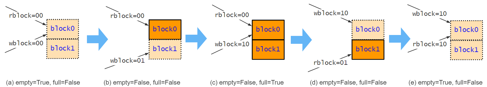         |
| :--------------------------------------------------------: |
| **图11**：一种使用 2bit 的读写块号指针来控制双缓冲的技巧。 |

根据以上技巧，编写用 wb 和 rb 来判断空满的代码：

```bsv
// 代码路径：src/17.MatrixT/MatrixT.bsv （部分）
   Wire#(Bool) empty <- mkWire;
   Wire#(Bool) full  <- mkWire;
   rule empty_full;
      empty <= wb == rb;                // True:空  False:不空
      full  <= wb == {~rb[1], rb[0]};   // True:满  False:不满
   endrule
```

然后，编写写数据的行为代码，即从外界输入数据的方法：

- 隐式条件：`!full` （不满）
- 行为：把数据写入 `{块号, 行号, 列号}` 所指向的 BRAM 位置，然后按行主序的方式移动指针

```bsv
// 代码路径：src/17.MatrixT/MatrixT.bsv （部分）
method Action datain(int val) if(!full);           // 外界调用该方法，输入待转置(行主序)的数据流
   ram.portA.request.put(
      BRAMRequest{write: True, responseOnWrite: False, address: tuple3(wb[0], wi, wj), datain: val });
   
   // ------------ 按行主序的方式移动指针 ------------
   wj <= wj + 1;         // 列号先增加
   if(wj == 7) begin     // 列号到最大时
      wi <= wi + 1       //   行号增加
      if(wi == 7)        //   行号到最大时
         wb <= wb + 1;   //     块号增加
   end
endmethod
```

然后，编写一个规则，只要双缓冲不空，就发起 BRAM 的读操作：

- 显式条件：`!empty` （不空）
- 行为：读 `{块号, 行号, 列号}` 所指向的 BRAM 位置，然后按列主序的方式移动指针

```bsv
// 代码路径：src/17.MatrixT/MatrixT.bsv （部分）
rule read_ram (!empty);
   ram.portB.request.put(
       BRAMRequest{write: False, responseOnWrite: False, address: tuple3(rb[0], ri, rj), datain: 0});
   ri <= ri + 1;
   if(ri == 7) begin
      rj <= rj + 1;
      if(rj == 7)
         rb <= rb + 1;
   end
endrule
```

然后，编写从 BRAM 读出数据的方法，作为矩阵转置器的输出数据的方法：

```bsv
// 代码路径：src/17.MatrixT/MatrixT.bsv （部分）
method ActionValue#(int) dataout;           // 外界调用该方法，获得转置后(列主序)的数据流
   let val <- ram.portB.response.get;
   return val;
endmethod
```

最后，编写 testbench 并测试，过程省略，读者可以自行运行仿真。

总之，本例达到了如下效果：

- 借助 BRAM 实现双缓冲，在外界积极不断地输入和拿出数据的情况下，能达到 1数据/周期 的吞吐率。
- 能轻松实现在外界不积极输入数据、输出数据的情况下，仍然保持结果正确：
  - 如果外界不积极地调用 `put` 方法，双缓冲经常为空，导致 `read_ram` 规则不激活，从而不再读出数据。
  - 如果外界不积极地调用 `get` 方法，则 `ram.portB` 的读缓冲区积攒数据，导致 `ram.portB.request.put` 被阻塞，导致 `read_ram` 规则不激活，导致双缓冲经常处于满的状态，最终导致 `put` 方法不能执行。


## <span id="head114">8.3 队列 FIFO 概览</span>

FIFO 是一类非常有用的模块。BSV 提供了几个 FIFO 包。在只进行同步时序逻辑设计时，只需了解 FIFO 、 FIFOF 、 SpecialFIFOs 、BRAMFIFO 这四个包中的各种同步 FIFO 就够。使用前根据需要引入它们：

```bsv
import FIFO::*;
import FIFOF::*;
import SpecialFIFOs::*;
import BRAMFIFO::*;
```

> :point_right: BSV 也提供了异步 FIFO 。本文不涉及异步时序逻辑设计，有兴趣请参考 [2]

这些 FIFO 的接口包括 `FIFO#()` 和 `FIFOF#()` ，如**表14** 。

​			**表14**：FIFO 的接口一览。

| 所属的包 | 接口名          | 包含的方法名                              | 说明                   |
| -------- | --------------- | ----------------------------------------- | ---------------------- |
| FIFO     | FIFO#(type td)  | clear, enq, deq, first                    | 基础的队列接口         |
| FIFOF    | FIFOF#(type td) | clear, enq, deq, first, notEmpty, notFull | 额外支持获取是否空和满 |

它们包含的这些方法如**表15** 。

​			**表15**：FIFO 接口的方法一览。

| 方法名   | 方法定义                  | 功能                 | 隐式条件说明                                 |
| -------- | ------------------------- | -------------------- | -------------------------------------------- |
| clear    | method Action clear;      | 清空队列             | 无                                           |
| enq      | method Action enq (td x); | 压入最新数据 x       | 大多数 FIFO 的 enq 的隐式条件是 “FIFO不满”   |
| deq      | method Action deq;        | 弹出最旧数据         | 大多数 FIFO 的 deq 的隐式条件是 “FIFO不空”   |
| first    | method td first;          | 获取最旧数据(返回值) | 大多数 FIFO 的 first 的隐式条件是 “FIFO不空” |
| notEmpty | method Bool notEmpty;     | 获取队列是否为空     | 无                                           |
| notFull  | method Bool notFull;      | 获取队列是否为满     | 无                                           |

FIFO 模块众多，功能大同小异，概览如**表16**。（从模块名可以看出它的接口是 `FIFO#()` 还是 `FIFOF#()` ）

​			**表16**：FIFO 模块一览。

| 类别                    | 容量 | FIFO 版本       | FIFOF 版本         | 定制保护版本  | 所属包       |
| ----------------------- | :--: | --------------- | ------------------ | ------------- | ------------ |
| 常规 FIFO               |  2   | mkFIFO          | mkFIFOF            | mkGFIFOF      | FIFO、FIFOF  |
| 常规 FIFO               |  1   | mkFIFO1         | mkFIFOF1           | mkGFIFOF1     | FIFO、FIFOF  |
| 常规 FIFO               | 定制 | mkSizedFIFO     | mkSizedFIFOF       | mkGSizedFIFOF | FIFO、FIFOF  |
| 可在满时并发 enq 和 deq |  1   | mkLFIFO         | mkLFIFOF           | mkGLFIFOF     | FIFO、FIFOF  |
| 可在空时并发 enq 和 deq |  1   | mkBypassFIFO    | mkBypassFIFOF      | -             | SpecialFIFOs |
| 可在空时并发 enq 和 deq | 定制 | -               | mkSizedBypassFIFOF | -             | SpecialFIFOs |
| 空时可 deq ，读出默认值 |  2   | -               | mkDFIFOF           | -             | SpecialFIFOs |
| BRAM 实现的大容量 FIFO  | 定制 | mkSizedBRAMFIFO | mkSizedBRAMFIFOF   | -             | BRAMFIFO     |

**图7** 展示了 `mkFIFO` 、 `mkFIFO1`、 `mkLFIFO` 、 `mkBypassFIFO` 在什么情况下允许在同一周期并发压入和弹出。具体的解释和用例见本章的后文。

|              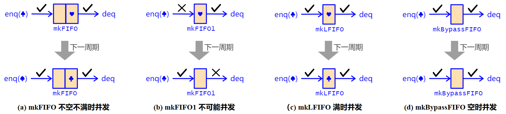              |
| :----------------------------------------------------------: |
| **图7**：mkFIFO、mkFIFO1、mkLFIFO、mkBypassFIFO 的并发行为。 |


## <span id="head115">8.4 常规 FIFO</span>

常规 FIFO 的行为是：

- 满时不能 enq （即使本周期同时有调用 deq）。换言之， “FIFO不满” 是方法 enq 的隐式条件。
- 空时不能 deq 和 first （即使本周期有调用 enq）。换言之， “FIFO不空” 是方法 deq 和 first 的隐式条件。

常规 FIFO 有三种容量可选：

- `mkFIFO`、`mkFIFOF` ：容量=2
- `mkFIFO1`、`mkFIFOF1` ：容量=1
- `mkSizedFIFO`、`mkSizedFIFOF` ：容量可定制

最常用的常规 FIFO 的容量=2，而容量=1的 FIFO 并不常用，因为要支持并发的 enq 和 deq ，则容量至少为2。原因详见**图7** 。

1. mkFIFO 在内含1个数据时，既不满也不空，可以支持在同一周期内并发的 enq 和 deq 。
2. mkFIFO1 要么空、要么满，不可能支持并发的 enq 和 deq ，只能交替进行 enq 和 deq，所以并不常用。

### <span id="head116">实例化和调用 FIFO</span>

以下语句实例化了四个 FIFO ：

```bsv
FIFOF#(Int#(6)) fifo1 <- mkFIFOF1;            // 接口为 FIFOF ，内容数据是 Int#(6) 类型，容量=1
FIFO#(Tuple2(Bool,int)) fifo2 <- mkFIFO;      // 接口为 FIFO ，内容数据是 Tuple2(Bool,int) 类型，容量=2
FIFO#(Int#(6)) fifo3 <- mkSizedFIFO(3);       // 接口为 FIFO ，内容数据是 Int#(6) 类型，容量=3
FIFOF#(Bool) fifo4 <- mkSizedFIFOF(4);        // 接口为 FIFOF ，内容数据是 Bool 类型，容量=4
```

以下语句给 `fifo2` 中压入一项数据，该数据需要符合 `fifo2` 的内容数据类型：

```bsv
fifo2.enq( tuple2(True, 42) );    // fifo2 内容数据类型为二元组，这里也要压入二元组
```

以下语句从 `fifo4` 中拿到最旧的数据，并把最旧的数据弹出（如果不弹出，下次拿到的还是这项数据）：

```bsv
let b = fifo4.first;     // 拿到最旧的数据 , 类型为 Bool
fifo4.deq;               // 弹出最旧的数据
// 逻辑顺序由调度注解 first SB deq 来保证，因此 first 和 deq 顺序可以交换，不影响结果
```

或者可以写的更复杂一些：以下代码不断拿到并弹出 `fifo3` 的数据，但只有该数据与 `fifo1` 的数据相等时，才弹出 `fifo1` ：

```bsv
fifo3.deq;
let v3 = fifo3.first;
let v1 = fifo1.first;
if(v1 == v3)
   fifo1.deq;
```

### <span id="head117">常规 FIFO 的调度注解</span>

**表17**是具有 `FIFOF#()` 接口的常规 FIFO 的调度注解 :point_down: 。对于 `FIFO#()` 接口，忽略方法 notFull 和 notEmpty 即可。

​			**表17**：常规 FIFO 的调度注解。

| 常规 FIFO | enq  | notFull | first | deq  | notEmpty | clear |
| --------- | ---- | ------- | ----- | ---- | -------- | ----- |
| enq       | C    | SA      | CF    | CF   | SA       | SA    |
| notFull   | SB   | CF      | CF    | SB   | CF       | SA    |
| first     | CF   | CF      | CF    | SB   | CF       | SA    |
| deq       | CF   | SA      | SA    | C    | SA       | SA    |
| notEmpty  | SB   | CF      | CF    | SB   | CF       | SA    |
| clear     | SA   | SA      | SA    | SA   | SA       | SBR   |


### <span id="head118">e.g. 开平方计算流水线 v2</span>

本例展示用常规 FIFO 构建具有反压功能的弹性流水线。

我们完善 6.1 节的很粗糙的开平方计算器，它是 16 级刚性流水线。我们用 `mkFIFO` 替代原来的 `mkDReg` 来传递流水线各级之间的数据，实现弹性流水线。

首先，仍然是用数组，定义 17 个 FIFO ，并用 for 循环调用 17 次 `mkFIFO` 进行实例化：

```bsv
// 代码路径：src/15.Sqrt/Sqrt_v2.bsv （部分）
   FIFO#( Tuple2#(UInt#(32), UInt#(32)) ) fifos [17];   // 接口数组，数组长度=17 
                                                        // 接口类型是 FIFO#( Tuple2#(UInt#(32), UInt#(32)) )
                                                        // FIFO 内容数据类型是 Tuple2#(UInt#(32), UInt#(32))
   for(int n=16; n>=0; n=n-1)
      fifos[n] <- mkFIFO;        // 用for循环批量实例化 17 个 FIFO
```

然后用 for 循环重复部署 16 个规则，每个规则从上一级的 fifo 里拿到和弹出数据，使用我们上次就实现的 `sqrtIteration` 函数（用来计算一次迭代的组合逻辑）计算后，压入下一级 fifo ：

```bsv
// 代码路径：src/15.Sqrt/Sqrt_v2.bsv （部分）
   for(int n=15; n>=0; n=n-1)
      rule pipe_stages;
         fifos[n+1].deq;
         fifos[n].enq( sqrtIteration( fifos[n+1].first , n )  );
      endrule
```

然后，我们把开平方计算器封装为模块。因为开平方计算器模块的输入输出方式与 FIFO 类似，我们直接复用 FIFO 接口，而不是自定义新的接口。

> 这里重点关注如何复用 `FIFO#(UInt#(32))` 接口（这是 7.6 节讲过的知识），因为流式的数据处理非常常见，它们都可以用 FIFO 接口。

首先，定义模块的接口：

```bsv
module mkSqrtUInt32( FIFO#(UInt#(32)) );
```

然后，在模块体中实现 `FIFO#(UInt#(32))` 的所有方法：`enq`, `deq`, `first` 和 `clear` 。代码如下：

```bsv
// 代码路径：src/15.Sqrt/Sqrt_v2.bsv （部分）
   method Action enq(UInt#(32) x);        // 模块的 enq 方法负责：
      fifos[16].enq( tuple2(x, 0) );      //   把输入数据压入流水线最前级的 fifo
   endmethod

   method deq = fifos[0].deq;             // 模块的 deq 方法负责：流水线最末级的 fifo deq
   
   method UInt#(32) first;                // 模块的 first 方法负责：
      match {.x, .y} = fifos[0].first;    //   拿到流水线最末级的 fifo.first , 解构该 Tuple2 
      return y;                           //   返回其中的结果数据 y
   endmethod

   method Action clear;                   // 模块的 clear 方法负责：
      for(int n=0; n<=16; n=n+1)          //
         fifos[n].clear;                  //   清空所有流水级的 fifo
   endmethod
```

最后，编写测试模块，如下：

```bsv
// 代码路径：src/15.Sqrt/Sqrt_v2.bsv （部分）
module mkTb();
   Reg#(int) cnt <- mkReg(0);
   rule up_counter;
      cnt <= cnt + 1;
      if(cnt > 40) $finish;
   endrule

   Reg#(UInt#(32)) x <- mkReg(1);
   
   FIFO#(UInt#(32)) sqrter <- mkSqrtUInt32;    // 实例化 mkSqrtUInt32，接口是 FIFO#(UInt#(32))

   rule sqrter_input;               // 这里也可以加入显式条件来实现不积极输入
      sqrter.enq(x * 10000000);     // 依次计算 10000000, 20000000, 30000000, 40000000, ... 的开方
      x <= x + 1;
   endrule

   rule sqrter_output (cnt%2==0);   // 因为 sqrter 有反压功能，这里可以加入隐式条件，阻止接受结果数据，而不担心丢失
      sqrter.deq;
      $display("%d", sqrter.first);
   endrule
endmodule
```

读者可自行运行 `src/15.Sqrt/Sqrt_v2.bsv` 来验证。

> :question: 思考：本例中，如果 rule sqrt_output 没有显式条件，那么把 `mkFIFO` 换成 `mkFIFO1` 会怎样？换成 `mkSizedFIFO(3)` 又会怎样？对 `mkSqrtUInt32` 的和性能是否有影响？


## <span id="head119">8.5 不保护 FIFO</span>

不保护 (Unguarded) 机制包括：

- 不保护压入 (ugenq) ： enq 方法不具有隐式条件，在 FIFO 满时仍可压入（此时行为是未定义的，即不知道会不会破坏 FIFO 的原有数据，因此要避免这种情况）
- 不保护弹出 (ugdeq) ： first 和 deq 方法不具有隐式条件，在 FIFO 空时仍可弹出（此时读到的值是未定义的，即不知道会读到什么值，因此也要避免这种情况）

常规 FIFO 是保护的，但都有其对应的不保护版本，它们既不保护压入，又不保护弹出，包括：

- mkUGFIFOF 、 mkUGFIFOF1 、 mkUGSizedFIFOF 。它们的接口都是 `FIFOF#(type a)`  。

用以下语句实例化一个 mkUGFIFOF ：

```bsv
FIFOF#(int) fifo <- mkUGFIFOF;
```

另外，还有可以分别定制是否保护压入、是否保护弹出的版本，包括：

- mkGFIFOF 、 mkGFIFOF1 、 mkGSizedFIFOF 。它们的接口都是 `FIFOF#(type td)`  。

它们的定义如下，可以发现多出了两个是否不保护的模块参数 (ugenq 和 ugdeq) ：

```bsv
module mkGFIFOF#(Bool ugenq, Bool ugdeq) (FIFOF#(td))
    provisos (Bits#(td, width_any));

module mkGFIFOF1#(Bool ugenq, Bool ugdeq)(FIFOF#(td))
    provisos (Bits#(td, width_any));

module mkGSizedFIFOF#(Bool ugenq, Bool ugdeq, Integer n) (FIFOF#(td))
    provisos (Bits#(td, width_any));
```

举例如下，实例化了三个 FIFO：

```bsv
FIFOF#(int) fifo1 <- mkGFIFOF(True, False);         // 容量=2，不保护压入，保护弹出
FIFOF#(int) fifo2 <- mkGFIFOF1(False, True);        // 容量=1，保护压入，不保护弹出
FIFOF#(int) fifo3 <- mkGSizedFIFOF(True, True, 5);  // 容量=5，不保护压入，不保护弹出
                                                    //        等效于 mkUGSizedFIFOF(5)
```

不保护 FIFO 的用途举例：假设我们要把 FIFO 的 deq 写在 if(条件) 下，我们希望在 条件=False 时，不要因为 FIFO 为空而导致整个规则不能激活，那么此时就可以用不保护弹出的 FIFO 。


## <span id="head120">8.6 LFIFO</span>

LFIFO （流水线FIFO）包括4个模块：`mkLFIFO`、`mkLFIFOF`、`mkGLFIFOF`、`mkUGLFIFOF` 。它们的容量都=1，但支持在满时并发进行压入和弹出，所以能像 容量=2 的 mkFIFO 那样，用来构成吞吐率=1数据/周期的高性能流水线（参考**图7**）。

以下代码实例化了两个 LFIFO ：

```bsv
FIFO#(int) fifo1 <- mkLFIFO;                   // 容量=1，接口为 FIFO ，保护压入，保护弹出
FIFOF#(int) fifo2 <- mkGLFIFOF(False, True);   // 容量=1，接口为 FIFOF，保护压入，不保护弹出
```

在流水线中，用 LFIFO 代替常规 FIFO ，可以带来如下的优势：

- 节省 1 个数据元素的资源量（节省一个寄存器以及相关的控制逻辑）。
- 在一些具有旁路 (bypass) 或转发 (forward) 的流水线中，有些地方必须用 LFIFO 代替常规 FIFO 来保证功能正确。

但 LFIFO 也有缺点：

- LFIFO 的 enq 的隐式条件 = 本周期调用了 deq 或 LFIFO 为空。注意到这里有一个“或”的逻辑，这意味着 LFIFO 的反压信号 (RDY) 是从输出端向输入端传播的组合逻辑电路，会随着流水线级数增多而构成一个很长的组合逻辑，可能会导致时序变差、时钟频率降低。尤其是当流水线各级还具有其它反压条件，产生额外的组合逻辑时，反压信号的组合逻辑会更快地变长。

因此笔者建议，在构建流水线时，如果对时钟频率要求较高但不在乎资源消耗，则能用常规 FIFO 的地方就不用 LFIFO （当然，要在保证功能正确的前提下）。

在具有旁路 (bypass) 或转发 (forward) 结构的流水线中，需要慎重分析哪些地方必须用 LFIFO ，否则可能导致行为错误。比如如下的累加式存储器。

### <span id="head121">e.g. 累加式写入的存储器</span>

累加式存储器可以用来进行直方图统计，即统计输入数据流中各数据出现的频率。要求：

- 功能：
  - 输入：地址 addr 和 data
  - 普通写：把 data 写入 addr
  - 累加写：读取 addr 中的数据 rdata ，与 data 相加后，再写回 addr。
  - 输出：无论是普通写还是累加写，都输出本次操作的地址 addr 和写入本地址的新值 data

- 性能：吞吐率能达到 1 数据/周期
- 要求有输入有效和输出反压机制
- 时钟频率：为了不让组合逻辑路径太长，要求读 BRAM、加法计算、写 BRAM 先后放在3个不同的流水级。

| 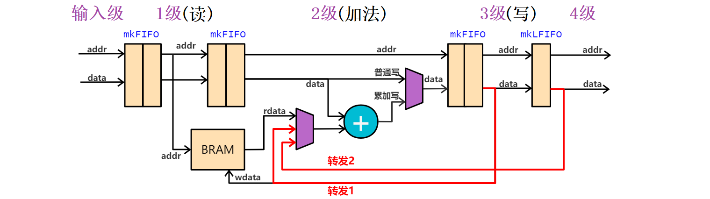 |
| :-------------------------------------------: |
|   **图8**：累加式写入存储器的流水线示意图。   |

由此，我们设计累加式存储器的流水线电路如**图8**，它被若干 FIFO 分成四级。因为读、加法、写被拆分到了相邻三级，导致从 BRAM 读到的 rdata 并不一定是最新的，最新的数据可能还在第3级或第4级，尚未写入BRAM。所以需要两条转发 (forward) 通路来保证执行结果正确：

- **转发1**：当第2级的地址与第3级相同（碰撞）时，说明上一周期在第1级读到的 rdata 不是最新的，最新的数据在第3级，还没被写入。所以需要从第3级转发到第2级。
- **转发2**：当第2级的地址与第4级相同（碰撞）时，说明上一周期在第1级读到的 rdata 不是最新的，最新的数据在第4级（虽然本周期第4级的数据已被写入，但本周期获得的 rdata 是上周期在第1级读的，当时尚未写入），所以需要从第4级转发到第2级。
- 当**转发1**和**转发2**的条件都成立时，**转发1**优先，因为第3级持有比第4级更新的数据。
- **不转发**：当**转发1**和**转发2**的条件都不成立时，才直接用 BRAM 读到的数据 rdata。

为了保证转发功能的正确：

- 第3级到第4级之间的 FIFO 必须是 `mkLFIFO` ，不能是 `mkFIFO` 。因为如果允许它堆积两个数据，第4级拿到的就不是最新的需要转发的数据（需要转发的数据是 FIFO 内的第2个元素，拿不出来）
- 第2级到第3级之间的 FIFO 可以是 `mkFIFO` 。因为如果它堆积两个数据，虽然第3级拿到的不是最新的需要转发的数据，但因为 FIFO 满，第2级阻塞，不能前进。等到 FIFO 不满时，第2级才能前进，第3级就能将正确的数据转发给第2级。

然后，只需按照**图8**编写代码即可。这里只展示四个流水线级行为和转发行为的代码如下。完整的代码见 `src/16.AccumulateRam/AccumulateRam.bsv` 。

```bsv
// 代码路径： src/16.AccumulateRam/AccumulateRam.bsv （部分）
BRAM2Port#(UInt#(12), int) ram <- mkBRAM2Server(defaultValue);

FIFO#(Tuple3#(Bool, UInt#(12), int)) fifo1 <- mkFIFO;
FIFO#(Tuple3#(Bool, UInt#(12), int)) fifo2 <- mkFIFO;
FIFO#(Tuple3#(Bool, UInt#(12), int)) fifo3 <- mkFIFO;
FIFO#(Tuple3#(Bool, UInt#(12), int)) fifo4 <- mkLFIFO;

Wire#(Maybe#(int)) wdata_from4 <- mkDWire(tagged Invalid);  // 转发路径2的数据
Wire#(Maybe#(int)) wdata_from3 <- mkDWire(tagged Invalid);  // 转发路径1的数据

rule stage1;
   match {.is_acc, .addr, .data} = fifo1.first;
   ram.portA.request.put(BRAMRequest{write:False,responseOnWrite:False, address: addr, datain: 0 });
   fifo1.deq;
   fifo2.enq( fifo1.first );
endrule

rule stage2;
   match {.is_acc, .addr, .data} = fifo2.first;
   int rdata <- ram.portA.response.get();
   if( is_acc )
      data = data + fromMaybe(fromMaybe(rdata, wdata_from4), wdata_from3);
   fifo2.deq;
   fifo3.enq( tuple3(is_acc, addr, data) );
endrule

rule stage3;
   match {.is_acc, .addr, .data} = fifo3.first;
   ram.portB.request.put(BRAMRequest{write:True,responseOnWrite:False, address: addr, datain: data });
   fifo3.deq;
   fifo4.enq( fifo3.first );
endrule

rule stage3_forward;
   match {.is_acc, .addr, .data} = fifo3.first;
   if( tpl_2(fifo2.first) == addr ) wdata_from3 <= tagged Valid data;
endrule

rule stage4_forward;
   match {.is_acc, .addr, .data} = fifo4.first;
   if( tpl_2(fifo2.first) == addr ) wdata_from4 <= tagged Valid data;
endrule
```


## <span id="head122">8.7 DFIFOF</span>

本节介绍模块 `mkDFIFOF`

`mkDFIFOF` 与常规的容量为 2 的 `mkFIFOF` 唯一的不同是：`mkDFIFOF` 的 first 和 deq 不具有隐式条件，当为空时：

- `mkDFIFOF` 允许调用 deq
- `mkDFIFOF` 允许调用 first ，返回一个默认值

该默认值在模块实例化时指定。比如指定该默认值为 int 型的 42：

```bsv
FIFOF#(int) fifo <- mkDFIFOF(42);    // 默认值=42
```

`mkDFIFOF` 可以视为一种不保护弹出 (ugdeq) 的 FIFO ，即 `mkGFIFOF(False, True)` ，但是能读出默认值的特点让它更实用。

### <span id="head123">e.g. 比特编码器 v5</span>

我们用 `mkDFIFOF` 和 `mkFIFO` 改进 7.4 节遗留的具有输出反压功能的比特编码器，让它能获得接近 1数据/周期 的吞吐率。

如**图9** 是设计思路。这里有个关键点：当遗留码寄存器堆积的长度超过 8bit 时，我们希望不论第1级有没有数据传递过来，第2级的规则都能激活，来把这 8bit 传递给输出级。换言之：我们总是希望遗留码寄存器能积极地清空自己。

为了优雅地解决该关键点，我们在第1级和第2级之间使用 `mkDFIFOF` 。理由是：我们可以给 `mkDFIFOF` 设置一个默认值二元组： (生成码, 生成码的长度) = (0, 0) 。如果刚好 `mkDFIFOF` 为空，会取出默认值，而不会因为隐式条件的存在而阻止第2级的规则激活。

| 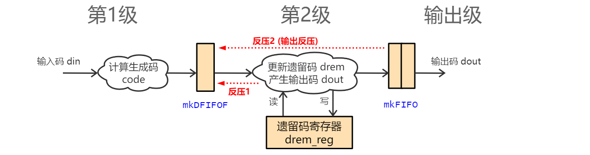 |
| :-------------------------------------: |
|   **图9**：比特编码器的流水线示意图。   |

另外，我们把比特编码器的接口改成 `FIFO#(Bit#(8))`  ，而不再用自定义的新接口。最后代码如下：

```bsv
// 代码路径：src/13.BitCoding/BitCoding_v5.bsv （部分）
module mkBitCoder ( FIFO#(Bit#(8)) );

   FIFO#(Bit#(8))                      fifo1 <- mkFIFO;
   FIFOF#(Tuple2#(Bit#(10), UInt#(4))) fifo2 <- mkDFIFOF( tuple2(0, 0) ); 
   FIFO#(Bit#(8))                      fifo3 <- mkFIFO;                  

   Reg#(Tuple2#(Bit#(31), UInt#(6))) drem_reg <- mkReg( tuple2(0, 0) );     // 存放遗留码 drem 以及其长度

   // 流水线第一级：计算生成码 code 以及其长度
   rule get_code;
      fifo1.deq;
      Bit#(8) din = fifo1.first;                          // din: 输入数据

      UInt#(4) len = 0;
      for(UInt#(4) i=0; i<8; i=i+1)                       // for循环：计算长度码 len
         if(din[i] == 1)
            len = i;
      
      UInt#(4) trim_len = len>0 ? extend(len) : 1;        // 计算数据码 trim 的长度
      Bit#(7) trim = truncate(din) & ~('1<<trim_len);     // 获取数据码 trim 
                                                          // 保留 din 的低 trim_len 个 bit，其余高位置 0）
      Bit#(10) code = {trim, pack(len)[2:0]};             // 获取生成码 code

      fifo2.enq(tuple2( code, trim_len+3 ));
   endrule
   
   (* conflict_free = "clear, get_drem_and_dout" *)

   // 流水线第二级：更新遗留数据和输出数据
   rule get_drem_and_dout;
      match {.drem, .drem_len} = drem_reg;                // 拿到遗留码 drem 以及其长度
      match {.code, .code_len} = fifo2.first;             // 拿到生成码 code 以及其长度

      if(extend(code_len) + drem_len < 32) begin          // 只有当不会导致溢出
         fifo2.deq;                                       //   才取出数据
         drem = (extend(code) << drem_len) | drem;        //   生成码 拼接 遗留数据
         drem_len = extend(code_len) + drem_len;          //   长度 = 生成码长度 + 遗留码长度
      end

      if(drem_len >= 8) begin                             // 如果总长度 >= 8 ，说明攒够了，输出一次
         fifo3.enq( truncate(drem) );                     //   输出数据 dout 到 fifo3
         drem = drem >> 8;                                //   高于 8 位的 bit 作为遗留数据
         drem_len = drem_len - 8;                         //   遗留数据长度-8, 因为有 8 bit 输出了
      end

      drem_reg <= tuple2(drem, drem_len);                 // 保存遗留码 drem 以及其长度到 drem_reg ，供下次使用
   endrule

   method enq   = fifo1.enq;
   method deq   = fifo3.deq;
   method first = fifo3.first;
   method Action clear;
      drem_reg <= tuple2(0, 0);
      fifo1.clear;
      fifo2.clear;
      fifo3.clear;
   endmethod
endmodule
```


## <span id="head124">8.8 BypassFIFO</span>

BypassFIFO 包括3个模块： 

- `mkBypassFIFO` ：容量=1，接口为 FIFO
- `mkBypassFIFOF` ：容量=1，接口为 FIFOF
- `mkSizedBypassFIFOF`  ：容量可定制，接口为 FIFOF

例如，以下代码实例化了两个 BypassFIFO：

```bsv
FIFO#(int) fifo1 <- mkBypassFIFO;             // 容量=1，接口为 FIFO
FIFOF#(int) fifo2 <- mkSizedBypassFIFOF(4);   // 容量=4，接口为 FIFOF
```

BypassFIFO 在为空时支持并发 enq 与 deq （参考**图7**)，此时 enq 的数据会被旁路（Bypass）到 first 方法上，呈现出类似 `mkWire` 的特点：写入时，当前周期可以立刻读出；但是如果不用 deq 弹出数据， BypassFIFO 还会保存数据供下周期来获取，不像 `mkWire` 不会保存数据。因此， BypassFIFO 提供一种无延迟传递数据的方式，但又能在接收者暂不能接收数据时缓存它。

比如，BypassFIFO 可以用来在流水线式 CPU 的取指令阶段（Instruction Fetch, IF阶段）和译码阶段（Instruction Decode, ID阶段）之间传递下一条指令的地址（next pc）。如**图10**，取指令总线接口至少具有1周期的延迟，为了达到1指令/周期的取指令吞吐率，ID阶段应该在计算出 next_pc（遇到跳转指令则 next_pc=pc+偏移，否则 next_pc=pc+1 ）后，直接把 next_pc **无延迟地**送到 IF阶段 的取指令总线接口上。然而，取指令总线接口可能会因为遇到总线阻塞或 cache miss 而停顿，导致它暂时不能接受 next_pc ，此时就需要一个 `mkBypassFIFO` 来缓存 next_pc ，避免它被丢弃。这样就不用让 ID 阶段暂停（stall）来阻止已经译码的指令向后传递。

在本教程最后提供的 RISC-V Rv32i 流水线 CPU 中，将使用这种设计（详见 13.2 节）。

|           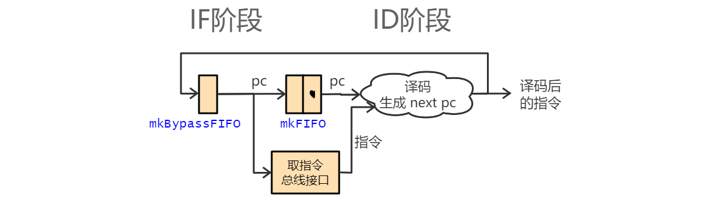           |
| :----------------------------------------------------------: |
| **图10** ：流水线式 CPU 的 IF 和 ID 阶段，用 mkBypassFIFO 来支持取指令总接线口的停顿（例如cache miss） |


## <span id="head125">8.9 大容量的 BRAMFIFO</span>

使用 BRAMFIFO 前需要引入：

```bsv
import FIFO::*;
import FIFOF::*;
import BRAMFIFO::*;
```

8.3 到 8.8 节讲的 FIFO 的底层都是用寄存器实现的，容量大于几百时就会产生庞大的译码电路。而 BRAMFIFO 底层使用 BRAM 实现，生成的 Verilog 会自动调用在 Xilinx 和 Altera 的所有型号的 FPGA 上的 BRAM，适合于实现容量较大的 FIFO。

BRAMFIFO 包括两个模块：

- `mkSizedBRAMFIFO` ：接口为 FIFO
- `mkSizedBRAMFIFOF` ：接口为 FIFOF

以下代码实例化了两个 BRAMFIFO ：

```bsv
FIFO#(int)  fifo1 <- mkSizedBRAMFIFO(8192);     // 容量=8192，接口为 FIFO
FIFOF#(int) fifo2 <- mkSizedBRAMFIFOF(114514);  // 容量=114514，接口为 FIFOF
```

BRAMFIFO 用起来和常规 FIFO 行为相同。


# <span id="head126">9 高级数据类型</span>

BSV 提供一些复杂的数据类型，包括数组 (array)、向量 (Vector)、元组 (tuple)、枚举 (enum)、结构体 (struct)、标签联合体 (union tagged) 。以及一些高级语句，包括 case 表达式、case 语句。

## <span id="head127">9.1 数组 array</span>

使用 `[]` 符号定义数组，`[]` 中的值必须是一个常量表达式。

如下例子创建了一个名为 `arr` 的数组。它有 10 项数据，每项数据的类型都是 `UInt#(16)` 。如果写在模块内，就是整个模块的局部变量（在运行时实际上是常量，因为它们不可能被硬件动态修改）；如果写在规则内，就是规则内的局部变量，生命周期为当前时钟周期。注意：它不会生成一个容量为 10 的寄存器或存储器。

```bsv
UInt#(16) arr[10];   // 数组，每个元素为 UInt#(16) 类型，长度为10，下标范围为 0~9

// 为这些数组实例赋值 , 注意数组下标从 0 开始
arr[0] = 0;
arr[1] = 3;
arr[2] = 6;
// arr[10] = 7;  错误！！下标溢出
// arr[11] = 0;  错误！！下标溢出

// 可以用循环来赋值
for (UInt#(16) i=0; i<10; i=i+1)
   arr[i] = i * 3;
```

如下例子创建了一个名为 `mat` 的二维数据，并用双重循环赋值。

```bsv
UInt#(16) mat [3][4];  // 二维数组，第1维下标范围为 0~2 ， 第2维下标范围为 0~3
for (UInt#(16) i=0; i<3; i=i+1)
   for (UInt#(16) j=0; j<4; j=j+1)
      arr2[i][j] = 4 * i + j;
```

可以用 `{}` 来给数组各元素赋初值：

```bsv
int arr3 [3] = {1, 7, 6};                // 三个元素分别为 1,7,6
int arr4 [2][3] = {{2,5,9}, {3,7,1}};
```

### <span id="head128"> 寄存器数组</span>

如下例子创建了一个长度为 4 的寄存器接口数组，并用 for 循环分别给数组每项都实例化了 `mkRegU` 。

```bsv
Reg#(int) reg_arr [4];       // 寄存器接口数组，每个元素为 Reg#(int) 类型
   for (int i=0; i<4; i=i+1)
      reg_arr[i] <- mkRegU;
```

这四个寄存器是独立的，在一个规则内，可以全部写入，也可以写入部分几个或一个：

```bsv
rule test;
   reg_arr[1] <= ’h10;
   reg_arr[3] <= reg_arr[2] + 2;
endrule
```

也可以用一个运行时的变量（比如来自另一个寄存器）作为可变地址来访问。

```bsv
Reg#(UInt#(2)) addr <- mkReg(0);
rule test;
   reg_arr[addr] <= reg_arr[addr] + 1;
endrule
```

除了寄存器，你还可以创建其它硬件模块的数组，比如 Wire 、 FIFO 、 BRAM 的数组。


## <span id="head129">9.2 向量 Vector</span>

向量是一种复合数据类型，能提供比数组更强大的功能。使用前需要引入：

```
import Vector::*;
```

以下语句创建了一个长度为 4，每项元素为 `Int#(16)` 的 Vector 。然后你可以用下标访问它们，分别为它们赋值。注意：与数组相同，如果写在模块内，就是整个模块的局部变量（在运行时实际上是常量，因为它们不可能被硬件动态修改）；如果写在规则内，就是规则内的局部变量，生命周期为当前时钟周期。注意：它们不会生成一个容量为 4 的寄存器或存储器。

```bsv
Vector#(4, Int#(16)) vec1;   // Vector，长度为4，下标范围为 0~3
vec1[0] = 2;
vec1[1] = -1;
//vec1[4] = -9;   // 错误！！下标溢出
```

当 Vector 内的元素派生自 Bits 类型类时， 整个 Vector 也是派生自 Bits 类型类的，可以用 pack 函数转化成 `Bit#(n)` 类型 。也可以用 unpack 函数把 `Bit#(n)` 类型转化为 Vector 。 Vector 中下标小的元素对应 `Bit#(n)` 中的低位，下标大的元素对应 `Bit#(n)` 中的高位：

```bsv
Vector#(4, UInt#(4)) vec2;
vec2[0] = 1;
vec2[1] = 2;
vec2[2] = 3;
vec2[3] = 4;

let tmp = pack(vec2);                          // 得到： tmp 是 Bit#(16) 类型的 16'h4321

Vector#(4, UInt#(4)) vec3 = unpack('h5678);    // 得到： vec3 的四个元素分别为 8, 7, 6, 5
```

### <span id="head130">使用 Vector 相关函数</span>

这里介绍 Vector 包提供的几种函数： `replicate` 、 `map` 、 `genVector` 、 `reverse` 和 `rotate` 。

你可以用 `replicate` 函数创建一个元素全都为某个值的 Vector ：

```bsv
Vector#(4, Int#(16)) vec0 = replicate(0);   // 每个元素都是 0
Vector#(10, Bit#(10)) vec1 = replicate(7);  // 每个元素都是 7
```

你还可用 `map` 和 `genVector` 函数创建一个元素从0开始值递增的数组：

```bsv
Vector#(5, Int#(16)) vec2 = map( fromInteger, genVector );
// 相当于：
// vec2[0] = 0;
// vec2[1] = 1;
// vec2[2] = 2;
// vec2[3] = 3;
// vec2[4] = 4;
```

以上代码的原理是 ：

- `genVector` 函数用来产生从0开始递增的 Vector ，其中每个元素是 Integer 类型。
- `fromInteger` 函数能把一个 Integer 变量转化为任意数值类型，比如这里转化成了 `Int#(16)`
- `map` 函数用来把 `fromInteger` 函数映射到  `Vector#(4, Integer)` 每个元素上，得到了 `Vector#(4, Int#(16))` 。

再比如，用 `map` 函数和自定义的平方函数，你可以创建每个元素为自身下标的平方的 Vector ：

```bsv
function Integer square(Integer x) = x * x;                            // 自定义的平方函数
Vector#(64, int) vec3 = map( fromInteger, map( square, genVector ) );  // 调用两次map ,构建平方数 Vector
```

`reverse` 函数可以把元素顺序颠倒。`rotate` 函数可以把元素沿着下标降低的顺序移动1下，比如

```bsv
Vector#(4, int) vec4 = map( fromInteger, genVector );   // vec4： 0,1,2,3
Vector#(4, int) vec5 = reverse( vec4 );                 // vec5： 3,2,1,0
Vector#(4, int) vec6 = rotate( vec4 );                  // vec6： 1,2,3,0
```

### <span id="head131">多维 Vector</span>

创建多维 Vector ，只需把 Vector 类型嵌套即可。

以下例子创建了二维的 Vector ，名为 vec34，并给部分数据赋值：

```bsv
Vector#(3, Vector#(4, int)) vec34;  // 二维Vector，第1维下标范围为 0~2 ， 第2维下标范围为 0~3
vec34[0][0] = 3;
vec34[1][2] = -9;
vec34[2][3] = -8;
//vec34[3][3] = -8;  // 错误！！第1维下标溢出
//vec34[2][4] = -8;  // 错误！！第2维下标溢出

// 可以用 Vector#(4, int) 类型的变量来承接 vec34 中的一行
Vector#(4, int) tmp = vec34[1];
```

### <span id="head132">寄存器 Vector</span>

就像数组那样，Vector 的元素类型也可以是寄存器接口，以此来构成寄存器阵列。以下代码定义并实例化了长度为 8 的寄存器向量，每个寄存器接口类型都是 `Reg#(int)` ，并被 `mkReg(1)` 实例化。

```bsv
Vector#(8, Reg#(int)) reg_vec <- replicateM( mkReg(1) );    // 8 个独立的寄存器
```

注意 `replicateM` 也是 Vector 包提供的函数，可以给 Vector 批量实例化硬件模块。注意要与 `replicate` 函数区分开。

这8个寄存器是独立的，在一个 rule 内，可以全部写入，也可以写入部分几个或一个：

```bsv
rule test;
   reg_vec[1] <= 10;
   reg_vec[3] <= reg_vec[6] + 2;
endrule
```

也可以用一个运行时的变量（比如来自另一个寄存器）作为可变地址来访问。

```bsv
Reg#(UInt#(3)) addr <- mkReg(0);
rule test;
   reg_vec[addr] <= reg_vec[addr+1] + 1;
endrule
```

除了寄存器，你还可以创建其它硬件模块的数组，比如 Wire 、 FIFO 、 BRAM 的数组。你可以定义 FIFO Vector 如下：

```bsv
Vector#(5, FIFO#(int)) fifo_vec <- replicateM( mkFIFO );    // 5 个独立的 FIFO
```

### <span id="head133">存放 Vector 的寄存器</span>

需要区分 **寄存器 Vector** 和 **存放 Vector 的寄存器** 的概念，比如以下：

```bsv
Vector#(8, Reg#(int)) reg_vec <- replicateM(mkReg(1));    // 寄存器 Vector ，注意这里使用的是 replicateM
Reg#(Vector#(8, int)) vec_in_reg <- mkReg(replicate(1));  // 存放 Vector 的寄存器，注意这里使用的是 replicate
```

其中，`reg_vec` 是 8个 独立的寄存器，可以独立写入某一项。

而 `vec_in_reg` 中的 8 个元素只能同时写入，即使你想实现部分写入的效果，也要把整个 `Vector#(8, int)` 类型的变量读出来，修改后，再整体写回去。比如：

```bsv
rule test;                              // vec_in_reg 的类型是 Reg#(Vector#(8, int))
   Vector#(8, int) vec = vec_in_reg;    // 整体读出来
   vec[4] = vec[5] + 1;                 // 修改
   vec_in_reg <= vec;                   // 整体写回去
endrule
```


## <span id="head134">9.3 typedef 关键字</span>

`typedef` 关键字用于定义一个新类型。后续的枚举 (enum)、结构体 (struct)、带标记的联合体 (tagged union) 都要用到 `typedef` 。 `typedef` 定义变量时，必须放在模块外、包内，不能放在模块内。

最简单的定义新类型如下，它把 32 bit 的无符号数定义为 Uint ：

```bsv
typedef UInt#(32) Uint;
```

这样，`Uint` 就成为了 `UInt#(32)` 的别名。这就像 `bit` 是 `Bit#(1)` 的别名， `int` 是 `Int#(32)` 的别名一样。

但是注意，对于用 `typedef` 定义的两个结构体 (struct)，即使成员变量完全一样，也不互为别名，不能直接互相赋值（但可以用前面讲过的 `b = unpack(pack(a))` 进行类型转换后再赋值）。


## <span id="head135">9.4 枚举 enum</span>

枚举类型的变量只能取规定的标签。比如红绿灯类型只能取 Red, Green, Yellow ，则可以定义枚举类型：

```bsv
typedef enum {Green, Yellow, Red} Light deriving(Eq, Bits);
```

> :triangular_flag_on_post: 复习一下 5.1 节的知识：`deriving(Eq, Bits)` 代表 Light1 派生自 `Eq` 和 `Bits` 类型类。`Eq` 表明该类型中的变量可以判断是否相等；`Bits` 表明该类型中的变量可以编码为若干 bit，这样才可综合。

然后就可以定义该枚举类型的变量，并且给它赋值：

```bsv
// 代码路径：src/18.EnumTest/EnumTest.bsv （部分）
Light va = Green;     // 定义变量 va
$display("%b", va);   // 打印出 00 ，说明 Green 被编码为 2'b00
va = Yellow;
$display("%b", va);   // 打印出 01 ，说明 Yellow 被编码为 2'b01
va = Red;
$display("%b", va);   // 打印出 10 ，说明 Yellow 被编码为 2'b10
```

可以看出，在不手动指定标签的编码时，默认第一个标签（Green）编码为0，后面的标签编码递增。

这种编码规则决定了枚举变量会被 pack 函数转化为怎样的 `Bit#(n)` 类型。比如：

```bsv
Light vb = Red;
let vb_bits = pack(vb);  // vb_bits 是 Bit#(2) 类型的 2'b10
```

可以指定一部分标签的编码，而未指定编码的标签则顺延它左边的标签的编码递增：

```bsv
typedef enum {Green, Yellow=5, Red} Light deriving(Eq, Bits);
// Green 编码为 0， Yellow 为 5 ， Red 为 6
// 如此定义的 Light 占 3 bit，因为 3 bit足够表示 0, 5 和 6
```

当然，也可以给所有标签指定编码：

```bsv
typedef enum {Green=125, Yellow=20, Red=85} Light deriving(Eq, Bits);
// 如此定义的 Light 占 7 bit，因为 7 bit足够表示 125, 20 和 85
```

:pushpin: 注意一个坑！：因为枚举变量不能取它未定义的编码值，如果把未定义的 `Bit#(n)` 类型的编码值用 `unpack()` 强行赋值给枚举变量，会导致不可预测的变化，因此要避免这种情况的出现。举例：

```bsv
typedef enum {Green=125, Yellow=20, Red=85} Light deriving(Eq, Bits);
Light va = unpack(0);    // 行为不确定！！ 因为编码 0 在 Light 类型中不存在 。pack(va) 甚至不再是 7'b0 ！！ 
Light vb = unpack(20);   // 行为确定，因为编码 20 在 Light 类型中对应 Yellow ，会得到 vb = Yellow
```

枚举类型的用途举例：

- 默认编码的枚举类型可以用来表示状态机状态；
- 手动指定编码的枚举类型可以用来匹配编码，实现解码。

例如，RISC-V RV32I CPU 的 7 bit opcode 规定了 9 类指令，可以定义为以下枚举类型：

```bsv
typedef enum { AUIPC   = 7'b0010111,   // AUIPC 类的指令的 opcode 的编码是 7'b0010111
               LUI     = 7'b0110111,   // LUI   类的指令的 opcode 的编码是 7'b0110111
               JAL     = 7'b1101111,   // ... 以此类推
               JALR    = 7'b1100111,
               BRANCH  = 7'b1100011,
               ALI     = 7'b0010011,
               ALR     = 7'b0110011,
               LOAD    = 7'b0000011,
               STORE   = 7'b0100011
} OpCode deriving(Bits, Eq);
```

然后就可以把指令 `instruction` 中的这 7 bit 用 `unpack()` 赋值给 `OpCode` 类型的变量，然后就可以优雅地根据指令类型干一些事：

```bsv
// 设 instruction 是 Bit#(32) 类型的，取到的指令
Opcode opcode = unpack( instruction[6:0] );
if(opcode == BRANCH)
    // 如果是 BRANCH 指令，就干某些事
else if(opcode == LOAD)
    // 如果是 LOAD 指令，就干某些事
```


## <span id="head136">9.5 结构体 struct</span>

结构体(struct)是由成员变量组成的复合类型，每个成员都要规定一个类型。与元组 (Tuple) 不同的是：

- 元组中的每个元素是匿名的，通常可以叫“第一个元素”、“第二个元素”……；而结构体的每个成员变量要有字段名，比如 a, b, c 。
- 元组不用 typedef 定义就能使用；而结构体需要 typedef 先定义再使用。
- 元组最多有8元组；结构体在定义时不限成员变量数量。

注意事项：

- 结构体的成员变量的字段名首字母必须小写
- 结构体的成员变量可以是复杂数据类型，比如元组, 枚举类型, 带标签联合体, 或者嵌套另一个结构体。

以下代码定义了两个结构体：

```bsv
typedef struct {                // 一个二维坐标结构体，类型名为 Coord ，具有两个成员变量 x 和 y
   int x;
   int y;
} Coord deriving(Bits, Eq);     // 类型名为 Coord

typedef struct{                 // 一个像素结构体，嵌套了 Vector 和 另一个结构体
   Vector#(3, UInt#(8)) color;  // RGB 三色值
   Bool transparent;            // 是否透明
   Coord coord;                 // 像素坐标
} Pixel deriving (Bits, Eq);    // 类型名 Pixel
```

可以使用 pack 函数把结构体变量转化为 `Bit#(n)` 类型， 比特的排列顺序是： struct 定义中靠前的放在 Bit#(n) 的高位，struct 定义中靠后的放在 Bit#(n) 的低位。比如 Pixel 结构体变量转化为 Bit#(n) 后，比特排列如下：

```
|   8bit       |   8bit       |   8bit       |  1bit         |   32bit     |   32bit     |
|   color[2]   |   color[1]   |   color[0]   |  transparent  |   coord.x   |   coord.y   |
高位                                                                                低位
                        Pixel 结构体转化为 Bit#(n) 后的比特排列顺序
```

你可以定义结构体变量，并且用如下的结构体构造方法为它赋值：

```bsv
Pixel pixel;

pixel = Pixel{     // 构造结构体的语法
   color:replicate('hFF),    // color[0]='hFF    color[1]='hFF    color[2]='hFF    
   transparent: False,       // transparent=False
   coord: Coord{x:1, y:2}    // coord.x=1    coord.y=2
};
```

当然，如果是在定义时赋值，因为知道右值的类型为 Pixel ，可以用 let 语句：

```bsv
let pixel = Pixel{
   color:replicate('hFF),    // color[0]='hFF    color[1]='hFF    color[2]='hFF    
   transparent: False,       // transparent=False
   coord: Coord{x:1, y:2}    // coord.x=1    coord.y=2
};
```

还可以用以下语句为成员变量单独赋值：

```bsv
pixel.color = replicate('hAB);
pixel.transparent = True;
pixel.coord = Coord{x:1, y:2};
pixel.coord.x = 8;
```


## <span id="head137">9.6 标签联合体 union tagged</span>

标签联合体 (union tagged) 是由成员变量组成的复合类型，区别于结构体，标签联合体每次只能取一种成员变量的值。比如，以下定义一个标签联合体名为 Pixel ，它要么取无效 None ，要么取黑白 16 bit Alpha ，要么取彩色 RGB （用一个嵌套的结构体来RGB）。

```bsv
// 代码路径：src/19.UnionTaggedTest/UnionTaggedTest.bsv （部分）
typedef union tagged {
   void None;            // 要么取无效           （注意要首字母大写）
   UInt#(16) Alpha;      // 要么取黑白 16 bit    （注意要首字母大写）
   struct {              // 要么取彩色 RGB565
      UInt#(8) r;        //                    （结构体成员变量首字母小写）
      UInt#(8) g;
      UInt#(8) b;
   } RGB;                //                     （注意要首字母大写）
} Pixel deriving (Bits, Eq);
```

编译器自动给 Pixel 类型加上 2bit 的标签 (tag)，用来区别当前 Pixel 变量取的是无效、黑白、还是彩色。

Pixel 会被组织成如下的位格式，它代表了 pack 函数会把 Pixel 类型转化为怎样的 `Bit#(n)` 类型：

```
        最高位                                           最低位
       |  tag 2bit  |    8bit    |    8bit    |    8bit     |
None:  |    00      |                  void                 |
Alpha: |    01      |    void    |         UInt#(16)        |
RGB:   |    10      |    red     |   green    |     blue    |
```

以下代码定义了三个 Pixel 类型的变量：

```bsv
// 代码路径：src/19.UnionTaggedTest/UnionTaggedTest.bsv （部分）
Pixel pixel1 = tagged None;                  // 标签为 None
Pixel pixel2 = tagged Alpha 100;             // 标签为 Alpha ，取值为 100
Pixel pixel3 = tagged RGB {r:6, g:2, b:9};   // 标签为 RGB ，取值为 r=6, g=2, b=9
```

可以在 if 中用 matches 语句匹配一个 pixel 是哪种标签，并且得到它的取值：

```bsv
// 代码路径：src/19.UnionTaggedTest/UnionTaggedTest.bsv （部分）
rule test;
   if     ( pixel1 matches tagged Alpha .alpha )     // 如果是 Alpha 标签，取值放在变量 alpha 里（UInt#(16)）
      $display("%d", alpha);
   else if( pixel1 matches tagged RGB .rgb )         // 如果是 RGB 标签，取值放在变量 alpha 里（结构体）
      $display("%d %d %d", rgb.r, rgb.g, rgb.b);
   else if( pixel1 matches tagged None )             // 如果是 None 标签
      $display("no pixel");
endrule
```

或者也可以用 case matches 语句：

```bsv
// 代码路径：src/19.UnionTaggedTest/UnionTaggedTest.bsv （部分）
rule test;
   case (pixel3) matches
      tagged Alpha .alpha : $display("%d", alpha);
      tagged RGB .rgb     : $display("%d %d %d", rgb.r, rgb.g, rgb.b);
      tagged None         : $display("no pixel");
   endcase
endrule
```

我们在 5.8 节学过的 Maybe 类型实际上是 BSV 预定义的一种标签联合体：

```bsv
typedef union tagged {
   void   Invalid;      // 取该标签时，无效
   data_t Valid;        // 取该标签时，有效
} Maybe#(type data_t) deriving (Eq, Bits);
```


## <span id="head138">9.7 case 语句与表达式</span>

BSV 具有 case 语句和 case 表达式：

- case 语句用来在一个变量匹配某值时执行一系列子语句。就像 Verilog 的 case 或 C 语言的 switch case 那样。
- case 表达式用来在一个变量匹配某值时产生一个返回值，作为整个 case 表达式的取值。 Verilog 和 C 语言没有这种机制。

### <span id="head139">case 语句</span>

以下 case 语句根据变量 x 的取值，执行语句来给变量 y 赋值。

```bsv
// 代码路径：src/20.CaseTest/CaseTest.bsv （部分）
Bit#(4) x = 'b1110;
int     y;

case(x)
   'b0000  : y = -87;  // 如果 x='b0000 ，则执行 x=-87
   'b0001  : y = -87;  // 如果 x='b0001 ，则执行 x=-87
   'b0100  : y = 42;   // 以此类推 ...
   'b0110  : y = 42;
   'b1110  : y = 1;    // 会匹配到这里，则执行 y=1
   default : y = 0;    // default匹配：如果以上匹配都失败，则执行 y=0 , 如果不需要，可以省略 default 匹配
endcase
```

如果 `case` 匹配后不止一个表达式，比如还要给另一个变量 z 赋值，则需要用 `begin...end` 结构：

```bsv
case(x)
   'b0000  : begin
                y = -87;          // 如果 x='b0000 ，则执行 x=-87
                z = 1;            //              还要执行 z=1
             end
   'b0001  : ...
```

### <span id="head140">case 表达式</span>

以下 `case...endcase` 构成一个表达式。对于每一个匹配值，使用 return 语句返回一个值，作为整个 case 表达式的取值。

```bsv
// 代码路径：src/20.CaseTest/CaseTest.bsv （部分）
Bit#(4) x = 'b1110;
int     y;

y= case(x)
      'b0000  : return -87;
      'b0001  : return -87;
      'b0100  : return 42;
      'b0110  : return 42;
      'b1110  : return 1;
      default : return 0;    // case 表达式不能省略 default 匹配，因为整个 case 表达式一定要有返回值
   endcase;   // 这里必须要有分号; 因为 y=case...endcase; 加上分号后才是完整的语句
```

### <span id="head141">case matches 模糊匹配</span>

模糊匹配（dont-care 匹配）的格式是 `case (...) matches ... endcase` ，可以是 case 语句/表达式 。注意比普通 case 语句/表达式多了一个 `matches` 关键字。

我们注意到以上例子中：

- `'b0000 : return -87;` 和 `'b0001 : return -87;` 可以合并为：当匹配 `000?` 时 `return -87`   （不在乎第0位）
- `'b0100 : return  42;` 和 `'b0110 : return  42;` 可以合并为：当匹配 `01?0` 时 `return 42`  （不在乎第1位）

因此，使用模糊匹配如下。注意 `?` 代表 dont-care ，即 `?` 可以匹配 0 也可以匹配 1 。

```bsv
// 代码路径：src/20.CaseTest/CaseTest.bsv （部分）
y = case(x) matches
       'b000?   : return -87;
       'b01?0   : return 42;
       'b1110   : return 1;
       default  : return 0;
    endcase;
```


# <span id="head142">10 多态</span>

多态（polymorphism）可以尽可能多地实现代码重用。比如：

- 设计一个函数，计算 Vector 中所有元素的和，在设计时不指定固定的 Vector 的长度和每个元素的数据类型，而在使用时，能适应各种情况。
- 设计一个双缓冲模块，在设计时不指定固定的双缓冲长度和每个元素的类型，而在使用时，能适应各种情况。

当然，这里的适应是指编译期适应，在编译时根据需要确定类型和位宽，而**不是**在仿真运行或硬件运行时动态适应。


## <span id="head143">10.1 多态中的基本概念</span>

我们以往接触过的函数参数类型和返回值类型都是固定的类型，比如是一个 int ：

```bsv
function int do_nothing( int i );   // 固定类型
   return i;
endfunction
```

然而它们也可以是类型变量，比如类型变量名为 td （必须以小写字母开头）如下：

```bsv
function td do_nothing( td i );     // 可变类型
   return i;
endfunction
```

编译器会在函数调用时再推断出 td 具体应该是什么类型，比如：

```bsv
Bool a = True;
int b = 114514;
let c = do_nothing(a);     // 推断出 c 为 Bool
let d = do_nothing(b);     // 推断出 d 为 int
```

下面，我们用通过编写一些“判断相等”的多态函数，来引入多态中的几个基本概念：**数值类型** (numeric type)、**派生要求** (overloading provisos)、 **关系要求** (relationship provisos)、 **数值函数** (numeric type functions) 和 **伪函数** (pseudo functions) 。

以下代码实现一个多态函数来判断两个参数是否相等，两个参数使用同样的类型变量 td 。另外，需要用 provisos （**补充要求**）关键字要求 td 是派生自 Eq 类型类的，这样才能使用 == 判断是否相等。

```bsv
// 代码路径：src/21.PolyFunc/EqualFunc.bsv （部分）
function Bool equal( td i, td j )
   provisos( Eq#(td) );   // 派生要求：要求 td 派生自 Eq 。 provisos 本身构成了函数定义的一部分，不能省略
   return i == j;
endfunction
```

以上 equal 函数没什么意义，用起来不如 `==` 符号方便。

以下 bit_equal 函数就有点意义了，它判断两个参数在编码层面是否相等。它允许两个参数具有不同的类型 td1 和 td2 ，把它们用 pack 函数转化成 Bit#() 类型后，再比较是否相等。 注意到 `provisos` 中有：

- **派生要求**：要求 td1 派生自 Bits 类型类，并获取它的位宽 sz1 
- **派生要求**：要求 td2 派生自 Bits 类型类，并获取它的位宽 sz2 
- **关系要求**：用关系要求 `Add#(sz1, 0, sz2)` 要求 sz1+0==sz2 ，也即 sz1 == sz2
- **数值类型** ：sz1 和 sz2 都是**数值类型**，是一种用来构造类型和接口的整数类型，比如 `Bit#(n)` 和 `Vector#(n, td)` 中的 n 都是数值类型。

```bsv
// 代码路径：src/21.PolyFunc/EqualFunc.bsv （部分）
function Bool bit_equal( td1 i, td2 j )
   provisos(
      Bits#(td1, sz1),             // 派生要求：要求 td1 派生自 Bits 类型类，获取其位宽为 sz1
      Bits#(td2, sz2),             // 派生要求：要求 td2 派生自 Bits 类型类，获取其位宽为 sz2
      Add#(sz1, 0, sz2)            // 关系要求：sz1+0=sz2 ，即 sz1==sz2
   );
   return pack(i) == pack(j);
endfunction

// 测试样例：
UInt#(16) a = 'hffff;
Int#(16)  b = -1;
Bool eq = bit_equal(a, b);    // 允许比较两个不同的类型 a 和 b ，只要它们转化成 Bit#() 后的位宽相等
                              // 这里得到 eq=True ，因为有符号数的 -1 与无符号数的最大值的编码相同
```

除了**派生要求**和**关系要求**，还可以在函数体内用**数值函数**帮助定义变量的类型，这些**数值函数**都接受**数值类型**作为参数，也返回**数值类型**。

比如，以下 bit_ext_equal 函数判断两个参数在编码层面是否相等，如果两个参数位宽不一，就把短位宽的变量进行零扩展（高位补零）再比较。在函数体内，我们定义临时变量 bi 和 bj 的位宽为 `TMax#(sz1,sz2)` ，也就是 sz1 和 sz2 的最大值。这里的 `TMax#()` 就是一个**数值函数**。

```bsv
// 代码路径：src/21.PolyFunc/EqualFunc.bsv （部分）
function Bool bit_ext_equal( td1 i, td2 j )
   provisos(
      Bits#(td1, sz1),             // 要求 td1 派生自 Bits 类型类，获取其位宽为 sz1
      Bits#(td2, sz2)              // 要求 td2 派生自 Bits 类型类，获取其位宽为 sz2
   );
   Bit#(TMax#(sz1,sz2)) bi = extend(pack(i));     // 类型函数 TMax#(), 使得 bi 的 位宽是 max(sz1, sz2)
   Bit#(TMax#(sz1,sz2)) bj = extend(pack(j));     // 类型函数 TMax#(), 使得 bj 的 位宽是 max(sz1, sz2)
   return bi == bj;
endfunction
```

或者，你还可以用**伪函数** SizeOf 来获取一个类型的位宽，进而用来在函数体里定义临时变量。以上代码可以写成另一个版本：

```bsv
// 代码路径：src/21.PolyFunc/EqualFunc.bsv （部分）
function Bool bit_ext_equal_v2( td1 i, td2 j )
   provisos(
      Bits#(td1, sz1),
      Bits#(td2, sz2)
   );
   Bit#(TMax#(SizeOf#(td1), SizeOf#(td2))) bi = extend(pack(i));  //bi的位宽是max(sizeOf(td1), Sizeof(td2))
   Bit#(TMax#(SizeOf#(td1), SizeOf#(td2))) bj = extend(pack(j));  //bj的位宽是max(sizeOf(td1), Sizeof(td2))
   return bi == bj;
endfunction
```

注意区分普通函数、类型函数、伪函数：

- **普通函数**（也就是5.6节学到的函数）：在仿真运行时执行。如果是可综合的，会转化成组合逻辑电路。
  - 特殊情况：当参数都为常量时，会在编译时就确定下返回值，从而降低仿真时的计算量和生成电路的面积，称为**常量传递**。

- **类型函数、伪函数**：编译期间执行。

本节的基本概念总结如下：

- **数值类型** (numeric type)：用来构造类型和接口的整数类型。比如 `Bit#(n)` 和 `Vector#(n, td)` 中的 n 都是数值类型。
- **派生要求** (overloading provisos)：写在 provisos 中，要求一个类型必须派生自某个类型类。
- **关系要求** (relationship provisos)：写在 provisos 中，要求一些数值类型满足一定的关系。
- **数值函数** (numeric type functions)：参数和返回值都是数值类型的函数。
- **伪函数** (pseudo functions)：参数和返回值可能是数值类型，但不全是。


### <span id="head144"> 派生要求一览</span>

​			**表18**：派生要求一览表。

| 派生要求格式     | 要求 t 是什么类型类？ | 对 t 类型的变量支持的操作                                    |
| ---------------- | --------------------- | ------------------------------------------------------------ |
| Bits#(t,n)       | Bits                  | pack() 把它转化成 Bit#() 类型，以及 unpack() 由 Bit#() 类型转化成 t 。n是t的位宽 |
| Eq#(t)           | Eq                    | == 和 !=                                                     |
| Arith#(t)        | Arith                 | +, -, *, /, %, 求负(单目-)                                   |
| Ord#(t)          | Ord                   | <, <=, >, >=                                                 |
| Bounded#(t)      | Bounded               | minBound() 和 maxBound()                                     |
| Bitwise#(t)      | Bitwise               | 按位与、按位或、按位非等                                     |
| BitReduction#(t) | BitReduction          | 逐位合并运算来产生1bit的结果（类比Verilog中的 \|a 写法）     |
| BitExtend#(t)    | BitExtend             | extend(), zeroExtend(), signExtend(), truncate()             |

### <span id="head145"> 关系要求一览</span>

​			**表19**：关系要求一览表。

| 关系要求格式  | 说明               | 备注                                            |
| ------------- | ------------------ | ----------------------------------------------- |
| Add#(n, m, k) | 要求 n+m=k         |                                                 |
| Mul#(n, m, k) | 要求 n*m=k         |                                                 |
| Div#(n, m, k) | 要求 n/m=k         | 是整数除法，忽视商的小数部分                    |
| Max#(n, m, k) | 要求n和m的最大值=k |                                                 |
| Min#(n, m, k) | 要求n和m的最小值=k |                                                 |
| Log#(n, m)    | 要求 log2(n-1)+1=m | 忽视m的小数部分。或者说，编码数字n-1至少要m比特 |

### <span id="head146"> 数值函数一览</span>

​			**表20**：数值函数一览表。

| 数值函数格式 | 得到         | 备注                         |
| ------------ | ------------ | ---------------------------- |
| TAdd#(n, m)  | n+m          |                              |
| TSub#(n, m)  | n-m          |                              |
| TMul#(n, m)  | n*m          |                              |
| TDiv#(n, m)  | n/m          | 是整数除法，忽视商的小数部分 |
| TLog#(n)     | log2(n-1)+1  | 忽视结果的小数部分           |
| TExp#(n)     | 2^n          |                              |
| TMax#(n, m)  | n和m的最大值 |                              |
| TMin#(n, m)  | n和m的最小值 |                              |

`Log#(n, m)` 和 `TLog#(n)` 的公式  `log2(n-1)+1`  比较绕，但又很常用，列举如**表21**。

​			**表21**：公式 `log2(n-1)+1`  的输入值和输出值列举。

| n 值   | log2(n-1)+1 的值 |
| ------ | ---------------- |
| 1      | 0                |
| 2      | 1                |
| 3\~4   | 2                |
| 5\~8   | 3                |
| 9\~16  | 4                |
| 17\~32 | 5                |
| ...    | ...              |

### <span id="head147"> 伪函数一览</span>

​			**表22**：伪函数一览表。

| 伪函数格式 | 函数原型                                         | 参数     | 返回值   | 说明                         |
| ---------- | ------------------------------------------------ | -------- | -------- | ---------------------------- |
| Sizeof#()  | function t SizeOf#(td) provisos (Bits#(td, sz)); | 类型     | 数值类型 | 返回一个类型的位宽           |
| valueOf()  | function Integer valueOf(t);                     | 数值类型 | Integer  | 把一个数值类型转化成 Integer |

`valueOf()` 伪函数也非常常用，比如在对多态的 `Vector#(len, td)` 操作时（len是Vector长度，是数值类型），要写一个循环来遍历每个元素，就需要用 `valueOf(len)` 获得 Integer 类型的 Vector 长度，然后用 Integer 变量作为 for 循环变量即可，比如：

```bsv
function td vectorSum(Vector#(len, td) vec)
   for(Integer i=0; i<valueOf(len); i=i+1)
      // ...
endfunction
```


## <span id="head148">10.2 多态函数举例</span>

**例一**：获取 Vector 的的长度：

```bsv
// 代码路径：src/21.PolyFunc/Func.bsv （部分）
function Integer vectorLen(Vector#(n, td) vec) = valueOf(n);
```


**例二**：把寄存器向量中的数据读出来，转化成数据向量：

```bsv
// 代码路径：src/21.PolyFunc/Func.bsv （部分）
// 功能：把寄存器向量中的数据取出来，组成新的数据向量返回
// 参数：Vector#(n, Reg#(td)) 寄存器向量
// 返回：Vector#(n, td)
function Vector#(n, td) regVector2Vector( Vector#(n, Reg#(td)) reg_vec )
   provisos( Bits#(td, sz) );
   Vector#(n, td) vec;
   for(Integer i=0; i<valueOf(n); i=i+1)
      vec[i] = reg_vec[i]._read;
   return vec;
endfunction
```


**例三**：计算两个变量的平方和：

```bsv
// 代码路径：src/21.PolyFunc/Func.bsv （部分）
// 参数：两个相同类型的变量，必须派生自 Arith
// 返回：返回它们的平方和
function td squareSum2(td a, td b)
   provisos( Arith#(td) );
   return a*a + b*b;
endfunction
```


**例四**：获取一个 `Bit#()` 变量的最高位的1的下标：

```bsv
// 代码路径：src/21.PolyFunc/Func.bsv （部分）
// 参数：Bit#(n) data
// 返回：返回它最高位的1的下标。
// 举例：data=8'b00100101 时，返回 3'd5
function UInt#(k) highestOnePosition(Bit#(n) data)
   provisos( Log#(n, k) );                          // 要求返回值的位宽和输入数据的位宽有 Log#() 的约束
   UInt#(k) pos = 0;
   for(Integer i = 0; i < valueOf(n); i=i+1)        // 从 0 到 n-1 （data的最高位下标）
      if( data[i] == 1 )
         pos = fromInteger(i);
   return pos;
endfunction

// 使用例：
Bit#(16) cnt = 123;
let pos = highestOnePosition(cnt);          // 根据highestOnePosition的provisos 自动推断出 pos 是 UInt(4)
//UInt#(4) pos = highestOnePosition(cnt);   // 这样也可以，但用户还要手动推断要用 UInt(4) ，不如 let 方便
```

> 思考：能否编写一个多态函数，输入一个 Bit#(n) 类型，从最高位开始删去所有的0，返回一个 Bit#(m) 类型 (m<=n) 。为什么？


**例五**：计算 Vector 每项元素之和：

```bsv
// 代码路径：src/21.PolyFunc/Func.bsv （部分）
// 参数：Vector 类型，长度任意，元素类型任意（但必须派生自 Arith ）
// 返回：Vector 求和，类型和
function td vectorSum(Vector#(len, td) vec)
   provisos( Arith#(td) );
   td sum = 0;
   for(Integer i=0; i<valueOf(len); i=i+1)    // 遍历 Vector
      sum = sum + vec[i];
   return sum;
endfunction
```


**例六**：计算 Vector 每项元素之和（能避免求和溢出，自动扩展 Vector 每项的位宽，扩展 TLog#(len) 位，len 是 Vector 长度，例如，若 Vector 长度=8，则扩展 3 位）。

```bsv
// 代码路径：src/21.PolyFunc/Func.bsv （部分）
// 参数：Vector类型，长度任意，元素类型任意（但必须派生自 Arith ）
// 返回：Vector 求和（无符号数），但扩展返回值的位宽，让它不可能溢出。
function td2 vectorSumAutoExtend(Vector#(len, td1) vec)
   provisos(
      Arith#(td2),
      Bits#(td1, sz1),
      Bits#(td2, sz2),
      Add#(sz1, TLog#(len), sz2)
   );
   td2 sum = 0;
   for(Integer i=0; i<valueOf(len); i=i+1)    // 遍历 Vector
      sum = sum + unpack(extend(pack(vec[i])));
   return sum;
endfunction


// 使用例：
Vector#(7, UInt#(32)) vec1 = replicate(0);
vec1[1] = 2;
vec1[6] = 4;
vec1[5] = 1;
UInt#(35) sum = vectorSumAutoExtend(vec1);   // 自动扩展了 3 bit
// 这里不能用 let sum = vectorSumAutoExtend(vec1);   因为 vectorSumAutoExtend 不能推断出返回值类型
```

>  以上 vectorSumAutoExtend 无法处理有符号数的情况，因为在位扩展时永远进行的是零扩展，我试图用 provisos BitExtend#() 时总是报错，在 BSV 官方文档 [1], [2] 也没找到 provisos BitExtend#() 的具体示例。所以目前只能退而求其次。


## <span id="head149">10.3 多态模块举例</span>

多态模块也是通过以上**派生要求** 、 **关系要求** 、 **类型函数** 和 **伪函数** 来约束变量之间的关系来实现的。本节举几个例子。

> 注意：多态模块是无法添加 `(* synthesize *)` 作为独立可综合模块的，因为它本身并没有确定下内部的数据结构，无法独立地生成 Verilog （Verilog 可没有多态的概念）。但这不代表多态模块不可综合，当它被其它模块调用时，其数据类型等信息被确定下来后，照样可以作为调用者模块的一部分而生成 Verilog 。

### <span id="head150">e.g. 自定义更多的寄存器</span>

我们在 `src/22.MoreRegs/MoreRegs.bsv` 中实现了两种新的寄存器：

- mkValidReg ： 只有在 `_write` 后的下一个周期， `_read` 方法的隐式条件才有效，读出上一周期写入的值。
- mkWireReg ： 调用 `_write` 写入的数据可以立即在当前周期被 `_read` 到，在不调用 `_write` 的周期，则 `_read` 到上次写入的数据。

mkWireReg 的实现如下：

```bsv
// 代码路径：src/22.MoreRegs/MoreRegs.bsv （部分）
module mkWireReg#(td init_data) ( Reg#(td) )    // 寄存器内的数据类型为 td
                                                // init_data 是 td 类型的配置参数，作为初始值（复位值）
   provisos( Bits#(td, sz) );                   // td 必须派生自 Bits ，这样它才能作为寄存器的值从而生成硬件

   RWire#(td) self_rwire <- mkRWire;
   Reg#(td) self_reg <- mkReg(init_data);
   Wire#(td) self_wire <- mkBypassWire;

   rule set_self_wire;
      self_wire <= self_reg;
   endrule
   
   method Action _write(td wdata);
      self_reg <= wdata;
      self_rwire.wset(wdata);
   endmethod

   method td _read = fromMaybe(self_wire, self_rwire.wget);

endmodule
```

mkValidReg 的实现则大同小异，此处省略。它们的实例化和调用方法与 `mkReg` 相同：

```bsv
Reg#(int) valid_reg <- mkValidReg;    // 实例化一个 mkValidReg ，它没有参数
Reg#(int) wire_reg <- mkWireReg(0);   // 实例化一个 mkWireReg ，他有一个参数 0 ，是初始值
```

另外我还编写了测试模块 mkTb ，读者可自行仿真测试。


### <span id="head151">e.g. 自定义双缓冲模块</span>

我们实现一个通用的、多态的双缓冲模块 `mkDoubleBuffer`  ，它能积攒 n 个数据再一并提交。要求如下：

- 数据元素类型是多态的（可以任意指定类型）。
- 内部具有两块存储，构成双缓冲，每块存储 n 个数据元素。
- 读和写只能交替在两块上进行，读 block0 的同时只能写 block1 ，反之亦然。
- 每次写一项数据元素，攒够 n 个数据元素后，转而去写另一个块（这称为“提交”）。
- 允许撤销 (cancel) 当前正在写的块，丢弃之前已经写入的还未提交的数据，从零开始积攒 n 个数据。
- 每次都读出整个块（即所有 n 个元素），相同的块一共要读 readTimes 次，然后转而去读另一个块。

以下是实现：

首先，规定模块的接口如下。注意其中定义了两个多态参数：

- `numeric type n` ， 数值类型 n 。
- `type td` ， 类型 td ：是每个数据元素的类型。

```bsv
//
// 双缓冲接口 DoubleBuffer
//
// 多态参数: n : 数值类型，双缓冲中每块的元素数量
//          td : 数据元素类型
//
// 方法 put : 
//      参数 cancel : False:正常输入一项数据元素   True:撤销当前正在写的块，重新开始积攒n个元素
//           indata : 一个输入数据元素
//
// 方法 get :
//      效果        : 读一次数据，读出一整块（n个元素）
//      返回值      : Tuple2(读计数，一整块数据) 
//                       读计数: 当前一整块被读的次数，从0开始
//                       一整块数据:  n个元素的Vector
interface DoubleBuffer#(numeric type n, type td);
   method Action put(Bool cancel, td indata);
   method ActionValue#(Tuple2#(UInt#(32), Vector#(n, td))) get;
endinterface
```

然后，实现模块 `mkDoubleBuffer` ，模块的定义如下。注意 readTimes 是模块的一个配置参数。

```bsv
// 代码路径：src/23.DoubleBuffer/DoubleBuffer.bsv （部分）
//
// 双缓冲模块
// 
// 接口： DoubleBuffer#(n, td)
//
// 参数： readTimes : 读一个块的次数
module mkDoubleBuffer#( UInt#(32) readTimes ) ( DoubleBuffer#(n, td) )
   provisos( Bits#(td, sz) );         // 要求： td 派生自 Bits ，这样才能存起来
```

然后实现模块，首先在模块内定义两块缓冲区（本模块面向小型双缓冲，所以用寄存器向量作为缓冲区，不像 8.2 节的矩阵转置使用 BRAM 作为双缓冲）。

```bsv
// 代码路径：src/23.DoubleBuffer/DoubleBuffer.bsv （部分）
   // 双缓冲寄存器组 ------------------------------------------------------------------------
   Vector#(n, Reg#(td)) buffer [2];          // 两块，每块是 n 个寄存器的向量
   buffer[0] <- replicateM( mkRegU );        // 块0 实例化
   buffer[1] <- replicateM( mkRegU );        // 块1 实例化
```

现在，需要确定下写指针的位宽，我们知道写指针的取值范围是 `0~n-1` ，所以应该用数值函数 `TLog#(n)` 作为写指针的位宽。

然后，定义一个常量 `wptrMax` ，作为写指针的最大值（写指针等于它时则归零）。方法是：先用 valueOf 伪函数把数值类型的 n 转化成 Integer 类型，减去1后，再用 fromInteger 函数把它转化成 `UInt#(TLog#(n))` 类型。

```bsv
// 代码路径：src/23.DoubleBuffer/DoubleBuffer.bsv （部分）
   // 常量 ------------------------------------------------------------------------
   UInt#(TLog#(n)) wptrMax = fromInteger(valueOf(n)-1);   // 写指针的最大值, 是运行时的常数
```

然后，定义写块号指针、写指针、读指针、读计数。它们都是寄存器：

```bsv
// 代码路径：src/23.DoubleBuffer/DoubleBuffer.bsv （部分）
   // 双缓冲指针和计数 ------------------------------------------------------------------------
   Reg#(Bit#(2))       wblock <- mkReg(0);   // 写块号指针 , 取值范围 'b00 ~ 'b11
   Reg#(UInt#(TLog#(n))) wptr <- mkReg(0);   // 写指针     , 取值范围 0 ~ wptrMax ， 也即 0~n-1
   Reg#(Bit#(2))       rblock <- mkReg(0);   // 读块号指针 , 取值范围 'b00 ~ 'b11
   Reg#(UInt#(32))       rcnt <- mkReg(0);   // 读计数     , 取值范围 0 ~ readTimes-1
```

注意写块号指针 wblock 和读块号指针 rblock 都是 2bit 的，这是一种判断双缓冲空或满的技巧。如**图11**展示了一个双缓冲在开始工作后的过程，浅色的块代表无数据（待写）的块，深色的块代表有数据（待读）的块。读写指针都是 2bit 的，每当读一个块后 rblock 就+1；每当写一个块后 wblock 就+1 。它们中的高位和低位的含义是：

- 低位：rblock 的低位作为当前待读的块号；wblock 的低位作为当前待写的块号。
- 高位：当 wblock 和 rblock 的低位相等时，高位用来区分当前是空还是满，高位相等为空，高位不等为满。

如此一来，我们就能区分**图11(a)**（空）和**图11(c)**（满）这两种情况，而如果用 1bit 的指针则不行。

|             |
| :----------------------------------------------------: |
| **图11**：一种使用 2bit 的读写指针来控制双缓冲的技巧。 |

根据以上技巧，写出如下判断空满的代码：

```bsv
// 代码路径：src/23.DoubleBuffer/DoubleBuffer.bsv （部分）
   // 双缓冲空满判断 ------------------------------------------------------------------------
   Wire#(Bool) empty <- mkWire;
   Wire#(Bool) full  <- mkWire;
   rule empty_full;
      empty <= wblock ==   rblock;
      full  <= wblock == {~rblock[1], rblock[0]};
   endrule
```

然后，编写写数据的行为代码，也即 put 方法：

- 隐式条件：`!full` （不满）
- 行为：把数据写入双缓冲，然后移动写指针，如果写指针=最大值，说明已经攒够了 n 个数据，就让写块号+1，即去写下一个块。

```bsv
// 代码路径：src/23.DoubleBuffer/DoubleBuffer.bsv （部分）
   // 双缓冲输入方法 ------------------------------------------------------------------------
   method Action put(Bool cancel, td indata) if( !full );
      if(cancel) begin                              // 如果撤销
         wptr <= 0;
      end else begin                                // 如果正常输入数据
         buffer[ wblock[0] ][ wptr ] <= indata;     //   写入缓冲区
         wptr <= wptr >= wptrMax ? 0 : wptr + 1;    //   移动写指针
         if(wptr >= wptrMax)                        //   如果写指针=最大值
            wblock <= wblock + 1;                   //     写块号+1，即去写下一个块
      end
   endmethod
```

然后，编写读数据的行为代码，也即 get 方法：

- 隐式条件：`!empty` （不空）
- 行为：写计数 rcnt+1 ，如果 rcnt+1=readTimes，说明已经要读够 readTimes 次了，就让读块号+1，即去读下一个块。

```bsv
// 代码路径：src/23.DoubleBuffer/DoubleBuffer.bsv （部分）
   // 双缓冲输出方法 ------------------------------------------------------------------------
   method ActionValue#(Tuple2#(UInt#(32), Vector#(n, td))) get if( !empty );
      rcnt <= rcnt+1>=readTimes ? 0 : rcnt + 1;     // 移动读计数
      if( rcnt+1>=readTimes )                       // 如果读计数+1=读次数
         rblock <= rblock + 1;                      //   读块号+1, 即去读下一块
      
      return tuple2(                                // 构造 tuple2 作为返回值
         rcnt,                                      //   读计数
         regVector2Vector( buffer[ rblock[0] ] )    //   从缓冲区读取的块
                                                    //   这里用到了10.2节中定义的 regVector2Vector() 函数
                                                    //   把寄存器向量的值取出来，转化为数据向量
      );
   endmethod
```

以上，模块 `mkDoubleBuffer` 就设计完了 。 

实例化 `mkDoubleBuffer` 的方法举例如下：

```bsv
DoubleBuffer#(5, UInt#(16)) doublebuffer <- mkDoubleBuffer(3);
    // n=5,  数据元素类型是UInt#(16),  readTimes=3
```

最后，编写 testbench 如下：

```bsv
// 代码路径：src/23.DoubleBuffer/DoubleBuffer.bsv （部分）
module mkTb ();
   // 时钟周期计数器 cnt ------------------------------------------------------------------------
   Reg#(int) cnt <- mkReg(0);
   rule up_counter;
      cnt <= cnt + 1;
      if(cnt > 1000) $finish;   // 仿真 1000 个周期
   endrule

   // DoubleBuffer 实例 ------------------------------------------------------------------------
   DoubleBuffer#(5, UInt#(16)) doublebuffer <- mkDoubleBuffer(3);

   // 向 doublebuffer 中输入 ------------------------------------------------------------------------
   Reg#(UInt#(16)) indata <- mkReg(0);
   rule double_buffer_put;// (cnt%9==0);    // 可以添加隐式条件，来模拟“有时候输入，有时候不输入”的情况，
                                            // 发现不影响结果，只影响性能
      if(indata < 48) begin
         doublebuffer.put(False, indata);
         indata <= indata + 1;
      end else
         doublebuffer.put(True, 0);
   endrule

   // 从 doublebuffer 中输出 ------------------------------------------------------------------------
   rule double_buffer_get;// (cnt%5==0);    // 可以添加隐式条件，来模拟“有时候接受输出，有时候不接受输出”的情况，
                                            // 发现不影响结果，只影响性能
      match {.rcnt, .rdata} <- doublebuffer.get;    // rcnt 是 读计数， rdata 是读到的块

      // 打印一行 -------------------------------
      $write("cnt=[%4d]   rcnt=[%4d]   data={", cnt, rcnt);
      for(Integer i=0; i<vectorLen(rdata); i=i+1)
         $write(" %2d", rdata[i]);
      $display("}");
   endrule
endmodule
```

该 testbench 的行为是：

- 输入：调用 put 方法，依次把数据 0\~47 输入到双缓冲中，然后就不停地撤销。因为 n=5（每5项数据提交一次），由此分析只有 0\~44 被成功地提交了。
- 输出：不断地试图调用 get 方法，每次得到5项数据后，就打印一行。因为 readTimes=3 ，所以每个相同的行重复打印三次。

我们可以看到仿真打印符合以上分析：

```bsv
cnt=[   5]   rcnt=[   0]   data={  0  1  2  3  4}
cnt=[   6]   rcnt=[   1]   data={  0  1  2  3  4}
cnt=[   7]   rcnt=[   2]   data={  0  1  2  3  4}
cnt=[  10]   rcnt=[   0]   data={  5  6  7  8  9}
cnt=[  11]   rcnt=[   1]   data={  5  6  7  8  9}
cnt=[  12]   rcnt=[   2]   data={  5  6  7  8  9}
// 省略 ...
cnt=[  40]   rcnt=[   0]   data={ 35 36 37 38 39}
cnt=[  41]   rcnt=[   1]   data={ 35 36 37 38 39}
cnt=[  42]   rcnt=[   2]   data={ 35 36 37 38 39}
cnt=[  45]   rcnt=[   0]   data={ 40 41 42 43 44}
cnt=[  46]   rcnt=[   1]   data={ 40 41 42 43 44}
cnt=[  47]   rcnt=[   2]   data={ 40 41 42 43 44}
```

在多态的加持下，该双缓冲模块通用性很强。第 13.3 节的 JPEG 图像压缩器就会用到它。


# <span id="head152">11 状态机 StmtFSM</span>

StmtFSM 是 BSV 提供的一个非常实用的包，用来以顺序执行的结构构造状态机，既可以综合，又可以用于构建 testbench 。

## <span id="head153">11.1 基本的构建和使用方法</span>

使用前要先引入：

```bsv
import StmtFSM::*;
```

以下我们用 Stmt 类型描述一个执行流程，也就是状态机的行为描述。用 `seq ... endseq` 描述一个顺序执行的结构，其中每一句都会对应状态机的一个状态。

```bsv
// 行为描述
Stmt test =
   seq
      $display("state1");  // 语句1：状态1
      $display("state2");  // 语句2：状态2
      $display("state3");  // 语句3：状态3
      // 还可以写更多的语句
   endseq;
```

### <span id="head154"> mkFSM</span>

然后，用以上行为描述构建一个状态机模块 mkFSM ：

```bsv
// 构建状态机
FSM testFSM <- mkFSM( test );
```

通常我们把行为描述和构建状态机写在一起：

```bsv
// 代码路径：src/24.FSMTest/FSMTest.bsv （部分）
// 行为描述 + 构建状态机
FSM testFSM <- mkFSM(
   seq
      $display("state1");  // 语句1：状态1
      $display("state2");  // 语句2：状态2
      $display("state3");  // 语句3：状态3
   endseq );
```

mkFSM 模块的接口为 FSM ，我们可以看到它有哪些方法：

```bsv
// 代码路径：src/24.FSMTest/FSMTest.bsv （部分）
// 对于模块 mkFSM , 它的接口：
interface FSM;
    method Action start();        // 开始运行状态机（隐式条件是状态机空闲）
    method Action waitTillDone(); // 等待状态机运行结束（隐式条件是状态机空闲）
    method Bool done();           // True:状态机空闲   False:状态机正忙 ，无隐式条件
    method Action abort();        // 如果状态机正忙，强制结束它并返回空闲状态，无隐式条件
endinterface: FSM
```

所以，我们可以这样控制状态机的运行：

```bsv
// 代码路径：src/24.FSMTest/FSMTest.bsv （部分）
rule r1;            // 效果：一旦状态机空闲，就启动它 （这样状态机每次运行完就只空闲一个周期）
   testFSM.start;   //   隐式条件：状态机空闲
endrule

rule r2 (testFSM.done);
   // 在状态机空闲时干一些事情
endrule

rule r3;
   testFSM.waitTillDone;   //   隐式条件：状态机空闲
   // 也可以这样在状态机空闲时干一些事情
endrule
```

因为状态机 testFSM 有三个状态，每个状态占一个周期，再考虑上 FSM 空闲占一个周期，所以以上代码中 testFSM 每四周期运行一轮。

### <span id="head155"> mkAutoFSM</span>

mkAutoFSM 模块没有接口，不需要调用 start 方法就直接开始运行，且运行完后自动运行 `$finish;`  因此 mkAutoFSM 往往用来构建 testbench 流程。比如：

```bsv
// 代码路径：src/24.FSMTest/AutoFSMTest.bsv （部分）
   // 行为描述 + 构建状态机
   mkAutoFSM( seq
      $display("state1");  // 语句1：状态1
      $display("state2");  // 语句2：状态2
      $display("state3");  // 语句3：状态3
   endseq );               // 运行完自动运行 $finish
```


## <span id="head156">11.2 执行结构</span>

本节讲解 mkFSM 和 mkAutoFSM 的执行机制。

### <span id="head157"> seq...endseq</span>

`seq...endseq` 用于描述顺序执行的结构，其中的每个语句占用一个状态，一个状态执行结束后就跳到下一个状态。状态分为两种：

- 如果状态中要执行的动作没有隐式条件，则该状态占一个周期。比如一个简单的寄存器写。
- 如果状态中要执行的动作有隐式条件，则要等待直到条件满足，才能执行它并跳到下一个状态。比如 FIFO 的 deq 或 enq 。或者是调用另一个状态机的 `start` 。

比如，以下状态机中，我们不仅写 fifo ，还嵌套调用了另一个状态机。

```bsv
// 代码路径：src/24.FSMTest/FSMStructures.bsv （部分）
// 设 fifo 是个 mkFIFO ， sfsm 是另一个 mkFSM
   mkFSM mfsm <- mkFSM( seq
      fifo.enq(42);                  // 状态1：试图 enq 直到成功为止，可能占多个周期
      $display("enq(42) done");      // 状态2：占1个周期
      sfsm.start;                    // 状态3：试图 sfsm.start ，直到 sfsm 空闲才能跳到下一个周期
      $display("sfsm started");      // 状态4：占1个周期
      sfsm.waitTillDone;             // 状态5：直到 sfsm 空闲才能跳到下一个周期，可能占多个周期
      $display("sfsm done");         // 状态6：占1个周期
   endseq );
   // 以上 sfsm.start 实际上也只占一个周期，
   // 因为下面已经有 sfsm.waitTillDone 了，所以每次运行到 sfsm.start 时它是一定是空闲的。
```

### <span id="head158">await 函数</span>

`await` 是 StmtFSM 包中的一个函数，它会根据一个 Bool 类型创作一个具有隐式条件的动作，只有 Bool 类型 = True 时，该动作才会执行。在 FSM 中，它可以起到 “等待某个 Bool 变量为 True 为止” 的效果。比如以上代码中 `sfsm.waitTillDone` 也可以写成：

```bsv
// 代码路径：src/24.FSMTest/FSMStructures.bsv （部分）
   mkFSM mfsm <- mkFSM( seq
      // ...
      await( sfsm.done )             // 直到 sfsm 空闲才能跳到下一个周期，可能占多个周期
                                     //  等效于 sfsm.waitTillDone;         
      // ...
   endseq );
```

### <span id="head159">delay 函数</span>

`delay(n)` 是 StmtFSM 包中的一个函数，允许在状态机中延迟 n 个周期，再跳转到下一个状态。比如：

```bsv
// 代码路径：src/24.FSMTest/FSMStructures.bsv （部分）
   mkFSM mfsm <- mkFSM( seq        
      $display("fsm started");       // 状态1：占1个周期
      delay(100);                    // 状态2：占100个周期
      $display("delay done");        // 状态3：占1个周期
   endseq );
```

### <span id="head160"> action...endaction</span>

action 可以把多个动作语句合并成一个动作。

如果想在同一周期执行多个动作，就把它们放在 `action...endaction` 中。比如，想要在一个周期内同时写两个寄存器 regx 和 regy ，同时还要打印一个信息，则可以：

```bsv
// 代码路径：src/24.FSMTest/FSMStructures.bsv （部分）
   mkFSM mfsm <- mkFSM( seq        
      // ...
      action                         // 一个 action 只占一个状态，在同一周期执行
         regx <= regy;
         regy <= regx;
         $display("regx=%d, regy=%d, exchange", regx, regy);
      endaction
      // ...
   endseq );
```

`action...endaction` 中的语句也能有隐式条件，当具有多个隐式条件时，只有在所有隐式条件都满足时，`action...endaction` 才会执行。比如，我们想等到 fifo 能 enq，且子状态机 sfsm 能运行时，同时进行 fifo.enq 和 sfsm.start ，可以这么写：

```bsv
// 代码路径：src/24.FSMTest/FSMStructures.bsv （部分）
   mkFSM mfsm <- mkFSM( seq        
      // ...
      action                  // 只有在所有状态都满足时，才一并执行 action 中的所有语句
         fifo.enq(53);
         sfsm.waitTillDone;
         $display("cnt=[%3d]  fifo.enq, sfsm done", cnt);
      endaction
      // ...
   endseq );
```

`action...endaction` 中的所有语句具有原子性，要么都不执行，要么在所有隐式条件都满足时都执行。

注意：`action...endaction` 中不能嵌套 `seq...endseq` 和 delay 函数，但可以嵌套 await 函数。

### <span id="head161"> noAction</span>

`noAction;` 是一个“什么都不干”的动作，写在 `seq...endseq` 中时会作为一个状态消耗一个周期。

### <span id="head162"> repeat</span>

`repeat(n) ...` 可以把一个结构重复执行 n 次，比如可以把一个 seq 顺序结构重复三次：

```bsv
   mkFSM mfsm <- mkFSM( seq        
      // ...
       repeat(3) seq
         $display("cnt=[%3d]  repeat", cnt);
         $display("cnt=[%3d]  repeat", cnt);
      endseq
      // ...
   endseq );
```

或者把一个 action 重复四次：

```
   mkFSM mfsm <- mkFSM( seq        
      // ...
      repeat(4) action
         $display("cnt=[%3d]  repeat", cnt);
         $display("cnt=[%3d]  repeat", cnt);
      endaction
      // ...
   endseq );
```

### <span id="head163"> par...endpar</span>

如果说 `action...endaction` 描述的是同步并行执行，那么 `par...endpar` 描述的就是异步并行执行。  `par...endpar` 中可以嵌套 `seq...endseq` ， `action...endaction` ，或者单个动作语句，每个都会成为一个线程，各个线程独立互不干扰地执行，直到所有线程执行结束，整个 `par...endpar` 才算执行完，然后才去执行 `endpar` 后面的语句。

以下例子创建了三个线程，我们观察到三个线程的 `$display()` 是乱序执行的（因为 `fifo.enq` 花费的时间不固定），这说明线程间是互相独立地执行的。

```bsv
// 代码路径：src/24.FSMTest/FSMStructures2.bsv （部分）
   FSM mfsm <- mkFSM( seq
      par
         seq                                                     // 线程1
            delay(10);
            $display("cnt=[%3d]  thread1: delay done", cnt);
         endseq

         action                                                  // 线程2
            fifo.enq(53);
            $display("cnt=[%3d]  thread2: fifo.enq done", cnt);
         endaction

         $display("cnt=[%3d]  thread3: par start", cnt);         // 线程3
      endpar                                                     // 所有线程结束，整个 par...endpar 才结束

      $display("cnt=[%3d]  endpar", cnt);
   endseq );
```

`par...endpar` 和 `seq...endseq` 可以互相嵌套。


## <span id="head164">11.3 分支和循环</span>

根据之前所学，我们知道 BSV 中的 if 分支、while 循环、for 循环都是在单周期内执行的动作，循环会被完全展开。

然而，如果在 `seq...endseq` 结构中描述分支和循环，它们会变成顺序的。

### <span id="head165">if 分支</span>

当 `seq...endseq` 结构中执行到分支结构 `if() ... else if() ... else if() .. else ...`  时，会判断条件来选择一个分支，该判断不消耗时钟周期。不过，每条分支下都至少要有一个动作，这样保证无论选择哪个分支，整个 `if` 分支结构都消耗至少一个时钟周期，如果某个分支内什么都不想干，就用 `noAction;` 动作占用一个周期。

以下代码描述了一个含分支结构的状态机：

```bsv
   FSM mfsm <- mkFSM( seq
      // ...
      if(cnt%3 == 0) seq                                   // 该分支消耗1个周期
         $display("cnt=[%3d]  taken if      (1/1)", cnt);
      endseq else if(cnt%3 == 1) seq                       // 该分支消耗2个周期
         $display("cnt=[%3d]  taken else if (1/2)", cnt);
         $display("cnt=[%3d]                (2/2)", cnt);
      endseq else seq                                      // 该分支消耗4个周期
         $display("cnt=[%3d]  taken else    (1/4)", cnt);
         $display("cnt=[%3d]                (2/4)", cnt);
         $display("cnt=[%3d]                (3/4)", cnt);
         $display("cnt=[%3d]                (4/4)", cnt);
      endseq
      // ...
   endseq );
```

分支中的结构可以是 `seq...endseq` ，也可以是 `par...endpar` ， `action...endaction` ，或者是单个动作语句。

>  注意区分另一种情况：如果 `if` 分支被嵌套在  `action...endaction` 中，那么整个分支就是在单周期内执行的。

### <span id="head166">while 循环</span>

当 `seq...endseq` 结构中执行到循环结构 `while(cond) ...`  时，会判断：

- `cond=False` 则不执行循环体，而是直接跳到 while 结构后面的语句。

- `cond=True` 则执行循环体，执行完以后再重复判断 `cond` ，若 `cond=True` 则再次执行循环体，直到`cond=False` 为止。

判断条件并不占用时钟周期，也就是说如果以开始就是 `cond=False` ，则整个 `while` 结构都不消耗时钟周期。不过，循环体至少要消耗一个时钟周期，其中必须至少有一个语句，如果循环体内什么都不想干，就用 `noAction;` 动作占用一个周期。

以下是一个例子：

```
   FSM mfsm <- mkFSM( seq
      // ...
      while(cnt % 5 != 0) seq
         $display("cnt=[%3d]  while ...", cnt);
      endseq
      // ...
   endseq );
```

`while` 循环体可以是 `seq...endseq` ， `par...endpar` ， `action...endaction` ，或者是单个动作语句。

> 注意区分另一种情况：如果 `while` 循环被嵌套在  `action...endaction` 中，那么整个循环就是在单周期内执行的，也就是会被编译器完全地进行循环展开。

### <span id="head167">for 循环</span>

`seq...endseq` 结构中出现的 for 循环：

```bsv
seq
   for( 语句A ; cond ; 语句B ) 循环体...
endseq
```

等效于：

```bsv
seq
   语句A;
   while(cond) seq
       循环体...
       语句B;
   endseq
endseq
```

注意，语句A 、语句B 、循环体 都不能省略，各自至少占一个周期，如果什么都不想干，就用 `noAction;` 动作占用一个周期。另外，循环体 和 语句B 是顺序执行的关系，而无法在同一个周期内执行。所以，如果语句A 、语句B 、循环体都只消耗1个周期，而循环进行了 n 次，则整个 for 循环消耗的周期数是 2n+1 。

`for` 的循环体可以是 `seq...endseq` ， `par...endpar` ， `action...endaction` ，或者是单个动作语句。

`for` 循环通常用寄存器作为循环变量，来进行循环。比如，以下代码让寄存器 regx 从 0 开始循环到 regy-1 ，循环体内进行一些动作：

```bsv
   // regx 和 regy 都是寄存器
   FSM mfsm <- mkFSM( seq
      // ...
      for(regx <= 0; regx < regy; regx <= regx + 1) seq
         // 语句1
         // 语句2
      endseq
      // ...
   endseq );
```

> 注意区分另一种情况：如果 `for` 循环被嵌套在  `action...endaction` 中，那么整个循环就是在单周期内执行的，也就是会被编译器完全地进行循环展开。


## <span id="head168">11.4 区别局部变量和寄存器</span>

在顺序结构 `seq..endseq` 中，不能定义和使用局部变量，因为局部变量并不能将自身的值保存到下周期，而顺序结构是按周期顺序执行的，在顺序结构中使用局部变量没有意义。比如：

```bsv
seq
   // int x=0;                   // 错误!
   // x = x + 1;                 // 错误!
   // for(int y=0; y<4; y=y+1)   // 错误！ 这里循环变量要用寄存器
   //    noAction;
endseq
```

而在 `action...endaction` 中，则可以使用局部变量，因为 action 只在一个时钟周期执行，其中所有的局部变量的生命周期仅仅在当前时钟周期。

```bsv
// 设 regx 是寄存器
seq
   action        // 这样是可以的：
   	  int x=0; 
   	  x = regx; 
      for(int y=0; y<4; y=y+1)
         x = x + y;
      regx <= x;
   endaction
endseq
```


## <span id="head169">11.5 举例</span>

### <span id="head170">e.g. SPI 发送器</span>

我们回顾 2.1 节展示的 SPI 发送器，它的时序波形如**图1** 。

|  |
| :------------------------------: |
|  **图1**：SPI 发送控制器的波形   |

SPI 发送器 `mkSPIWriter` 的代码如下。实现思路是：

- 在 write 方法里，把待写的 8 bit 数据（字节）存到 wdata 寄存器里，并启动状态机。
  - 注意：write 方法会获得隐式条件“状态机空闲”，也就是说，当状态机正忙时，外界无法调用 write 方法。

- 状态机内，用 while 循环 8 次，每次拿出 wdata 中的一个 bit 赋给 mosi 信号。同时也要正确地控制 ss 和 sck 信号。
- 在 spi 方法里，直接把 ss, sck, mosi 三个信号引出。

```bsv
// 代码路径：src/3.SPIWriter/SPIWriter.bsv （部分）
module mkSPIWriter (SPIWriter);        // BSV SPI 发送（可综合！！）， 模块名称为 mkSPIWriter
   Reg#(bit) ss <- mkReg(1'b1);
   Reg#(bit) sck <- mkReg(1'b1);
   Reg#(bit) mosi <- mkReg(1'b1);
   Reg#(Bit#(8)) wdata <- mkReg(8'h0);
   Reg#(int) cnt <- mkReg(7);          // cnt 的复位值为 7

   FSM spiFsm <- mkFSM (               // mkFSM 是一个状态机自动生成器，能根据顺序模型生成状态机 spiFsm
      seq                              // seq...endseq 描述一个顺序模型，其中的每个语句占用1个时钟周期
         ss <= 1'b0;                   // ss 拉低
         while (cnt>=0) seq            // while 循环，cnt 从 7 递减到 0，共8次
            action                     // action...endaction 内的语句在同一周期内执行，即原子操作。
               sck <= 1'b0;            // sck 拉低
               mosi <= wdata[cnt];     // mosi 依次产生串行 bit
            endaction
            action                     // action...endaction 内的语句在同一周期内执行，即原子操作。
               sck <= 1'b1;            // sck 拉高
               cnt <= cnt - 1;         // cnt 每次循环都递减
            endaction
         endseq
         mosi <= 1'b1;                 // mosi 拉高
         ss <= 1'b1;                   // ss 拉高，发送结束
         cnt <= 7;                     // cnt 置为 7，保证下次 while 循环仍然正常循环 8 次
      endseq );                        // 顺序模型结束

   method Action write(Bit#(8) data);  // 当外部需要发送 SPI 时，调用此 method。参数 data 是待发送的字节
      wdata <= data;
      spiFsm.start();                  // 试图启动状态机 spiFsm
   endmethod

   method Bit#(3) spi = {ss,sck,mosi}; // 该 method 用于将 SPI 信号引出到模块外部
endmodule
```

然后我们为它编写 testbench 如下。这里用到了 `mkAutoFSM` 。注意两点：

- 因为 `spi_writer.write` 方法具有隐式条件，所以每条 `spi_writer.write` 会等到条件允许（也就是上次发送结束）后再执行。
- `mkAutoFSM` 执行结束后会自动 `$finish;` ，它不会等 `8'h00` 数据发送完，因此我们仿真时看不到 `8'h00` 的发送过程，只能看到前两个字节的发送过程。

```bsv
// 代码路径：src/3.SPIWriter/TbSPIWriter.bsv （部分）
module mkTb ();
   let spi_writer <- mkSPIWriter;

   mkAutoFSM(
      seq
         spi_writer.write(8'h65);   // SPI 发送 0x65 (因为 write 有隐式条件，会自动等上一次 write 执行完)
         spi_writer.write(8'h14);   // SPI 发送 0x14 (因为 write 有隐式条件，会自动等上一次 write 执行完)
         spi_writer.write(8'h00);   // SPI 发送 0x00 (因为 write 有隐式条件，会自动等上一次 write 执行完)
      endseq                        // 还不等 8'h00 发送完就会 $finish;
   );

   rule spi_show;                   // 每个时钟周期都打印 spi_writer 产生的 SPI 信号
      let spi = spi_writer.spi;
      $display(" (ss, sck, mosi) = (%1d, %1d, %1d)", spi[2], spi[1], spi[0] );
   endrule
endmodule
```


# <span id="head171">12 BSV for Verilog</span>

无论 BSV 写的多花里胡哨，部署在 FPGA 最终还是要用 Verilog 。本节介绍如何把自己编写的 BSV 模块嵌入 Verilog 项目里。

BSV 编译器可以把 BSV 代码以模块为单位转化成符合 Verilog-2001 标准的 Verilog 代码，在各种开发平台（Quartus、Vivado等）上具有极好的移植性。之所以不转化为新的 Verilog-2005 或 SystemVerilog ，是考虑到各家综合工具对旧版 Verilog 的语法解读更加统一，歧义更小。

个人推荐的开发流程是：

1. 编写 BSV 功能模块：

   - 不仅要编写模块本身，还要编写一个 testbench 来调用并测试它。不仅是为了验证正确性，也是为了生成一个仿真波形，让我们在信号层面上理解调用者是如何和被调用者交互的。
   - 在调试时，如果只想看仿真打印，推荐使用 BSV 仿真（而不是Verilog仿真），也就是命令行 `bsvbuild.sh -bs` ，因为仿真运行速度会更快。
   - 对于你想要独立生成 Verilog 代码的模块，别忘了在 module 定义上加上 `(* synthesis *)`  属性
   - 泛型模块不能作为生成 Verilog 代码的顶层，不能加  `(* synthesis *)`  属性，且只能被其它模块调用。
2. 编写完成后，用命令行 `bsvbuild.sh -vw` 生成 Verilog 代码，并生成仿真 `.vcd`波形文件。
3. 查看生成的 Verilog 模块的输入输出接口：
   - 生成的 Verilog 文件 (.v) 可能有很多个，每个对应文件一个模块，包括一些子模块，以及仿真代码生成的仿真模块。你需要查看的是与你想要的 BSV 模块同名的 Verilog 模块。
4. 打开 .vcd 波形文件，找到你想要的模块的调用者，查看它调用该模块的波形，理解各信号的意义。
   - 如果你想要删除一些不必要的 EN 和 RDY 握手信号，在 BSV 代码文件中的模块上加上 `always_enabled` 和 `always_ready`  属性，重新生成 Verilog 。
5. 根据如上理解，以及你的项目需要，编写 Verilog 调用者代码来调用该模块。


以上流程的第 4\~5 步你可能还不了解，本章讲解相关的知识，包括：

- 了解三种方法（值方法、动作方法、动作值方法）会生成怎样的输入输出信号。
- 删除不必要信号的方法，即属性 `always_ready`  和  `always_enabled`  的使用方法。
- 生成的 Verilog 可能还依赖一些 BSV 提供的 Verilog 源代码库文件，如何找到并添加它们？


## <span id="head172">12.1 输入输出信号</span>

本节讲解 BSV 转化成 Verilog 后会生成怎样的信号，以及它们的行为。

### <span id="head173"> 时钟和复位</span>

首先，全局时钟信号输入 `CLK` 和全局复位信号输入 `RST_N` 是一定会生成的：

- `input CLK` 全局时钟：模块的所有输出信号在 `CLK` 的上升沿变化 ，所有输入信号在 `CLK` 的上升沿被采样
  - 这是典型的标准同步时序逻辑
- `input RST_N` 全局复位：当 `CLK` 的上升沿，若 `RST_N=0` ，模块中需要复位的寄存器复位。若 `RST_N=1` ，则正常工作
  - 这是典型的标准同步复位


### <span id="head174"> 方法生成的信号</span>

每个方法都会生成一系列信号，如**表23** 。

​			**表23**：BSV 方法生成的 Verilog 信号。

| Verilog 信号 |  方向  | 备注               | BSV 视角下的含义 | 值方法             | 动作方法           | 动作值方法         |
| ------------ | :----: | ------------------ | ---------------- | ------------------ | ------------------ | ------------------ |
| 握手信号 EN  | input  | 与 RDY 握手        | 外界是否调用     | :x:                | :heavy_check_mark: | :heavy_check_mark: |
| 握手信号 RDY | output | 与 EN 握手         | 隐式条件是否成立 | :heavy_check_mark: | :heavy_check_mark: | :heavy_check_mark: |
| 输入数据信号 | input  | 需要在 EN=1 时有效 | 方法参数         | :x:                | :grey_question:    | :grey_question:    |
| 输出数据信号 | output | 会在 RDY=1 时有效  | 返回值           | :heavy_check_mark: | :x:                | :heavy_check_mark: |

>:heavy_check_mark: ：会生成信号
>
>:grey_question: ：如果有参数则生成信号，没有参数则不生成信号
>
>:x: ：不会生成信号


### <span id="head175">举例：mkBitCoder 模块的信号</span>

下面我们举例分析 `src/13.BitCoding/BitCoding_v5.bsv` 中的 `mkBitCoder` 模块生成的信号。

`mkBitCoder`它的接口直接借用了 `FIFO#(Bit#(8))` ，而不是新定义的接口，它有以下四个方法：

```bsv
interface FIFO#( Bit#(8) );
   method Action  enq (Bit#(8) x);   // 动作方法 ， 压入数据
   method Action  deq;               // 动作方法 ， 弹出数据
   method Bit#(8) first;             // 值方法 ， 弹出数据
   method Action  clear;             // 动作方法，清空
endinterface: FIFO
```

用命令行 `bsvbuild.sh -vw BitCoding_v5.bsv` 生成 Verilog 代码和 .vcd 波形文件。

打开生成的 Verilog 文件 `mkBitCoder.v` ，看到模块输入输出信号如下，BSV 还帮我们生成了相关的描述注释：

```verilog
// Ports:                                          // 笔者注释：关注以下输入输出描述
// Name                         I/O  size props
// RDY_enq                        O     1 reg
// RDY_deq                        O     1 reg
// first                          O     8 reg
// RDY_first                      O     1 reg
// RDY_clear                      O     1 const    // 笔者注释：const 代表这个信号可能可以省略
// CLK                            I     1 clock
// RST_N                          I     1 reset
// enq_1                          I     8 reg
// EN_enq                         I     1
// EN_deq                         I     1
// EN_clear                       I     1
//
// No combinational paths from inputs to outputs  // 笔者注释：告诉我们输入输出之间没有组合逻辑路径，
//                                                //          这对时序来说是好事
//
// ... 省略一部分
module mkBitCoder(CLK,
		  RST_N,

		  enq_1,
		  EN_enq,
		  RDY_enq,

		  EN_deq,
		  RDY_deq,

		  first,
		  RDY_first,

		  EN_clear,
		  RDY_clear);
  input  CLK;
  input  RST_N;

  // action method enq                  // 笔者注释： enq 方法生成的信号
  input  [7 : 0] enq_1;
  input  EN_enq;
  output RDY_enq;

  // action method deq                  // 笔者注释： deq 方法生成的信号
  input  EN_deq;
  output RDY_deq;

  // value method first                 // 笔者注释： first 方法生成的信号
  output [7 : 0] first;
  output RDY_first;

  // action method clear                // 笔者注释： clear 方法生成的信号
  input  EN_clear;
  output RDY_clear;
```

对于动作方法 enq ：

- output RDY_enq : 代表当前时钟周期 enq 的隐式条件是否满足，即模块是否接受外界输入 enq_1 数据
- input  EN_enq : 代表当前时钟周期外界是否想输入 enq_1 数据。只允许在 RDY_enq=1 的周期=1 
- input  [7 : 0] enq_1 : 是 8bit 的输入数据，每当 RDY_enq=EN_enq=1 （握手成功）时输入一次

对于动作方法 deq ：

- output RDY_deq : 代表当前时钟周期 deq 的隐式条件是否满足，即模块是否有可弹出的数据
- input  EN_deq : 代表外界是否想弹出数据。只允许在 RDY_deq=1 的周期=1 
- 因为没有参数所以没有输入信号

对于值方法 first ：

- output RDY_first : 代表当前周期 first 的隐式条件是否满足，即模块是否有可输出的数据
- 实际上和 RDY_deq 是永远相同的，因为它们来自同一个 fifo 的 first 和 deq 方法，二者隐式条件相同。
- output [7 : 0] first : 是 8bit 的输出数据，当 RDY_first=1 时有效。

对于动作方法 clear :

- output RDY_clear : 代表当前周期 clear 的隐式条件是否满足，即模块是否允许清空操作
- 因为没有隐式条件，此信号实际上永远=1
- input  EN_clear : 代表外界是否想清空
- 因为没有参数所以没有输入信号


为了印证以上分析，打开 `.vcd` 波形文件查看这些信号。如**图12**，可以看出：

- 调用者积极地调用 enq 方法：即只要 RDY_enq=1 ，就让 EN_enq=1 
- 只要 RDY_enq=EN_enq=1 （握手成功），就令输入数据 enq_1 更新为下一个待输入数据
- 调用者积极地调用 deq 方法：即只要 RDY_deq=1 ，就让 EN_deq=1 
- 每当 RDY_deq=EN_deq=1 （握手成功），直到下次 RDY_deq=1 ，输出数据 first 会更新，这是因为成功弹出了上一个输出数据
- RDY_deq 与 RDY_first 永远相等，因为 deq 与 first 隐式条件相同。在编写 Verilog 时任选一个来用即可。

| 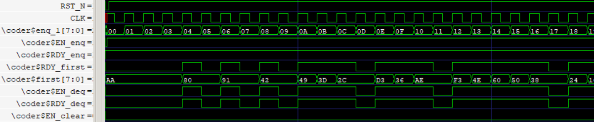  |
| :---------------------------------------------: |
| **图12**：BitCoder 的波形（积极输入，积极弹出） |

如果我们在 BSV 源码`src/13.BitCoding/BitCoding_v5.bsv`的 testbench 中给规则 coder_get 加一个显式条件，让调用者不再积极地每当 deq 隐式条件满足时就调用它，而是消极地每隔两周期才调用，那么生成的波形就如**图13**，可以看出：

- 调用者消极地调用 deq 方法：即 RDY_deq=1 时， EN_deq 不一定=1 ，这说明调用者可以根据需要来决定是否让 EN_deq=1 。
- 其余分析结论与**图12**相同。

| 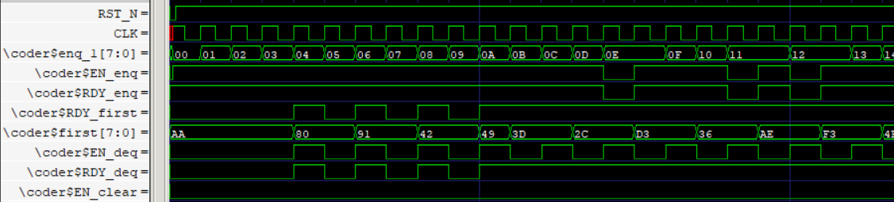  |
| :---------------------------------------------: |
| **图13**：BitCoder 的波形（积极输入，消极弹出） |

同理，如果我们在 BSV 源码的 testbench 中给规则 coder_put 加一个显式条件，让调用者不再积极地每当 enq 隐式条件满足时就调用它，而是消极地每隔四周期才调用，那么生成的波形就如**图14**，可以看出：

- 调用者消极地调用 enq 方法：即 RDY_enq=1 时， EN_enq 不一定=1 ，这说明调用者可以根据需要来决定是否让 EN_enq=1 。
- 其余分析结论与**图12**相同。

| 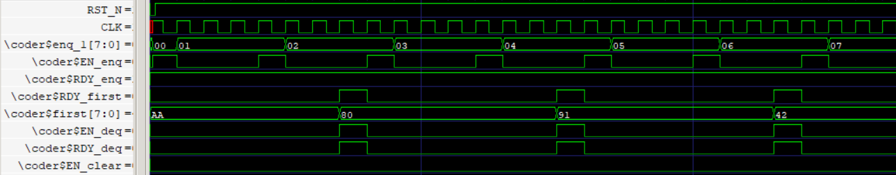  |
| :---------------------------------------------: |
| **图14**：BitCoder 的波形（消极输入，积极弹出） |

### <span id="head176"> 总结</span>

对于值方法：

- RDY=1 说明输出数据有效。
- 不存在 EN 信号，因为无论外界是否调用值方法，都不会对被调用模块产生影响。

对于动作方法和动作值方法：

- RDY 信号指示当前是否能调用该方法。
  - RDY=1 时说明输出数据有效（如果是动作值方法）。

- EN 信号指示当前外界是否要调用该方法，要求只能在 RDY=1 时让 EN=1 。
  - EN=1 时，必须让输入数据有效（如果有参数）。

- 每当 EN=RDY=1 的时钟周期，一次握手完成，方法被调用了一次。

我们编写 Verilog 来调用 BSV 生成的 Verilog 模块时，需要依照以上原则，根据模块输出的 RDY 和 输出数据 信号来正确地产生 EN 和 输入数据信号。


## <span id="head177">12.2 删除不必要的信号</span>

### <span id="head178">always_ready 属性</span>

有些方法没有隐式条件，或者说隐式条件=True ，那么 RDY=1 就是恒成立的，可以用 always_ready 断言该结论，同时删除生成 Verilog 后的 RDY 信号 。

比如 `src/13.BitCoding/BitCoding_v5.bsv` 中的 `mkBitCoder` 模块的 `clear` 方法没有隐式条件，我们在 `mkBitCoder` 模块的定义前面加上如下 `always_ready`  属性：

```bsv
(* synthesize *)
(* always_ready="clear" *)            // 用 always_ready 来删除 clear 方法的 RDY 信号
module mkBitCoder ( FIFO#(Bit#(8)) );
   //...
```

也可以和 `synthesize` 属性写在一起：

```bsv
(* synthesize, always_ready="clear" *)
```

对于一个加上  `always_ready`  属性的方法，如果隐式条件不总是 = True ，编译器就会报断言错误。


### <span id="head179">always_enabled 属性</span>

有些方法不仅没有隐式条件，而且总是希望每周期都被调用（比如 BypassWire 的 _write 方法），也就是说 EN=RDY=1 是恒成立的，可以用 `always_enabled` 断言该结论，同时删除生成 Verilog 后的 EN 和 RDY 信号。

比如给模块 `mkModule` 的 `methodA` 加上 `always_enabled` ，写作：

```bsv
(* synthesize *)
(* always_enabled="methodA" *)            // 用 always_enabled 来删除 methodA 方法的 EN 和 RDY 信号
module mkModule  ...
```

也可以和 `synthesize` 属性写在一起：

```bsv
(* synthesize, always_enabled="methodA" *)
```

对于一个加上  `always_enabled`  属性的方法，如果隐式条件不总是 = True ，或者调用它的 BSV 模块没有每周期都调用它 ，编译器就会报断言错误。

`always_enabled`  属性仅仅适用于动作方法和动作值方法，而不能用于值方法，因为值方法没有 EN 信号。

`always_enabled`  属性不像  `always_ready`  用得那么多，一般只用在想要组合逻辑输入的情况下，比如该方法把参数写入了一个 BypassWire 内。


## <span id="head180">12.3 引入缺少的 Verilog 库文件</span>

BSV 生成的 Verilog 会调用一些 BSV 提供的 Verilog 代码库。

当你把 BSV 生成的模块用于 FPGA 项目时，需要把它依赖的代码库文件复制到你的项目里，才能让 BSV 生成的 Verilog 被 Vivado、Quartus 等工具综合（否则将报模块名未定义错误）。

### <span id="head181">Verilog 代码库的路径</span>

Verilog 代码库的路径包括：

-  `<bsc安装目录>/bsc/lib/Verilog` ：包括跨平台的 Verilog 代码，不限综合工具，无论你用 Quartus / Vivado 都能综合
-  `<bsc安装目录>/bsc/lib/Verilog.Quartus` ：包括仅适用于 Quartus 的代码。
-  `<bsc安装目录>/bsc/lib/Verilog.Vivado` ：包括仅适用于 Vivado 的代码。

在 3.1 节中我们把 `bsc` 安装在了 `/opt` 目录中，那么 `<bsc安装目录>` 就是 `/opt`  。

### <span id="head182"> 根据需要引入文件</span>

**方法一**是在你写的 BSV 生成的 Verilog 文件里查找 "submodule" 关键字，可以看到它调用的模块名，然后去 Verilog 代码库路径下找到这些文件，把它们复制并添加到你的 FPGA 项目里即可。

例如：`src/13.BitCoding/BitCoding_v5.bsv` 生成的代码文件 `mkBitCoder.v`  里，搜索 "submodule" 关键字可以搜到：

```bsv
  // submodule fifo1
  FIFO2 #(.width(32'd8), .guarded(32'd1)) fifo1(.RST(RST_N),
						.CLK(CLK),
                        // 省略多行 ...
						.EMPTY_N(fifo1$EMPTY_N));
  // submodule fifo3
  FIFO2 #(.width(32'd8), .guarded(32'd1)) fifo3(.RST(RST_N),
						.CLK(CLK),
						// 省略多行 ...
						.EMPTY_N(fifo3$EMPTY_N));
```

显然它调用了 FIFO2 这个模块。于是我们去 `<bsc安装目录>/bsc/lib/Verilog` 中找到了 `FIFO2.v` 文件，把它复制并添加到你的 FPGA 项目里即可。

**方法二**是直接编译项目 ，看如何报错，缺少哪个模块名，就去 Verilog 代码库的路径下找同名文件即可。


# <span id="head183">13 样例研究</span>

本章提供三个样例 SPIFlash 读写器、 RISC-V 流水线 CPU 、 JPEG 图像压缩器 。

本章配套代码已全部完成并测试，部分文字尚未完成，留待后续补充。


## <span id="head184">13.1 SPIFlash 读写器</span>

代码目录：  `src/SPIFlash`

- `SPIFlashController.bsv` 包含 SPIFlash 读写控制器模块 `mkSPIFlashController` 。
- `SPIController.bsv` 包含 SPI 控制器模块 `mkSPIController` ，被 `mkSPIFlashController` 调用。
- `TbSPIFlashController.bsv` 包含仿真顶层模块 `mkTb` ，是 `mkSPIFlashController`  的 testbench 。

目的：展示状态机 StmtFSM 包的复杂应用。

核心知识点：

- 状态机实现外设总线协议

### <span id="head185"> 原理介绍</span>

实现 W25QXX 系列 SPIFlash 的读写控制器，包括页读、页写、页擦除。

> 留待后续补充……

### <span id="head186"> 结果展示</span>

运行命令生成仿真波形：

```bash
$ bsvbuild.sh -vw mkTb SPIFlashController.bsv
```

查看波形：

|  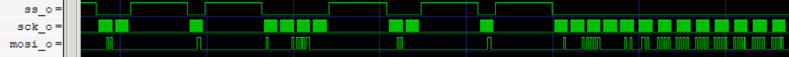  |
| :--------------------------------------------: |
| **图15**：仿真产生的页擦除、页写 (部分) 的波形 |


## <span id="head187">13.2 RISC-V 流水线 CPU</span>

代码目录：  `src/Rv32iCPU`

- `Rv32iCPU.bsv` 包含 RISC-V CPU 模块 `mkRv32iCPU` 。
- `DFIFOF1.bsv` 包含多态模块 `mkDFIFO1` ，它被 `mkRv32iCPU` 调用。
- `TbRv32iCPU.bsv` 包含仿真顶层模块 `mkTb` ，是 `mkRv32iCPU`  的 testbench 。
- `benchmark` 目录包含一些能让 CPU 运行的程序，也即指令流文件和数据流文件。

目的：展示如何用 BSV 优雅地实现经典四级流水线 CPU 。

核心知识点：

- 用各种 FIFO 构建弹性流水线
- 用结构体提升代码可读性
- 调度属性

### <span id="head188"> 原理介绍</span>

RV32I 是 RISC-V 的基础整数指令集，本节实现完整支持 RV32I 指令集的 CPU，重点在于展示经典四级流水线 CPU 的原理，并跑一些 RISC-V 指令流程序来验证。

一些术语说明如**表23** 。

​			**表23**：CPU 体系结构中的术语

| 简称    | 全称           | 释义                           | 备注                                           |
| ------- | -------------- | ------------------------------ | ---------------------------------------------- |
| pc      | 程序计数       | 当前指令在指令 RAM 中的地址    | 32bit                                          |
| npc     | 下一条程序计数 | 下一条需要执行的指令的地址     | 无跳转时 npc=pc+4（每条指令占4字节）           |
| imm     | 立即数         | 从指令中直接获取的数据         | 32bit                                          |
| regfile | 寄存器文件     | 通用寄存器阵列                 | 32 个 32bit 的通用寄存器                       |
| rsrc1   | 源寄存器1      | 从寄存器文件中读取的寄存器值   | 32bit                                          |
| rsrc2   | 源寄存器2      | 从寄存器文件中读取的寄存器值   | 32bit                                          |
| rdst    | 目的寄存器     | 写入寄存器文件的值             | 32bit                                          |
| ibus    | 指令总线       | 接受 pc 作为访存地址，读出指令 |                                                |
| dbus    | 数据总线       | 接受访存请求，读出读数据       | 请求字：是读是写、写字节使能、读写地址、写数据 |

RV32I 的所有指令类型如**表24** 。

​			**表24**：RV32I 包含的9种指令的大致行为。一些细节没展示，比如 LOAD 和 STORE 还分为按字节访存、按字访存、按双字访存。

| 指令类型r    | rsrc1              | rsrc2              | rdst     | 访存地址  | npc                                         |
| ------------ | ------------------ | ------------------ | -------- | --------- | ------------------------------------------- |
| JAL          |                    |                    | pc+4     |           | pc+imm                                      |
| JALR         | :heavy_check_mark: |                    | pc+4     |           | rsrc1+imm                                   |
| BRANCH       | :heavy_check_mark: | :heavy_check_mark: |          |           | pc+imm 或 pc+4 (取决于 rsrc1 和 rsrc2 比较) |
| AUIPC        |                    |                    | pc+imm   |           | pc+4                                        |
| LUI          |                    |                    | imm      |           | pc+4                                        |
| 立即数类算术 | :heavy_check_mark: |                    | ALU 结果 |           | pc+4                                        |
| 寄存器类算术 | :heavy_check_mark: | :heavy_check_mark: | ALU 结果 |           | pc+4                                        |
| LOAD         | :heavy_check_mark: | :heavy_check_mark: | 内存读值 | rsrc1+imm | pc+4                                        |
| STORE        | :heavy_check_mark: | :heavy_check_mark: |          | rsrc1+imm | pc+4                                        |

从**表24**看出，指令是否读取 rsrc1/rsrc2 、是否写入 rdst 、是否访存、如何跳转等行为会带来各种各样的变化。为此，我们设计流水线如**图15**，它包括四段：

1. **IF段** (Instruction Fetch) ：
   - 持有当前的 pc，把它作为读地址送入 ibus（指令总线）。
2. **ID段** (Instruction Decode) ：从指令总线读到指令，用它：

   - 译码：获取 opcode 、 imm 、rsrc1号 、 rsrc2号 、rdst号 等信息。
   - 读取 regfile：根据 rsrc1号 、 rsrc2号 读取 regfile，得到 rsrc1 和 rsrc2 。
   - 计算 npc ：
   - 当指令不是 JAL、JALR、BRANCH 时，向 IF段 发送 npc=pc+4 （顺序执行的下一条指令）；
   - 当指令为 JAL 时，向 IF段 发送 npc=pc+imm ；
   - 当指令为 JALR 时，暂不能确定跳转地址；当指令为 BRANCH 时，暂不能确定是否跳转。需要寄存器的计算结果。因此等 EX/MEM 段再跳转。
3. **EX/MEM段** (Execute/Memory access) ，简称 **EX段** ：用译码后的指令和寄存器读值进行：

   - 计算 npc：

   - 当指令为 JALR 时，向 IF段 发送 npc=rsrc1+imm ；

   - 当指令为 BRANCH 时，根据比较结果判断 npc=pc+imm 还是 npc=pc+4 。


   - 计算：对于算术逻辑类指令，用 ALU 计算目的寄存器结果。

   - 访存：对于 LOAD/STORE，用“访存转换”算出读写请求：（是读是写、写字节使能、读写地址、写数据），送入ibus

4. **WB段** (Write Back to Register) ：对于所有要写入寄存器的指令，把相应的结果写回，其中：

   - 如果是 LOAD 指令，从 dbus 中拿到结果。

   - 如果是其它指令（算术逻辑指令、JAL、JALR、LUI、AUIPC），从 ALU 拿到结果。

| 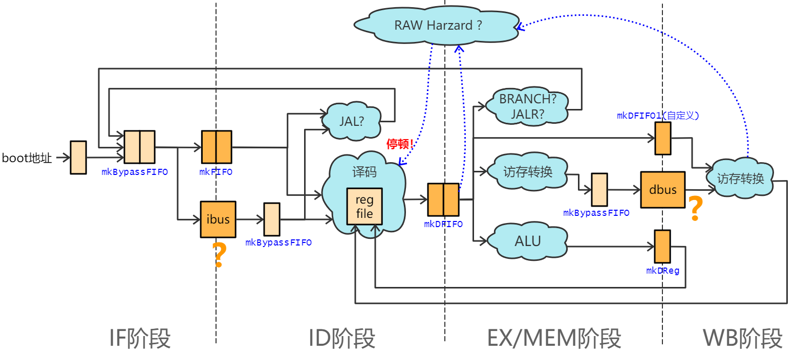 |
| :---------------------------------------: |
|   **图18**：RISC-V CPU 四级流水线设计图   |

**图18**包含了本科课程《计算机组成原理》一般涉及的两种流水线停顿：

- 跳转停顿：BRANCH/JALR 指令需要寄存器读值才能计算 npc ，为了防止 ID段 组合逻辑过长，我们在 EX段 才计算并发送 npc 到 IF 段，导致总是在 ID段 产生一周期的气泡 （这里不考虑 speculation + 冲刷流水线的技术）。
- 实现方法：EX段 和 ID段 都可以向 IF段 发送 npc ，但不会同时，所以给 EX段 和 ID段 加上 `(* conflict_free *)` 属性。

- 写后读依赖停顿：当 WB段 或 EX段 的 rdst号 与 ID段 的 rsrc1号 或 rsrc2号 碰撞时，说明 ID段 要读取尚未写入寄存器的数据，ID段 需要停顿直到不再碰撞（数据已经写入 regfile）为止。
- 实现方法：对于 ID段 的停顿，在 ID段 安插一个 mkBypassFIFO ，在停顿时保存 ibus 响应的读指令，避免它消失。
- 额外优化：在 WB段 的 ALU结果 是经过寄存器缓存的，不是组合逻辑路径，因此当与 ID段 碰撞时，不停顿 ID段，而是用转发 (forward) 技术把 ALU结果 转发到 ID段。


另外，我们还灵活运用各种 FIFO 实现了《计算机组成原理》中一般不要求实现，但在实际应用中非常必要的功能——总线停顿。ibus 和 dbus 都可能发生总线停顿，包括两种：

- 请求停顿：可能暂时无法接受一个请求。比如遇到了 cache miss 或总线从机争用。
- 响应停顿：接受请求后，响应的读出指令/读出数据 并不一定在下周期出现，有可能是下下周期、下下下周期。具有不确定的延迟。

我们使用以下方法解决这些总线停顿：

- 对于 ibus 的请求停顿，在 IF段 安插一个 mkBypassFIFO ，当 ibus 无法接受请求时，缓存住 npc 。
- 对于 ibus 的响应停顿，当停顿发生时，ID段 的 mkBypassFIFO 无数据， ID段 的规则就不会执行，不会向后传递指令，直到 ibus 有响应为止。
- 对于 dbus 的请求停顿，在 EX段 安插一个 mkBypassFIFO ，当 dbus 无法接受请求时，缓存该请求。
- 对于 dbus 的响应停顿，用一个 mkDFIFO1 进行同步。当 dbus 暂无响应时，不从 mkDFIFO1 中拿走一个数据，导致 EX段 停顿，不会继续向前执行。

>  mkDFIFOF1 不是 BSV 的库里预定义的，是我自己编写的多态模块，它与 mkFIFOF1 唯一的区别是：可以在空时用 first 读到一个默认数据。

如果你用 Verilog 编写过流水线 CPU 就会知道，在如上所述的这些跳转停顿、写后读停顿、各种总线停顿的存在下，需要很复杂的冒险处理模块（Hazard Unit）来控制各种停顿组合下流水线的推移。然而在 BSV 的思维下，我们灵活地用 FIFO 的思维来应对这些停顿，不仅让流水线示意图（**图18**）更清晰易懂，也让代码修改变得更简单，方便我们进行设计空间搜索。例如你想试试在 ID段 就把 BRANCH/JALR 的 npc 发送给 IF段 会怎样，就不需要像 Verilog 那样既修改指令流又修改数据流（这样也很容易改出bug）

具体的代码实现见`Rv32iCPU.bsv` （请结合**图18**阅读代码）。

### <span id="head189"> 结果展示</span>

**仿真**：

你可以修改 testbench 代码  `TbRv32iCPU.bsv` 中的两个字符串：

```bsv
String   filename_instruction = "benchmark/qsort_instruction.txt";
String   filename_data        = "benchmark/no_data.txt";
```

来指定要让 CPU 运行的指令流（放在指令 RAM 中）和数据流（放在数据 RAM 中）。

还可以修改：

```bsv
Bit#(32) print_data_count     = 40;
```

来决定仿真结束前打印数据 RAM 中的前多少个数据（用于查看结果）。

我在 benchmark 目录里提供了四个测试程序，说明如**表25**。

​			**表25**：我们实现的 CPU 的测试程序

| 程序说明 | filename_instruction 取值           | filename_data                | 测试成功的标志   |
| -------- | ----------------------------------- | ---------------------------- | ---------------- |
| 快速排序 | `"benchmark/qsort_instruction.txt"` | 随意 *****                   | 看排序结果 ***** |
| 算术测试 | `"benchmark/testA_instruction.txt"` | 随意 *****                   | 最终 pc/4=2227   |
| 访存测试 | `"benchmark/testB_instruction.txt"` | `"benchmark/testB_data.txt"` | 最终 pc/4=2719   |
| 跳转测试 | `"benchmark/testC_instruction.txt"` | 随意 *****                   | 最终 pc/4=2906   |

> *****：随意代表可以随意设置，该程序不要求数据 RAM 中有初始值。
>
> *****：排序结果通过打印数据 RAM 中的前 38 个数据来查看，这 38 个数据应该是由小到大排列的。

按**表25**设置好你想在 CPU 上运行的程序，然后运行以下命令来仿真：

```bash
$ bsvbuild.sh -bs mkTb TbRv32iCPU.bsv
```

仿真会在检测到 CPU 遇到死循环（JAL跳转到自身）时停止，然后会打印此时的一些信息，以及数据 RAM 中的前 `print_data_count` 个数据。

例如，对于访存测试（testB），你会看到如下的打印：

```
fetch: cycle= 5479   instructions= 3599   100*cpi= 152   pc/4= 2719
DataRAM[00000000] =       16535
DataRAM[00000004] = -1396670317
DataRAM[00000008] =       36611
省略...
```

这代表总共运行了 5479 个周期，3599 条指令， 100*cpi=152（平均运行每条指令需要1.52个周期），最后死循环停在了 pc/4=2719 的为止。依照**表25**可知测试成功。

另外，你还可以按照 `TbRv32iCPU.bsv` 中注释的指示，加入 ibus 和 dbus 的请求停顿和响应停顿，看看测试是否还能成功。（我验证过各种停顿的组合情况下，均成功）

**Verilog 综合结果**：

生成的 `mkRv32iCPU.v` 在 Altera Cyclone IV EP4CE115F29C8 上占用 5312 LE (logic elements)，占总量的5%。时钟频率达到 77MHz 。


## <span id="head190">13.3 JPEG 图像压缩器</span>

代码目录：  `src/JpegEncoder`

- `JpegEncoder.bsv` 包含 JPEG 图像压缩器模块 `mkJpegEncoder` 。
- `DoubleBuffer.bsv` 包含多态双缓冲模块 `mkDoubleBuffer` ，被 `mkJpegEncoder` 调用。
- `TbJpegEncoder.bsv` 包含仿真顶层模块 `mkTb` ，是 `mkJpegEncoder`  的 testbench 。
- `PgmReader.bsv` 包含用于读取 .pgm（未压缩灰度图文件）的模块，仅限于仿真使用，被 `mkTb` 调用。
- `img` 目录包含一些 .pgm 文件，用来在仿真时被送入 `mkJpegEncoder`  进行压缩。
- `python/txt2jpg.py` 转换工具，用于把仿真生成的包含十六进制数的文本文件转化为二进制文件（.jpg图像是二进制文件）。
- `python/jpeg_encoder.py` 是 JPEG 图像压缩器的软件代码实现，硬件模块  `mkJpegEncoder` 是根据它编写的。

目的：展示如何用 BSV 优雅地实现 JPEG 图像压缩器。

核心知识点：

- 双缓冲
- 矩阵乘法
- 多态的应用
- Vector 的应用

### <span id="head191"> 原理介绍</span>

该模块根据 JPEG 图像压缩算法的 python 代码 `src/JpegEncoder/python/jpeg_encoder.py` 编写。

能输入图像（8bit灰度图）的原始像素，输出 JPEG 压缩流（带有 `.jpg` 文件头尾）。

> 留待后续补充……

### <span id="head192"> 结果展示</span>

**仿真**：

testbench 模块会读取并解析原始像素文件（不压缩的 `.pgm` 格式），把像素输入到 `mkJpegEncoder` 模块，再从中拿出压缩后的像素，以十六进制数的形式写入一个文本文件 `out.jpg.txt` 。

首先指定你想压缩的图像文件，比如是 `img/in003.pgm` ，方法是修改 `TbJpegEncoder.bsv`  中的如下一行：

```bsv
PgmReader   pgm_reader  <- mkPgmReader("img/in003.pgm");
```

然后运行仿真命令：

```bash
$ bsvbuild.sh -bs mkTb TbJpegEncoder.bsv
```

会看到产生了一个 `out.jpg.txt` 文件，打开它可以看到文本形式的十六进制数，它就是图像压缩流。

然后，用以下命令调用我写的转换工具，把文本文件转化为二进制文件：

```bash
$ python python/txt2jpg.py out.jpg.txt out.jpg
```

得到的 `out.jpg` 可以用图像查看器直接打开查看。

> 笔者还没研究出来 BSV 怎么直接写二进制文件，所以目前只能写在文本文件里。

**Verilog 综合结果**：

生成的 `mkJpegEncoder.v` 在 Altera Cyclone IV EP4CE115F29C8 上占用 12533 LE (logic elements)，占总量的11%。时钟频率达到 43MHz 。

考虑到每周期能并行输入 8 个像素，且由于双缓冲的实际而不存在停顿，吞吐率可达 344 M 像素/秒 。
